### 1.MAC地址

* 每一个网卡都有一个6字节（48bit）的MAC的值（Media Access Control Address）

* 全球唯一，（网卡厂商）固化在网卡的存储空间（ROM）中，由IEEE802标准规定

* 格式：

  * 前3个字节：OUI（Organizationally Unique Identifier），组织唯一标识符。

    由IEEE的注册管理机构分配给厂商，组织唯一标识符代表网卡厂商。

  * 后3个字节：网络接口标识符
  
    由厂商自行分配。
    
    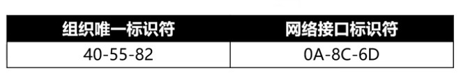
  
* OUI查询：
  
  * http://standards-oui.iee.org/oui.txt  : 可以查出厂商对应的组织唯一标识符
  
  * https://mac.51240.com
  
* 表示格式：
  
  * Windows：20-89-84-41-88-09
  
  * Linux, Android, Mac, IOS：20:89:84:41:88:09
  
  * Packet Tracer：2089.8441.8809
  
* 数据包里面的目标MAC地址是：FFFF.FFFF.FFFF

  * 当我们不知道对方主机的MAC地址时，源计算机会先发送一个ARP广播来获取对方的MAC地址。

    获取成功后，会缓存IP地址和MAC地址的映射信息，俗称ARP缓存。

  ```
  说明没有目标MAC地址，也就是希望该区域内的计算机都能收到这个数据包。
  这是一个ARP广播，来查询目的IP的MAC地址的。
  ```

  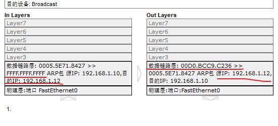

  

  * 通过ARP广播获取的MAC地址，属于动态（dynamic）缓存。

    存储时间比较短（默认是2分钟），过期了就自动删除。
  

### 2.IP地址

#### 2.1.  简介

* IP地址，Internet Protocol Address：互联网上的每一个主机都有一个IP地址。

* 最初是IPv4版本，32bit（4字节），2019年11月25日，全球的Ip地址已经用完。

* 后面推出了IPv6版本，128bit（16字节）

* 后续说到ip地址，默认是ipv4。

  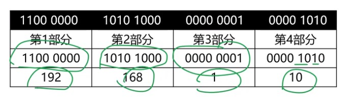

#### 2.2. IP地址组成		

* IP地址由2部分组成：网络标识（网络ID），主机标识（主机ID）
  
  * 同一网段的计算机，网络ID部分相同。
  

#### 2.3. 子网掩码

* 通过与子网掩码（subnet mask）进行与运算可以计算出网络ID：子网掩码&IP地址

  ​		11000000 10101000 00000001 00001010  ： 192.168.1.10

  ​		11111111 11111111 11111111 00000000  ： 255.255.255.0

  * 两者与&运算结果：网段

    11000000 10101000 00000001 00000000  ：192.168.1.0
  
* 子网掩码：
  
  * 连续的1对应IP地址的那一部分，就是IP地址的网络标识（ID）部分。
  * 连续的0对应IP地址的那一部分，就是IP地址的主机ID部分。
  
    
  
* **一个网段所能分配的IP数量**：

    * ip地址的 **主机ID部分 **不能全为0（主机位标识为0时）：192.168.1.0

      ​	所以当结尾是0时，说明这表示网段。

    * ip地址的 **主机ID部分 **不能全是1：192.168.1.255

      ​	当主机位全是1时，表示这个是一个广播IP地址：

     可以ping一个网段，来给这个网段内的所有IP发包：

     ​	C: \ >**ping 192.168.1.255**

     ​	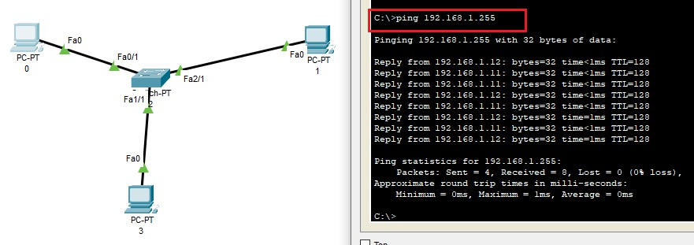

     ​	如果目标IP地址是192.168.1.255，表示要发给192.168.1.0这个网段内的所有IP地址。

     

    * 所以192.168.1.0网段内的可以分配的ip数量是：192.168.1.1 ~ 192.168.1.254，即256-2。

    

* 与&运算规律：

  * 与 1 进行与运算，不变

  * 与 0 进行与运算，为0
  
* IP地址的两部分

  * 子网掩码：连续的1和连续的0组成
  
  * 连续的1对应IP地址的那一部分，就是IP地址的网络标识（ID）部分。
  
  * 连续的0对应IP地址的那一部分，就是IP地址的主机ID部分。
  
    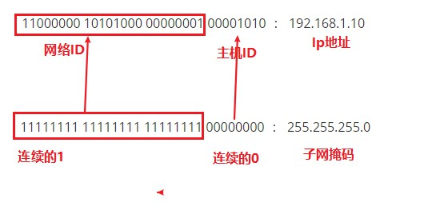
  
* 计算机和其他计算机进行通信前，会先判断目标主机和自己是否在同一个网段。

    * 同一网段：不需要由路由器进行转发
    * 不同网段：需要路由器进行转发


#### 2.4. IP地址的分类

* A类地址：默认子网掩码是255.0.0.0

  格式是：0xxxxxxx.xxxxxxxx.xxxxxxxx.xxxxxxxx

* B类地址：默认子网掩码255.255.0.0

  格式是：10xxxxxx.xxxxxxxx.xxxxxxxx.xxxxxxxx

* C类地址：默认子网掩码255.255.255.0

  格式是：110xxxxx.xxxxxxxx.xxxxxxx.xxxxxxxx

  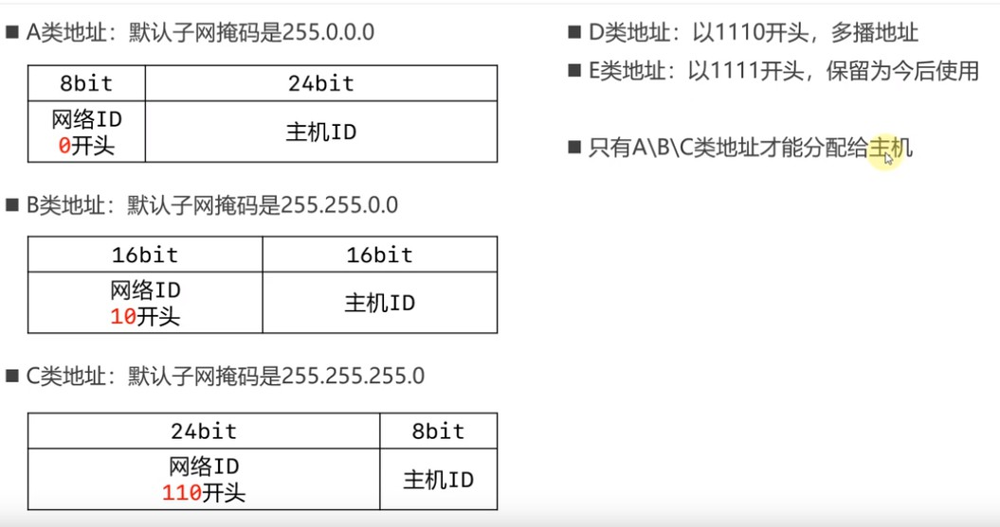

* D类地址：以1110开头，多播地址。

* E类地址：以1111开头，保留为今后使用。

  

* **注意：只有A,B,C类地址才能分配给主机。**


#### 2.5. A类地址：

* 判断是不是A类地址

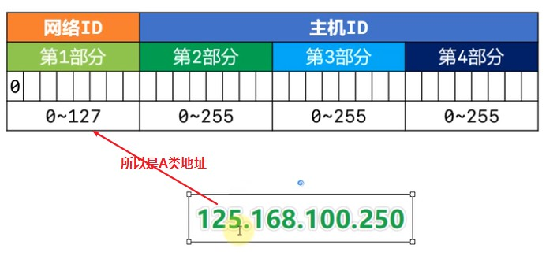

* 网络ID部分

  0不能用：0.168.100.250，即00000000.00000000.00000000.00000000不能作为一个网段。

  127作为保留网段，也不能用：其中127.0.0.1是本地环回地址(Loopback)，代表本机地址。

  * 可以分配的网段：

    第一部分取值范围是：1~126

* 主机ID部分

  * 第2，3，4字节部分的取值范围是 0 ~ 255
  * 每个A类网段能容纳的最大主机数是：256 * 256 * 256 - 2

#### 2.6. B类地址


* 网络ID部分：网段

  10000000 ~ 10111111 : 128.0 ~ 191.255

  网段数量：63 * 256

  A类网段中00000000不能作为一个网段，但是10000000可以作为一个网段，因为有一个非0位。

* 主机ID部分：去掉环回地址和表示网段的地址

  256 * 256 - 2

* 所以B类地址一共有：63 * 256 *（256 * 256 - 2）个

#### 2.7. C类地址

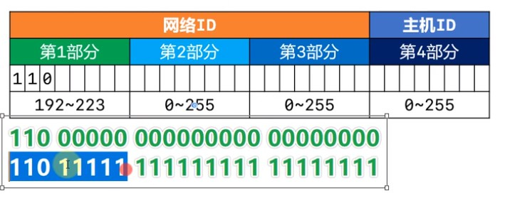

* 网络ID部分：

  11000000 00000000 00000000 ~ 11011111 11111111 11111111

  192.0.0 ~ 223.255.255

  网段数量：31 * 256 * 256

* 主机ID部分：

  256 -2 

* 所以C类地址一共有：31 * 256 * 256 * (256 -2)

#### 2.8. D,E类地址

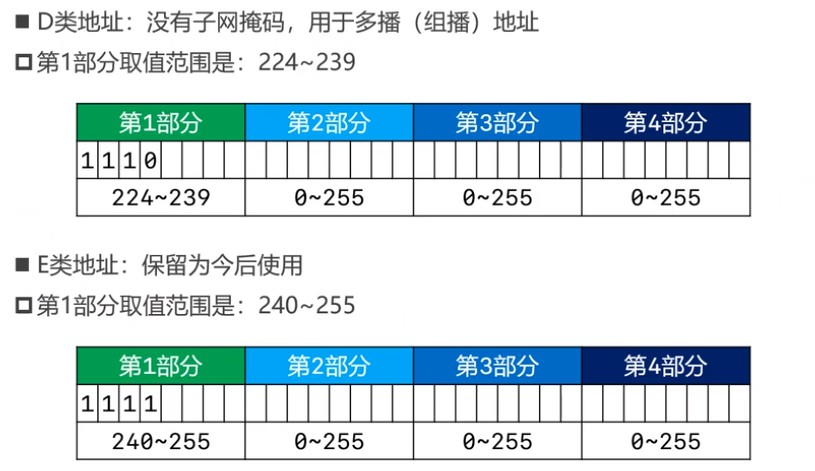

#### 2.9. 子网掩码的CIDR表示方法

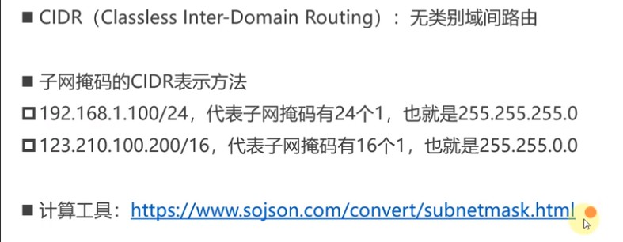

* /24 这部分代表掩码

### 3. 子网划分

#### 3.1. 为什么要进行子网划分

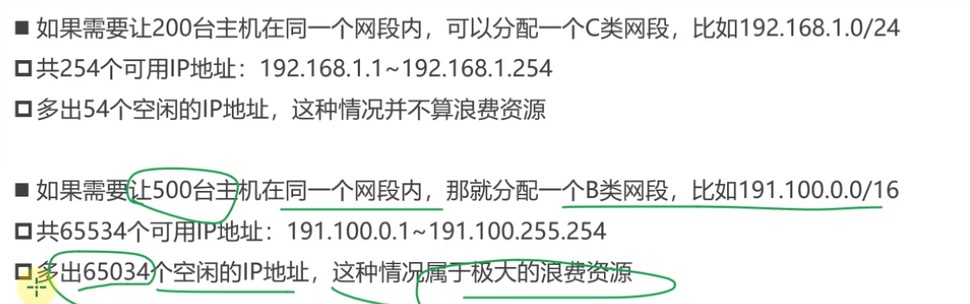

* 为了尽量避免浪费IP地址资源

  合理地进行子网划分。

* 子网划分一般有两种：
  * 等长子网划分
  * 变长子网划分

#### 3.2. 等长子网划分


* 将主机位取出若干位作为网络位。

  ​	比如有一个C类网段：192.168.0.0/24。这个网段可用的ip数量：192.168.0.1 ~ 192.168.0.254。

  但是我只需要100个ip，所以会有154个ip被浪费掉。那么我需要再进行子网划分，且我采用等长子网划分：

  ​	网段：				11000000 10101000 00000000 00000000   192.168.0.0/24

  ​	原来子网掩码	 11111111 11111111 11111111 00000000    255.255.255.0

  ​	现在子网掩码     11111111 11111111 11111111 10000000    255.255.255.128

  ​	此时网络位25位，主机位只有7位，11000000 10101000 00000000 00000000这个网段变成了两个网段：

  ​	11000000 10101000 00000000 0.0000000     192.168.0.0/25

  ​	11000000 10101000 00000000 1.0000000	 192.168.0.128/25

  ​	这两个网段分别有128-2 = 126个主机ip。

* 192.168.0.0/24

  ​	这个网段的网络位是不变的，因为C类地址默认的网络位是24位。但是如果我们进行子网划分，将从主机位取出若干位作为网络位。

  ​	一开始只有一个网段，但是后来将这个网段划分，就变成了2个网段了。

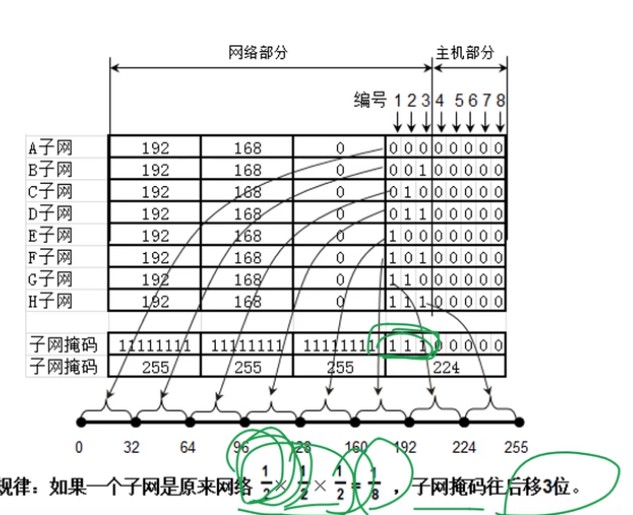

#### 3.3. 变长子网划分

​			192.168.0.0/24 等分成: 192.168.0.0/25 和 192.168.0.128/25

​														192.168.0.0 ~ 192.168.0.127 和 192.168.0.128 ~ 192.168.0.255

​			192.168.0.0/25 等分成: 192.168.0.0/26 和 192.168.0.64/26

​														192.168.0.0 ~ 192.168.0.63 和 192.168.0.64 ~ 192.168.0.127

​			192.168.0.0/26 等分成: 192.168.0.0/27 和 192.168.0.32/27

​														192.168.0.0 ~ 192.168.0.31 和 192.168.0.32 ~ 192.168.0.63

​			192.168.0.0/27 等分成: 192.168.0.0/28 和 192.168.0.16/28

​														192.168.0.0 ~ 192.168.0.15 和 192.168.0.16 ~ 192.168.0.31

​			192.168.0.0/28 等分成: 192.168.0.0/29 和 192.168.0.8/29

​														192.168.0.0 ~ 192.168.0.7 和 192.168.0.8 ~ 192.168.0.15

​			192.168.0.0/29 等分成: 192.168.0.0/30 和 192.168.0.4/30  

​														192.168.0.0 ~ 192.168.0.3 和 192.168.0.4 ~ 192.168.0.7

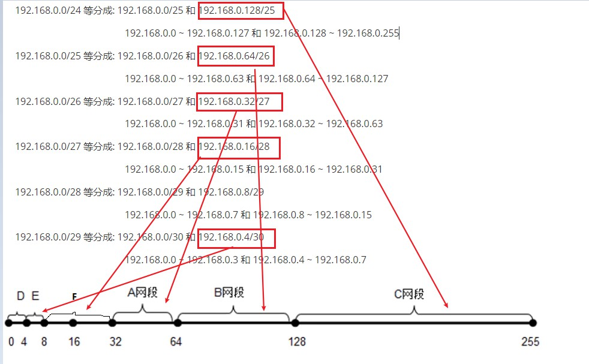


### 4. 思考1

* 这两台设备能通信吗？

  

  ​	计算机发消息时要先判断目标ip是否和自己在同一网段，比如从左向右发消息，计算机0的掩码是255.255.255.0与目标地址192.168.10.10与运算得到结果是：192.168.10.0。而源ip地址192.168.0.10的网段是192.168.0.0。所以两者显然不在同一个网段。所以从左向右一开始就发布出去。

  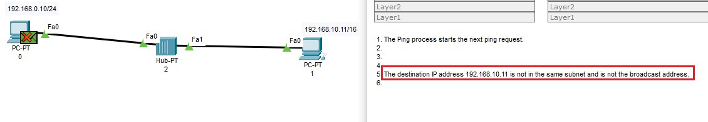

  ​	

  从右向左：计算机1的网段是192.168.0.0，用自己的（不知道目的计算机的掩码）掩码判断目标地址192.168.0.10的网段是192.168.0.0。发现网段是一样的，那么从右向左能发出去。然是发出去后，还要能接收，经历一次从左向右发送消息。计算机0再判断是否同一个网段时，就会发现不在同一个网段。从左向右发布出去。

  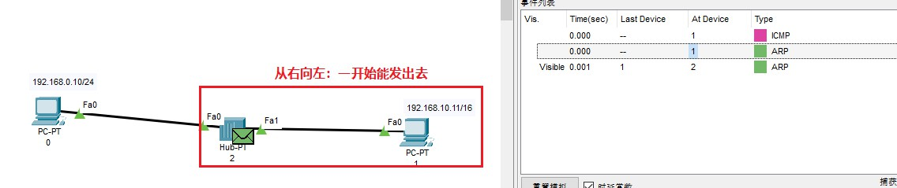

* 一种特殊情况：

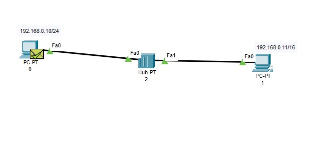

​		从左向右：判断目的ip192.168.0.11的网段是192.168.0.0

​		从右向左：判断目的ip192.168.0.10的网段是192.168.0.0

​		所以这两个ip能通信：192.168.0.10/24 和 192.168.0.11/16。

​		主要看计算机发信息时判断源ip和目的ip是否在同一个网段的结果。

### 5. 超网

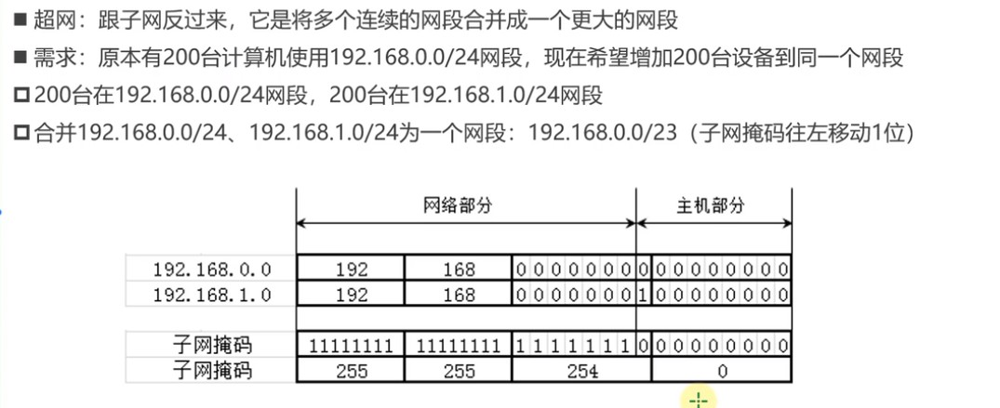

* 注意必须是连续的网段才能合并。

### 	6. 思考2

* 192.168.0.255/21这个ip地址，可以分配给计算机使用吗？

  分析：如果主机位全是0或全是1，那就不能分配给计算机。

  192.168.0.255与掩码与运算：

  11000000 10101000 00000000 11111111

  11111111 11111111 11111000 00000000

  11000000 10101000 00000000 00000000：192.168.0.0

  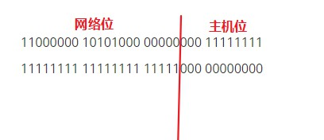

  发现主机位不全是1，也不全是0，所以可以分配给计算机。

* 这个网段192.168.0.255/21的广播地址是：

  11000000 10101000 00000111 11111111

  192.168.7.255

### 7. 网段合并规律

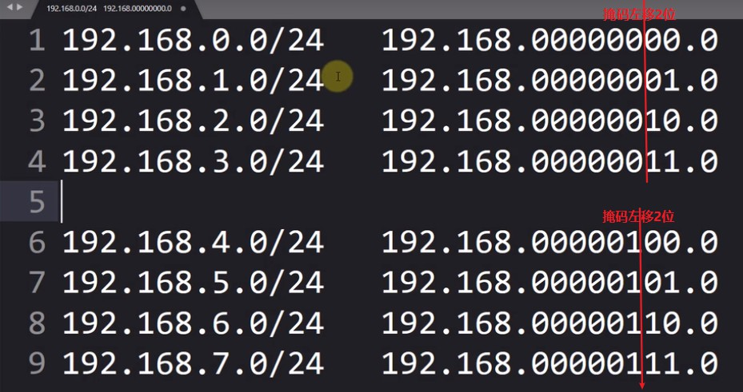

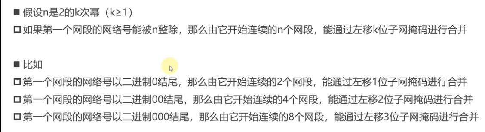

### 8. 判断一个网段是子网还是超网

 1. 首先判断该网段的类型：A, B, C

 2. 在判断和默认的子网掩码相比，当前的掩码是向左移还是向右移。

 3. 左移：超网；右移：子网。

 4. 比如：

    25.100.0.0/16是一个A类子网    

    00011001 01100100 00000000 00000000
    
    11111111 11111111 00000000 00000000  得到网段 00011001 01100100 .0.0 -- 25.100
    
    而A类地址原本的子网掩码是：255.0.0.0，网段是25；现在掩码255.255.0.0，网段25.100
    
    所以网段变小了，是一个A类子网。
    
    
    
    200.100.0.0/16是一个C类超网
    
    11011100 01100100 00000000 00000000
    
    11111111 11111111 00000000 00000000
    
    C类地址：主机位8位；改地址：主机位16位，所以是一个C类超网

