#### 10.网络安全

​	网络通信中面临的4种安全威胁

​	1.截取：窃听通信内容

​	2.中断：中断网络通信

​	3.篡改：篡改通信内容

​	4.伪造：伪造通信内容。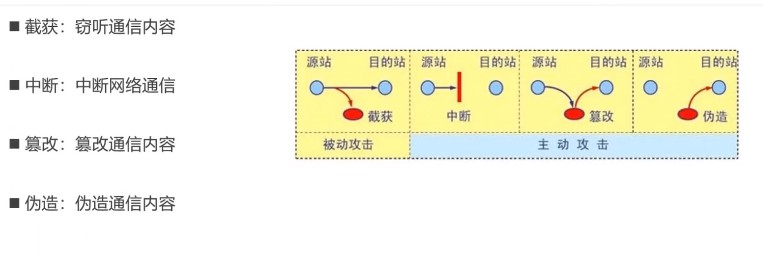

##### 1.HTTP协议的安全问题

###### 1.概述

​	HTTP协议默认是采取明文传输的（没有加密，数据包被拦截到就能直接看到），因此有很大的安全隐患。

​	常见的加密方式有：

​	1.不可逆

​		单向散列函数：MD5，SHA等

​	2.可逆

​		对称加密：DES，3DES，AES等

​		非对称机密：RSA等

​	3.其他

​		混合密码系统，数字签名，证书。

###### 	2.常见英文

​		encrypt：加密

​		decrypt：解密

​		plaintext：明文

​		ciphertext：密文

###### 3.背景假设

​		1.为了便于学习，设计4个虚拟人物

​		Alice，Bob：互相通信

​		Eve：窃听者

​		Mallory：主动攻击者。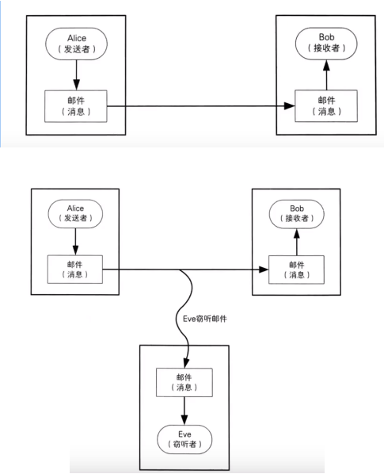

​	2.通过加密防止被窃听：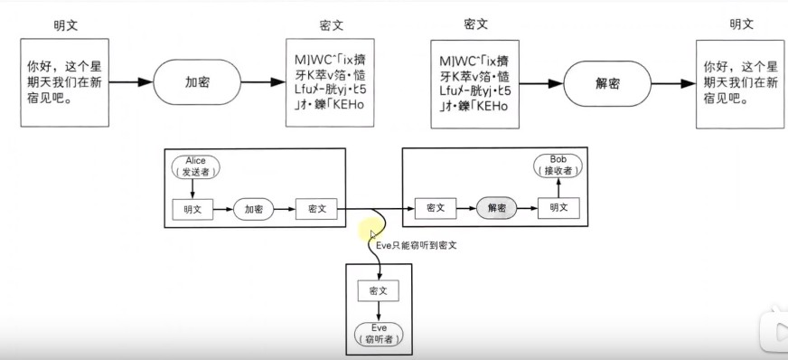

##### 2.单向散列函数

###### 1.概述

单向散列函数：One-way hash function

1.单向散列函数，可以根据消息内容计算出散列值

2.散列值的长度和消息的长度无关，无论消息是1bit，10M，100G，单向散列函数都会计算出固定长度的`散列值`。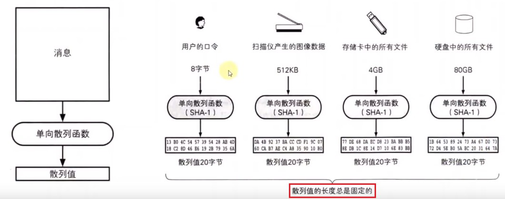

3.单向散列函数的特点

​	1.根据任意长度的消息，计算出固定长度的散列值。

​	2.计算速度快，能快速计算出散列值

​	3.消息不同，散列值也不同

​	4.具备单向性：设计初的目的就是，无法根据散列值得到原数据。（现在可能被破解了）

​	5.哪怕原数据只有1bit的区别，也会产生完全不同的散列值。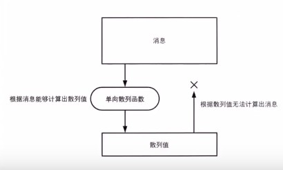

4.单向散列函数的其他称呼

​	1.单向散列函数也被称为

​		消息摘要函数（Message digest function）

​		哈希函数（hash function）

​	2.输出的散列值，也被称为

​		消息摘要（message digest）

​		指纹（fingerprint）

5.常见的单向散列函数

​	MD4，MD5：

​		产生128bit的散列值，MD就是Message Digest的缩写，目前已经不安全。

​	SHA-1

​		产生160bit的散列值，目前已经不安全

​	SHA-2

​		SHA-256，SHA-384，SHA-512，散列值长度分别是256bit，384bit，512bit

​	SHA-3

​		全新标准

###### 2.单向散列函数的应用

​	1.防止数据被篡改

​		为将要检测的数据计算出一个散列值，通过检测这个数据的散列值是否发生了改变，来判断数据是否改变。

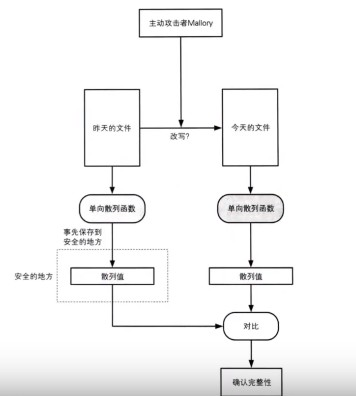

​	2.密码加密

​	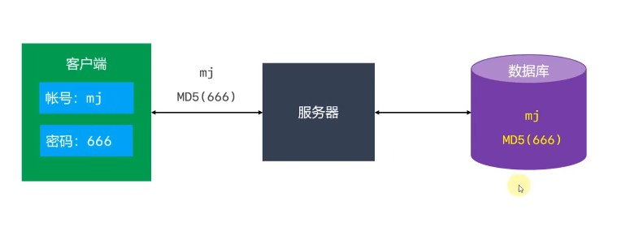

##### 3.对称加密和非对称加密：是可逆的加密

###### 1.对称加密Symmetric Cryptography：

对称加密中，加密用的密码和解密用的密钥是相同的。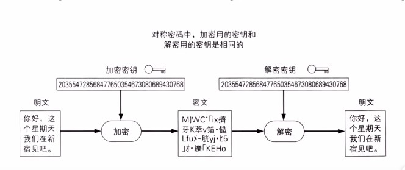

​	主要两个组成部分：加密算法和密钥

​	常见的对称加密算法：

​	1.1DES（Data Encryption Standard）

​		只能一次性将64bit明文加密成64bit密文的对称加密算法，密钥程度是56bit；

​		规格上来说，密钥长度是64bit，但是每隔7bit会设置一个用于错误检查的bit，因此密钥长度实际上是56bit。

​		由于DES每次只能加密64bit的数据，遇到比较大的数据，需要对DES加密进行迭代（反复）。

​		目前已经可以在短时间内被破解，所以不建议使用。

​	1.23DES（Triple Data Encryption Standard）

​		将DES重复3次所得到的一种加密算法，也叫做3重DES

​		三重DES并不是进行三次DES加密（加密->加密->加密），而是（加密->解密->加密）的过程，这个过程中加密解密的密钥不同。

​		目前还被一些银行机构使用，但是处理速度不高，安全性逐渐暴露出问题。

​	1.3AES（Advanced Encryption Standard）

​		取代DES称为新标准的一种对称加密算法，又称Rijndae加密法

​		AES的密钥长度有128，192，256bit三种

​		目前AES，已经逐步取代DES，3DES，成为首选的对称加密算法。

​		一般来说，我们也不应该去使用任何自制的密码算法，而是应该使用AES

​		它经过了全世界密码学家所进行的高品质的验证工作。

2.非对称加密（公钥密码）：

​	加密用的密钥和解密用的密钥是不同的。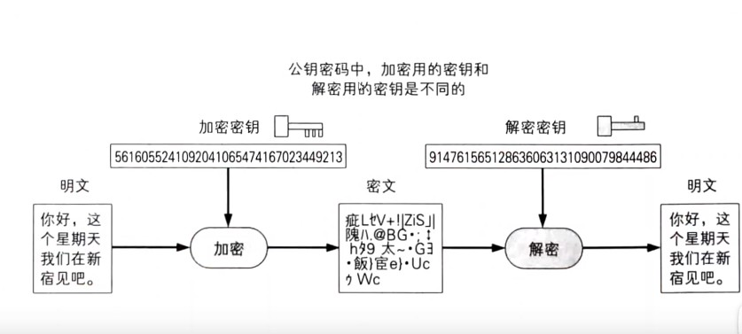

###### 	2.密钥配送问题

​		1.在使用对称加密时，一定会遇到密钥配送问题。

​		如果Alice将使用对称加密过的消息发送给Bod，那么两者必须协商好加密算法，并且Alice要将密钥发送给Bod。只有这样Bod才能完成解密。

​		但是在发送密钥过程中，可能会遇到问题：

​			可能会被Eve窃取到密钥。

​			最后Eve也能完成解密。

​		2.如何解决密钥配送问题

​		有以下几种解决密钥配送的方法

​			实现共享密钥（比如私下共享）

​			密钥分配中心

​			Diffie-Hellman密钥交换

​			`非对称加密`

​		3.非对称加密解决密钥配送问题：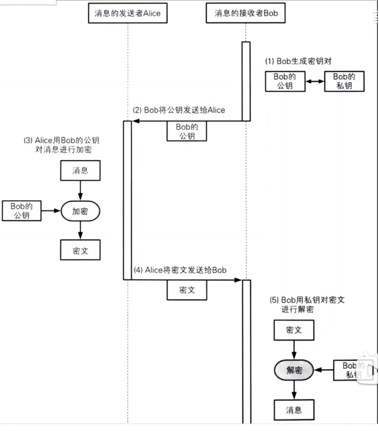

​		

###### 3.非对称加密Asymmetric Cryptography

​	1.在非对称加密中，密钥分为加密密钥，解密密钥2中，它们并不是同一个密钥。

​	2.加密密钥：一般是公开，因此该密钥称为公钥（public key）

​	3.私密密钥：由消息接收者自己保管的，不能公开，因此也称为私钥（private key）

​	4.公钥和私钥是一一对应的，不能单独生成。一对公私钥是`针对一个接收端的`。

​	5.由公钥加密的密文，必须使用与该公钥对应的私钥才能解密。

​	6.由私钥加密的密文，必须使用与该私钥对应的公钥才能解密。

​		因为公钥是公开的，那用私钥加密的东西，都会被其他端用公钥解密。

​		有其特定用途：数字签名

​	7.目前使用最广泛的非对称加密算法是RSA，是三位开发者名字的首字母组成。

​	8.非对称加密的加密解密速度比对称加密要慢，但是比要安全的多。

​		怎么解决加密解密速度慢这个问题呢？

###### 4.混合密码系统（Hybrid Cryptosystem）

​	1.对称加密的缺点

​		不能很好地解决密钥配送问题（密钥会被窃听）。

​	2.非对称加密的缺点

​		加密解密速度比较慢

​	3.混合密码系统：是将对称加密和非对称加密的优势相结合的方法。

​		解决了非对称加密速度慢的问题

​		并通过非对称加密解决了对称加密的密钥配送问题。

​	4.网络上的密码通信所用的SSL/TLS都运用了混合密码系统。

​	5.原理

​		我们一般通信时，两端传输的数据都不会太小，那么如果都用非对称加密对这些数据加密的话，会是个非常低效的过程，那么就又混合密码系统来解决这个问题：

​		思路：既然非对称加密加密解密数据很慢，那么就用对称加密加密解密数据；同时对对称加密的密钥进行非对称加密后再传给接收端（这个密钥的数据量很小：所以用非对称加密来安全加密）。

​		`即用对称加密来加密解密数据，非对称加密来加密解密对称加密的密钥。`

​		所以最终发送给接收端的是两部分：用公钥密码加密的会话密钥（对称加密的密钥）和用对称密钥加密的数据部分。

​		会话密钥（session key）：为本次通信随机生成的临时密钥，作为对称加密的密钥，用于加密消息，提高速度。

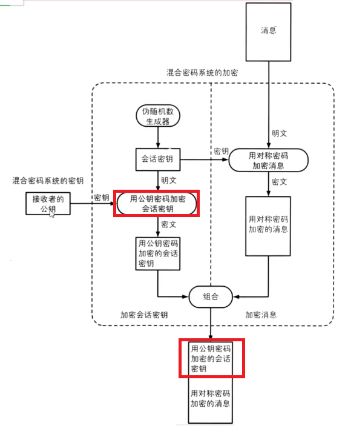

​	6.加密步骤

​		1.首先，消息发送者要拥有消息接收者的公钥

​		2.生成会话密钥，作为对称加密的密钥，加密消息

​		3.用消息接收者的公钥，加密会话密钥。

​		4.将2，3两步生成的加密结果，一并发送给消息接收者。

​	7.发送出去的内容包括：

​		1.用会话密钥加密的消息（加密方法：对称加密）

​		2.用公钥加密的会话密钥（加密方法：非对称加密）

##### 4.数字签名：确定消息是发送者发的

###### 	1.概述

​	1.想象以下场景：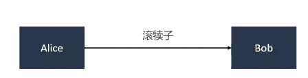

​	Alice发的内容有可能是被篡改过的，或者有人伪装成Alice发消息，或者就是Alice发的，但她可能会否认。

​	问题来了：Bob如何确定这段消息的真实性呢？如何识别篡改，伪装，否认呢？

​	2.解决方案：数字签名。

​		在数字签名技术中，有以下2种行为

​		生成签名：由消息的发送者完成，通过“签名密钥”生成。

​		验证签名：由消息的接收者完成，通过“验证密钥”验证。

​	3.但是签名也可能被篡改伪造。

​		如何能保证这个签名是消息发送者自己签的呢？

​		用消息发送者的私钥进行签名：因为私钥只有消息发送者才有，那么能被发送者公钥解密的签名，一定是发送者生成的签名。

###### 	2.数字签名：过程

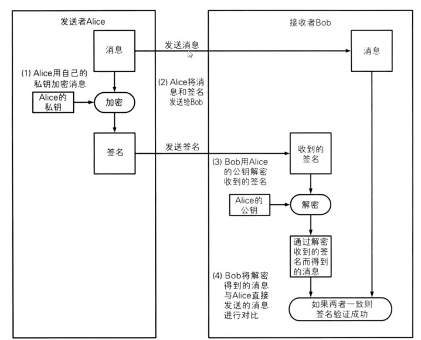

​		注意：

​			假设发送的消息部分是明文：这个消息我不在乎其他人能不能看到，我只想证明这个消息是我发的，没有被其他人篡改。

​			Alice消息发送者生成密钥对：用来做签名

​			Alice发送给Bob的数据包括两部分：签名和消息

​			Alice用自己的私钥对消息进行加密后得到的密文，称为签名。

​			接收者Bob会用Alice的公钥对签名进行解密得到消息，再和直接接收到的消息进行对比，如果两者一致，则签名验证成功：说明消息是Alice发送的且没有被篡改。

​			也可以结合非对称加密，对消息加密。（此时还需要接收者生成密钥对）

​		缺点：

​			发送者对消息进行私钥加密，公钥解密，这是非对称加密，而整个消息部分一般数据量较大，所以效率低下。

###### 3.数字签名：改进

缺点回顾：

​	发送者对消息进行私钥加密，公钥解密，这是非对称加密，而整个消息部分一般数据量较大，所以效率低下。

思路：

​	结合单向散列函数，无论数据有多大，运用散列函数都可以生成固定长度的散列值。这个散列值就代表着消息数据（可以理解为数据的id），可以对散列值进行私钥加密，得到签名。

​	那么接收者收到数据后，用公钥解密签名得到的散列值和直接接收的消息的散列值进行比较，判断是两者否一致。来确定消息是否是发者发送的。

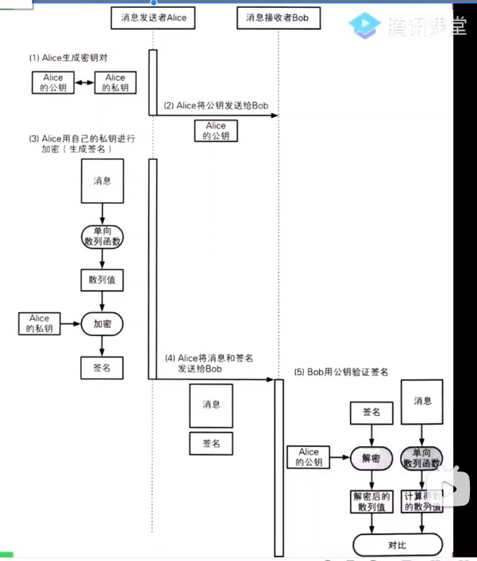

###### 4.数字签名 - 疑惑

​	1.如果有人篡改了消息内容或签名内容，会是什么结果？

​		签名验证失败，证明内容被篡改了。

​	2.数字签名不能保证机密性？

​		数字签名的作用不是为了保证机密性，仅仅是为了能够识别内容有没有被篡改。

​	3.数字签名的作用

​		确认消息的完整性

​		识别消息是否被篡改

​		防止消息发送人否认。

##### 5.非对称加密 - 公钥私钥总结

 	1. 签名可以理解成一种公开的加密：只是为了告诉接收者消息是我发送的。
 	2. 数字签名：其实就是将非对称加密反过来使用：
	3. 非对称加密：`接收者只希望只有自己才能对消息进行解密`，因为私钥是不公开的，那么肯定是私钥解密，希望发送者拿着接收者的公钥对消息进行加密。
	4. 数字签名：`消息发送者不希望别人冒充我发消息`，只有我能签名，所以用消息发送者的私钥进行加密，消息接收者用发送者的公钥进行解密。

##### 6.证书

###### 1.公钥的合法性问题；

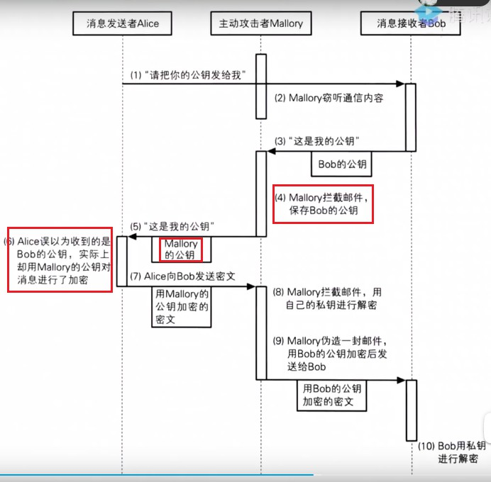

​		1.消息接收者，在发送公钥给消息发送者时，公钥可能会被攻击者拦截到。那么拦截者可能会把拦截者的公钥发给发送者，发送者用拦截者的公钥加密的消息发送时，这个消息被拦截者拦到后，就可以被拦截者自身的私钥解密。而且拦截者还可以在改造一下消息，再用接收者的公钥加密后发送给接收者，接收者就会受到一个被篡改的消息（没有用数字签名：所以篡改不会被发现）。

​		2.所以在互联网上，非对称加密消息时，会将公钥发送给消息发送者，那么就可能会遇到中间者攻击拦截公钥。再发送自己的公钥给消息发送者，所以怎么确保公钥的合法性呢？怎么防止别人伪造我得公钥呢？

​		3.公钥在互联网上传输导致的问题：那么怎么保证这个公钥是消息接收者的呢？

​		其实还是签名机制来保证，用接收者的私钥要对公钥加密得到一个公钥签名，将公钥签名和公钥一起发送给消息发送者，消息发送者用接收者的公钥解密公钥签名得到公钥，再和公钥对比是否被篡改吗？

​		4.但这样其实没有解决问题：

​		拦截者只要保证发送者解密后得到的公钥和接收的公钥一致即可。所以可以用拦截者的私钥对拦截者公钥加密的都公钥签名，再和拦截者公钥一起发过去，还是可以欺骗消息接收者。

​		因为要把公钥和公钥签名都发给消息发送者，那么如果中间又被拦截到后。拦截者再多做一步操作呗，将拦截者的公钥用拦截者私钥加密后，再和拦截者的公钥一起发送给接收者。那么消息发送者用的是拦截者的公钥对公钥签名解密，最后还是会认为公钥没有问题。

###### 2.证书：Certificate

​	所以靠个人签名不能保证公钥不被拦截，所以我们需要依赖一个权威的中间机构，来为公钥做担保。

​	1.密码学中的证书，全称叫做公钥证书（public-key certificate, PKC），里面主要包括三部分

​		姓名，邮箱等个人信息。

​		此人的公钥

​		由认证机构（Certificate Authority, CA）施加数字签名：机构用其私钥加密注册者的公钥。

​	2.CA就是能够认定“公钥确实属于此人并能够生成数字签名的个人或者组织。

###### 3.证书使用

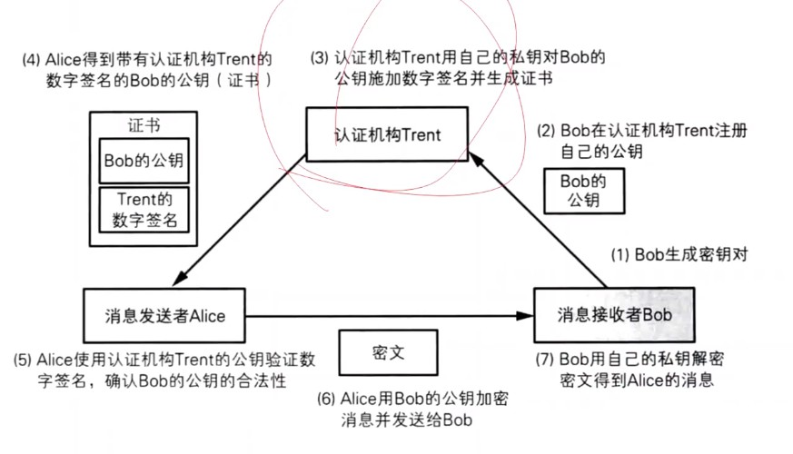

​	考虑一个问题：如果注册的证书和认证机构的签名在给Alice的过程中，被拦截到了。拦截者此时自己作为一个“认证机构”自己做了一个证书，再将证书和自己的公钥传给Alice，不是也能欺骗Alice吗？

​	这个概率非常小，毕竟是认证机构。那么肯定是被广范围认可的，接收者只认可这个认证机构的证书，别人想模仿难度很大。当然无法保证绝对的安全，但是尽量缩小不安全的概率。

​	事实上，各大CA的公钥，默认已经内置在浏览器和操作系统中了。所以不需要再去其他地方下载公钥了，浏览器中的公钥就是合法的公钥。

​	安全都是相对的，只能尽量提高安全性。

###### 4.证书的注册和下载

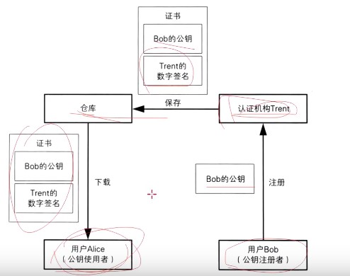

###### 5.查看Windows已经信任的证书

