#### 11.HTTPS

##### 1.概述

​	1.HTTPS（HyperText Transfer Protocol Secure），译为超文本传输安全协议。

​		常称为HTTP over TLS，HTTP over SSL，HTTP Secure。由网景公司于1994年首次提出，HTTPS是在HTTP的基础上使用SSL/TLS来加密报文，对窃听和中间人攻击提供合理的防护。

​		HTTPS就是身披SSL/TLS外壳的HTTP。HTTPS是一种通过计算机网络进行安全通信的传输协议，经由HTTP进行通信，利用SSL/TLS建立安全信道，加密数据包。HTTPS使用的主要目的是提供对网站服务器的身份认证，同时保护交换数据的隐私与完整性。

​	2.HTTPS的默认端口号是443（HTTP是80）

​	3.在浏览器上输入http://www.baidu.com会自动重定向到https://www.baidu.com

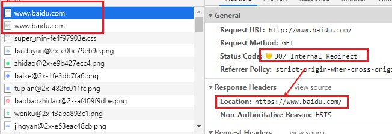

​	4.HTTPS的成本

​		证书的费用

​		加解密计算

​		降低了访问速度

​		有些企业的做法是：包含敏感数据的请求才使用HTTPS，其他保持使用HTTP

##### 2.SSL/TLS

​	TLS（Transport Layer Security），译为：传输层安全性协议，前身是SSL（Secure Sockets Layer），译为：安全套接层。

​	SSL/TLS工作在哪一层：应用层和传输层之间。要将HTTP报文加密后，在发给传输层。其中SSL/TLS这一层又分为握手层和记录层。

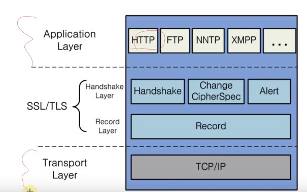

##### 3.OpenSSL

​	OpenSSL是SSL/TLS协议的开源实现，始于1998年，支持Windows,Mac,Linux等平台。利用OpenSSL可以使用SSL/TLS的一些功能，比如加密，生成密钥对，生成签名证书。

​	Linux，Mac一般自带OpenSSL

​	Windows下载安装OpenSSL：https://slproweb.com/products/Win32OpenSSL.html

​	常用命令：

​		生成私钥：openss genrsa -out mj.key

​		生成公钥：open rsa -in mj.key -pubout -out mj.pem

​	可以使用OpenSSL构建一套属于自己的CA，自己给自己颁发证书，称为“自签名证书”。

##### 4.HTTPS的通信过程

​	1.总的可以分为3大阶段：

​		1.TCP的3次握手

​		2.TLS的连接：

​			主要就是协商各种信息，利用密钥交换算法来生成一个会话密钥，之后就可以进行HTTP通信。

​			主要协商内容：协定加密组件，TLS版本，计算出会话密钥，将公钥证书（包含公钥）给客户端

​		3.HTTP请求和响应：

​			`之后HTTP的请求响应过程：就是用TLS连接得到的会话密钥来对数据进行对称加密；服务器的公钥对会话密钥进行加密（非对称加密）。`再加上签名等机制。

​			所以非对称加密，对称加密，

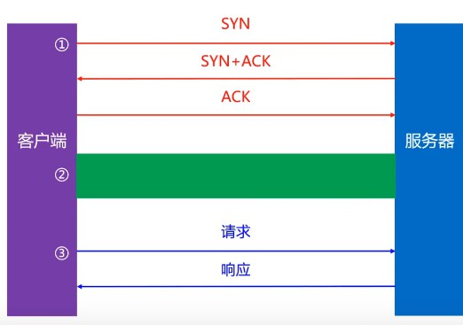

​	

​	2.TLS 1.2的连接

​		大概有10大步骤，图片中省略了中间产生的一些ACK确认。

​		抓包可以看到这些ACK过程。

​	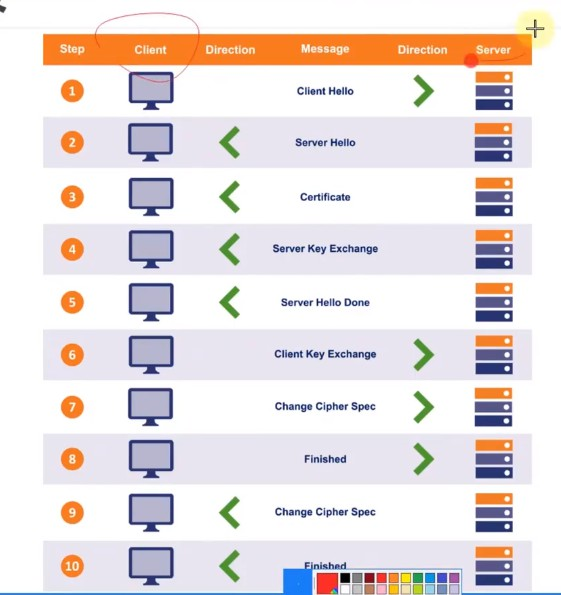

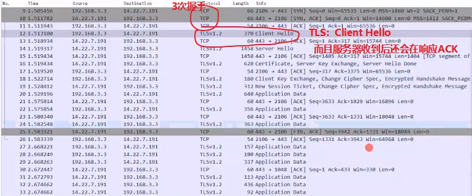

##### 5.TLS 1.2的连接

##### 

​	步骤1：Client Hello

​	客户端向服务器发送一个数据包，主要协定这些内容

​		TLS的版本号；

​		支持的加密组件（Cipher Suiter）列表，加密组件是指所使用的的加密算法以及密钥长度。

​		一个客户端随机数（Client Random）

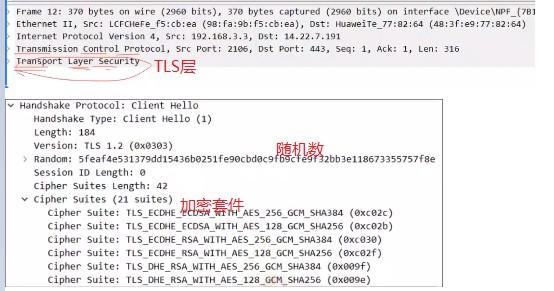

​	步骤2：Server Hello

​		服务器向客户端发送一个数据包，主要包括下面内容

​			TLS的版本号

​			选择的加密组件：是从接收到的客户端机密组件列表中挑选出来的。

​			一个随机数。

​	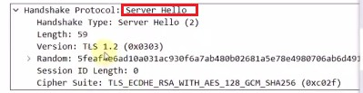

​	步骤3：Cetificate

​		服务器将公钥证书（被CA签名过的），发给客户端。

​		证书里面包含着公钥，第三方认证机构的签名信息，服务端域名信息等

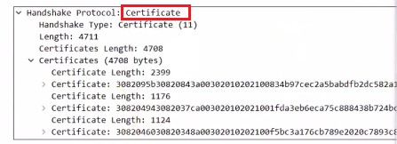

​	步骤4：Server Key Exchange

​		传给客户端一个用以实现ECDHE算法的其中一个参数（Server Params）

​		`ECDHE是一种密钥交换算法：客户端和服务端都要拥有密钥，就是根据TLS的前几部，协定一些参数，然后两端根据参数都能计算出一个相同的密钥。`

​		为了防止伪造，Server Params经过了服务器私钥签名。

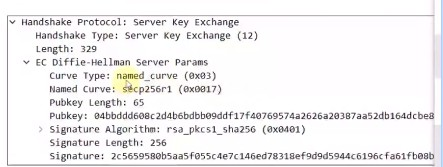

​	步骤5：Server Hello Done

​		告知客户端，协商部分结束。

​		目前为止，客户端和服务器端之间通过明文（前5不都是明文）共享了：

​			Client Random, Server Random, Server Params

​		而且，客户端也已经拿到了服务器的公钥证书，接下来，客户端会验证证书的真实有效性。

​	步骤6：Client Key Exchange

​		客户端解析证书，这部分工作由客户端来完成。首先会验证公钥是否有效，比如颁发机构，过期时间等等，如果发现异常，则会弹出一个警告框，提示证书存在的问题。如果证书没有问题，那么就开始生成主密钥的步骤。

​		客户端发给服务器：用以实现ECDHE算法的另一个参数（Client Params）

​		目前为止，客户端和服务器端都拥有的ECDHE算法需要的2个参数：Server Params, Client Params

​		此时客户端，服务器都可以使用ECDHE算法：

​			根据Server Params, Client Params计算出一个新的随机密钥串：Pre-master secret

​			然后结合Server Params, Client Params，Pre-master secret生成一个主密钥，最后再利用主密钥衍生出其他密钥而且双方都有这些密钥：客户端发送用的会话密钥，服务器端发送用的会话密钥。

​			会话密钥就是对HTTP请求发送的内容进行对称加密，如果用的是别的密钥交换算法算法的话（此处的密钥交换算法ECDHE是两边都算出主密钥，会话密钥），这个会话密钥本身又会被非对称加密后传输给接收端（用接收的证书的公钥加密会话密钥）。

​	步骤7：Change Cipher Spec

​		告知服务器：之后的通信会采用计算出来的会话密钥（对称加密的密钥）进行加密。

​	步骤8：Finished

​		看一些你的密钥有没有问题：客户端发给服务器，看看服务器能不能解密。

​		发送一个包含连接至今全部报文的整体校验值（摘要，哈希值），并且用上面得到的会话密钥加密这个密钥之后发送给服务器。

​		这次握手协商能否成功：要以服务器是否能够正确解密该报文作为判定标准。

​	步骤9，10

​		Change Cipher Spec和Finished

​		客户端正确解密后，会连续发送两次报文给客户端。

​		到此为止，客户端服务器都验证加密解密没问题，握手正式结束，表明TSL层连接建立成功。

​		后面开始传输加密的HTTP请求和响应。

之后HTTP的请求响应过程：就是用TLS连接得到的会话密钥来对数据进行加密解密。

###### 5.1注意：

这是以ECDHE是一种密钥交换算法为例进行讲解的TLS连接，所以看到的其他的TLS连接可能和上面有细节差别。取决于用的是什么密钥交换算法，怎么搞定两边都有主密钥的。是左右两个各自计算，还是左边计算好传过去呢？

如果用的是别的密钥交换算法算法的话（此处的密钥交换算法ECDHE是两边都算出主密钥，会话密钥），这个会话密钥本身又会被非对称加密后传输给接收端（用接收的证书的公钥加密会话密钥）。

TLS主要就是能两边建立一个安全的信道，安全的传输信息，怎么让两边安全的都有这个会话密钥

##### 6.Wireshark解密HTTPS

​	1.设置环境变量SSLKEYLOGFILE（浏览器会将key信息导出到这个文件）

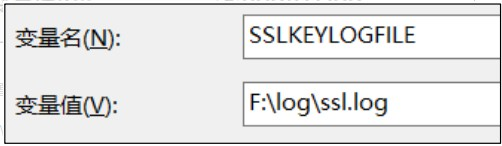

​	设置完成后，最好重启一下操作系统

​	2.在Wireshark中选择这个文件

​	编辑 → 首选项 → Protocols → TLS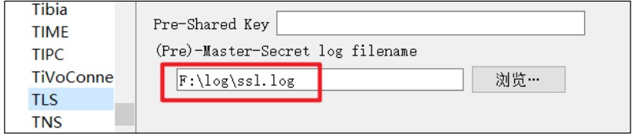

​	3.如果环境变量不管用，可以直接设置浏览器的启动参数

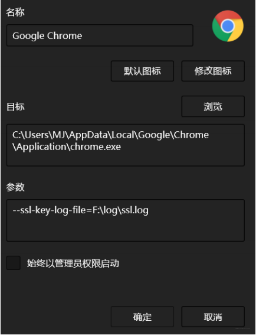

##### 7.服务器配置HTTPS - 生成证书

1.主要就是让浏览器从后端能下载一个证书，前端不用什么工作，因为浏览器可以自己解析证书。

环境：Tomcat 8, JDK1.8

2.首先，使用JDK自带的keytool生成证书。

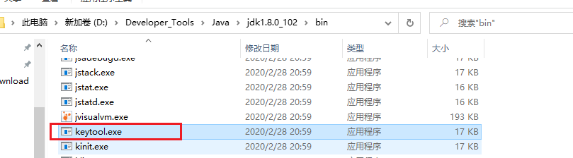

一个生成免费证书的网站: https://freessl.org/

证书：里面会放一个我的公钥，我的私钥自己保管，不对外开放。所以选择这个命令

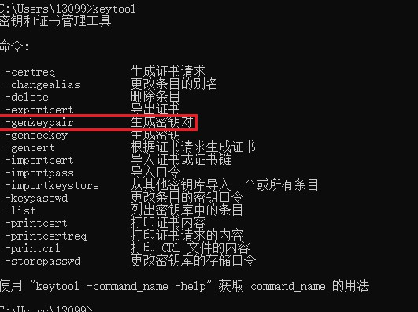


```markdown
keytool -genkeypair -alias mj -keyalg RSA -keystore F:/mj.jks
```

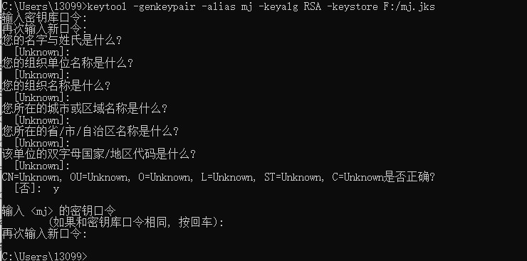

3.配置服务器：

把生成的mj.jks放到tomcat目录下的conf文件夹中

4.修改 TOMCAT_HOME/conf/server.xml 中的 Connector，之后重启一下tomcat

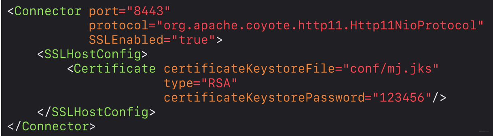

5.当然浏览器会提示不安全，因为这个证书不是第三方签发的，是我们自己生成的，浏览器不信任。