#### 12.HTTP协议的升级改进

HTTP：HTTP和HTTPS都可以理解为HTTP。

##### 1.HTTP协议的不足（HTTP/1.1）

​	1.同一时间，一个连接只能对应一个请求：

​		HTTP1.0：发送一个请求，要建立一个连接，通信完毕后，连接就会断开。如果还有下一次请求，那么还得建立一个新的连接，通信完毕后，连接再断开。

​		HTTP1.1：建立一个长连接后，在这次连接中可以发多个请求，请求都发完后，连接才会断开。但是在这个通信过程中，这些多个请求是排队发送的，所以同一时间还是只能发送一个请求。HTTP1.1建立的一个连接可以复用，但是同一时间只能发送一个请求，所以说同一时间，一个连接只能对应一个请求。

​		那么以前浏览器为了并发的话，就会创建多个连接对象，建立多个HTTP连接。

​		针对同一域名，一个浏览器最多允许同时最多6个并发连接。

​	2.只允许客户端主动发起请求：服务器无法主动响应；

​		是一种请求应答模式。

​		一个请求只能对应一个响应。

​		HTTP1.1通信过程中，我们想要加载一个网站，例如JD。客户端发送一个请求：jd.com后，服务器做不到一起返回多个文资源给我，比如很多图片啊，CSS，JS啊，服务器无法主动做到这一点。

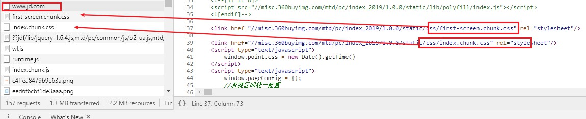

​		例如请求jd.com后，页面中的css，图片等资源，服务器无法一次全部返回给浏览器。需要再次分次请求这些资源，服务器再单个应答。

​		HTTP1.1中，服务器只能是请求应答的模式。浏览器请求服务器一次，服务器返回一次资源，而且请求只能由客户端发起。服务器做不到，一下子把所有的资源都发给浏览器。

​	3.同一个会话的多次请求中，头信息会被重复传输。

​		比如在Session会话技术中，登陆成功后，服务器返回一个Set-Cookie响应头，告诉浏览器存储下来。之后，浏览器为了证明自己的身份，每次请求都会带着Cookie请求头信息，去请求服务器。

​		通常会给每个传输增加500~800字节的开销。

​		如果使用Cookie，增加的开销有时会达到上千字节。即每次请求都会重复传输这上千字节的数据。

##### 2.SPDY

​	1.SPDY(speedy的缩写)，是基于TCP的应用层协议，它强制要求使用SSL/TLS。2009年11月，Google宣布将SPDY作为提高网络素的内部项目。

​	2.SPDY与HTTP的关系：

​		SPDY并不用于取代HTTP，它只是修改了HTTP请求与相应的传输方式。

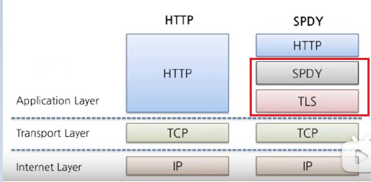

​		HTTP升级到SPDY：只需要在HTTP下面增加一个SPDY层，现有的所有服务端应用均不用做任何修改。

​	3.SPDY是HTTP/2的前身

​		2015年9月，Google宣布移除对SPDY的支持，拥抱HTTP/2。		

##### 3.HTTP2

###### 1.概述

1.HTTP/2，于2015年5月以RFC 7540正式发表。

​	根据W3Techs的数据，截至2019年6月，全球有36.5%的网站支持了HTTP/2

2.HTTP/1.1和HTTP/2的速度对比

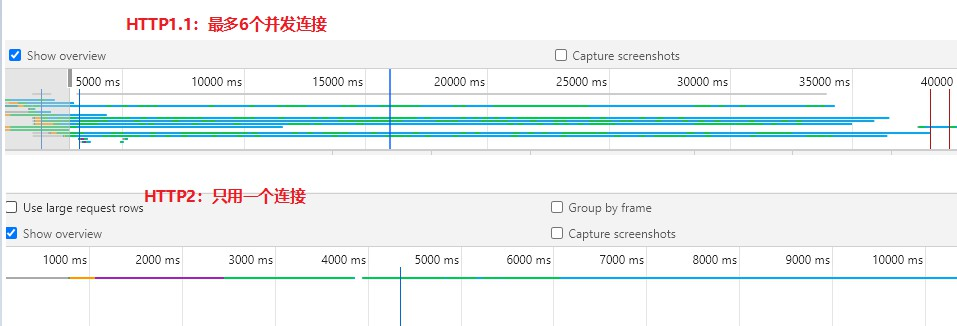

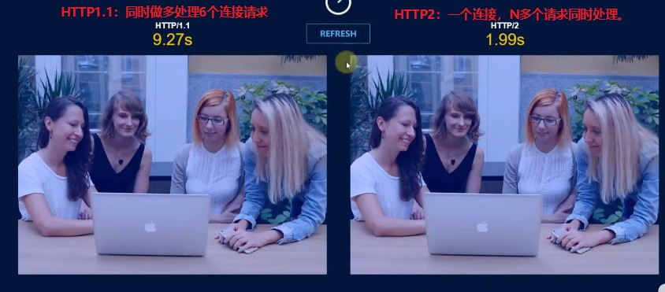

3.HTTp/2在底层传输做了很多的改进和优化，但在语意上完全与HTTP/1.1兼容。

​	比如请求方法（如GET，POST），Status Code，各种Headers等都没有改变，

​	因此，想要升级到HTTP/2：开发者不需要修改任何代码，只需要升级服务器配置，升级浏览器。

​	所以HTTP/1.1迁移到HTTP/2非常容易。

4.注意

​	TCP和IP这两层是操作系统内核在处理，所以要想用到TCP的一些新特性，就要升级修改操作系统的内核非常麻烦，所以很多TCP的新特性根本就没用到。

​	HTTP/2标准没有强制要求使用SSL/TSL，但是目前绝大多数的HTTP/2连接都使用了SSL/TSL。

###### 2.HTTP2的特性 - 二进制格式

​	1.HTTP/1.1采用的是文本格式传输数据，本质上就是字符串。而HTTP/2采用二进制格式传输数据。

​		以前的请求头信息变成了Headers Frame二进制头帧，请求体部分变成了Data Frame二进制数据帧。

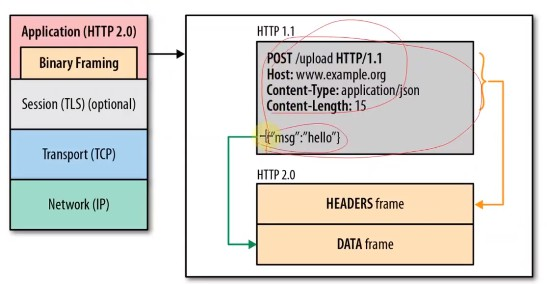

​		二进制格式在协议的解析和优化扩展上带来更多的优势和可能。

​	2.HTTP/2的特性：多路复用（Multiplexing）

​		客户端和服务器可以将HTTP消息分解为互补依赖的帧，然后交错发送，最后再在另一端把他们重新组装起来。

​		并行交错的发送多个请求，请求之间互不影响；并行交错的发送多个响应，响应之间互不干扰。

​		使用一个连接并行发送多个请求和响应。

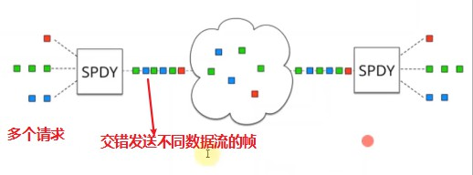

​		不必再为绕过HTTP/1.1的限制而做很多工作：

​		限制：

​			同一时间，一个连接只能对应一个请求。

​			只允许客户端主动发起请求。

​			同一个会话的多次请求中，头信息会被重复传输。

​		做的工作：

​			比如image sprites、合并CSS，JS、内嵌CSS，JS，Base64图片、域名分片等。

​		HTTP/1.1和HTTP/2请求三个文件的对比：

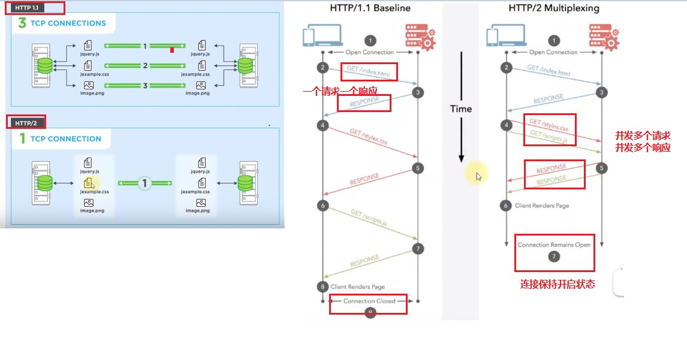

​	3.HTTP/2标准允许每个数据流都有一个关联的权重和依赖关系

​		可以向每个数据流分配一个介于1至256之间的整数：优先级

​		每个数据流与其他数据流之间可以存在显示依赖关系。

​		客户端通过构建和传递：“优先级树”，表明它倾向于如何接受响应；服务器可以根据此信息，通过控制CPU，内存和其他资源的分配设定数据流处理的优先级。

​		在资源数据可用之后，确保将高优先级响应以最快方式传输至客户端。

​		优先级确定过程：

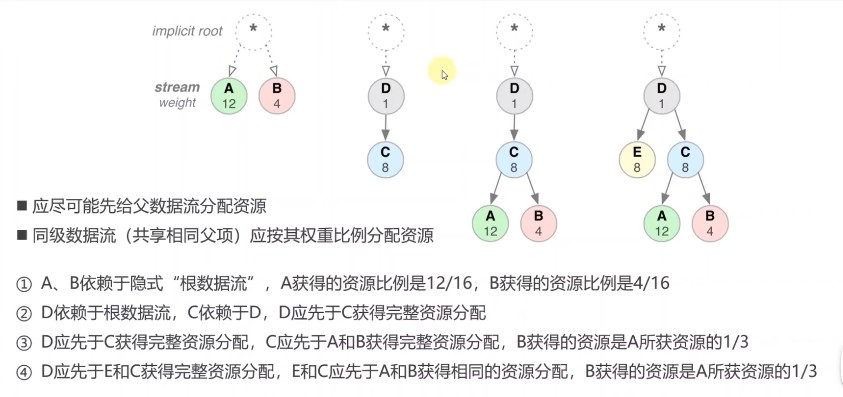

​	4.头部压缩

​		会追踪以前请求发送的请求头信息，已经发过的请求头，就不会再发送了。

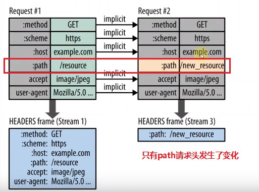

​		HTTP/2使用HPACK压缩请求头和响应头，可以极大减少头部开销，进而提高性能。

​		早起版本的HTTP/2和SPDY使用zlib压缩：可以将所传输头数据的大小减小85%~88%，但在2012年夏天，被攻击导致会话劫持，后被更安全的HPACK取代。

​	5.服务器推送

​		要注意：只要是HTTP请求，服务器端就不能在没有请求的情况下，主动发数据给浏览器。

​		HTTP/2也一样，只是服务器可以对一个请求，返回多个响应。除了对开始的请求的响应外，服务器还而已向客户端推送额外资源，而无需客户端额外明确地请求。

​		请求一个HTML页面，服务器发现HTML还有CSS,图片等资源。那么就响应多次资源，将CSS，图片一并响应过去。

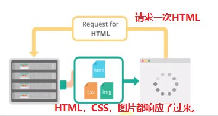

###### 3.HTTP/2的一些基本概念

​	1.数据流：已建立的连接内的`双向`字节流，可以承载一条或多条消息。

​		每个`双向`字节流可以理解成一个请求。

​		数据流是一个逻辑上的概念，每个数据流的存在性是依靠每个帧头的数据流标识符而存在。

​		所有通信都在一个TCP连接上完成，同一时间，此连接可以承载任意数量的双向数据流。

​	2.消息：即HTTP的请求或响应消息，由一系列帧构成，会发送给TCP层。

​	3.帧：HTTP/2通信的最小单位，每个帧都包含帧头（会标识出当前帧所属的数据流）。

​		来自不同数据流的帧可以交错发送，然后再根据每个帧头的数据流标识符重新组装。即逻辑上看数据流是分别独立传输互不干扰，但其实一次传输中分属不同数据路的帧会一起传输。即一个通道中同时发送的有各个不同的数据流的帧，所以数据流也是个逻辑上的概念，它们的独立性靠每个帧头的数据流标识符来区分。

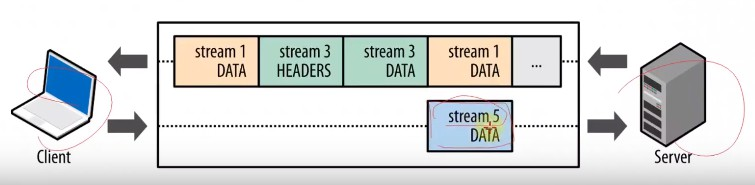

###### 4.HTTP/2的问题

​	1.对头阻塞（head of line blocking）

​	HTTP2还是基于TCP协议的，TCP要保证传输过来的包是有序的。如果某个包在TCP层丢失了，那么后面的包都传不过来。因为TCP要保证包的顺序，会一直等丢失的包重传。只有顺序没问题了，才会向上传递给应用层。

​	所以有一个QUIC协议，可以解决这个问题，因为QUIC协议底层是基于UDP协议的。

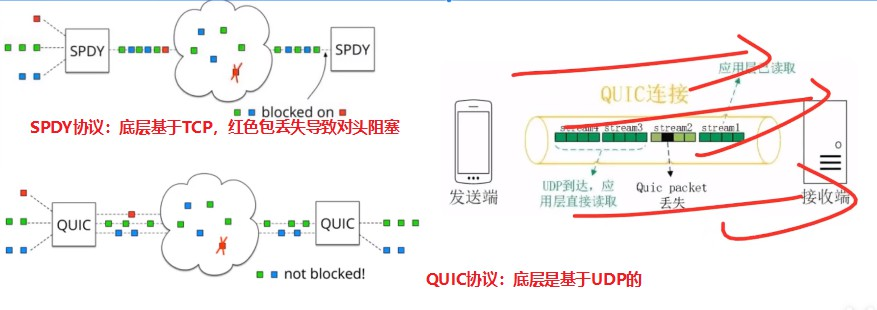

​	2.握手延迟

​	还是因为底层是TCP，还有TLS建立一个信任的信道连接。

​	RTT(Round Trip Time)：往返延迟，可以简单理解为通信一来一回的时间。

​	QUIC协议能实现0RTT的连接通信：因为底层是走UDP，不用多次握手建立连接，直接将数据发过去。

​	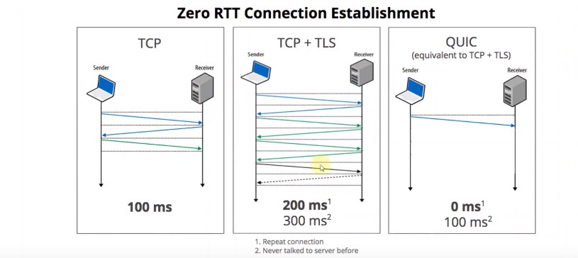

##### 3.HTTP3

###### 1.概述：

​	Google仍觉得HTTP/2不够快，于是就有了HTTP/3，HTTP/3由Google开发，弃用TCP协议，改为使用基于UDP协议的QUIC协议实现。

​	QUIC（Quick UDP Internet Connections）译为：快速UDP网络连接，由Google开发，于2018年从HTTP-Over-QUIC改为HTTP/3。

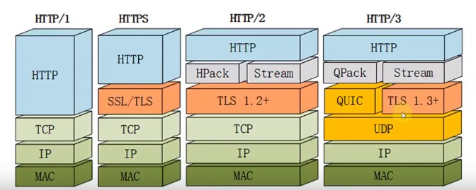

###### 2.HTTP/3疑问

​	1.HTTP/3基于UDP，如何保证可靠传输？

​		有QUIC协议层来保证，做了以前TCP的一部分工作保证可靠传输。

​	2.为何Google不开发一个新的不同于TCP，UDP的传输层协议呢？

​		目前世界上的网路设备基本只认识TCP，UDP。

​		如果要修改传输层，意味着操作系统的内核也要修改，比如Socket的一系列API。

​		这些情况也导致了，IETF标准化的许多TCP新特性都因缺乏广泛支持而没有得到广泛的部署和使用。

​	3.HTTP3还没有落地实现，成为一个标准，还在试验，测试阶段。

###### 3.HTTP/3的特性：连接迁移

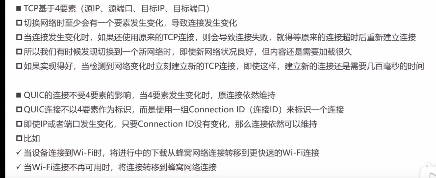

###### 4.HTTP/3的问题

​	操作系统内核，CPU负载。

​	根据Google和Facebook称，与基于TLS的HTTP/2相比，它们大规模部署的QUIC需要近2倍的CPU使用量。

​	因为以前用的都是基于TCP协议的HTTP，所以操作系统，比如Linux内核的TCP部分有很好的优化，而UDP部分由于很少用到，所以没有得到像TCP那样的优化。而且大部分硬件对TCP和TLS都有加速，这个对于UDP基本没有。所以QUIC也没有得到这些优化。