#### 13.其他协议

##### 1.ARP和RARP

​	1.ARP（Address Resolution Protocol），译为地址解析协议。

​		是网络层的一个协议，通过IP地址获取MAC地址。

​	2.RAPR（Reverse Address Resolution Protocol），译为逆地址解析协议。

​		使用与ARP相同的报头结构，作用与ARP相反，用于将MAC地址转换为IP地址。

​		后来被BOOTP，DHCP所取代。

##### 2.ICMP

​	ICMP（Internet COntrol Message Protocol），译为互联网控制消息协议，网络层协议。

​	IPV4中的ICMP被称作ICMPv4，IPv6中的ICMP则称作ICMPv6。

​	通常用于返回错误信息：比如TTL值过期，目的不可达。

​	ICMP的错误消息总是包括乐源数据并返回给发送者。

##### 3.Socket：

​	是一套网络编程API，一般的操作系统都有，利用它可以建立网络连接。

​	开发人员平常发送的HTTP，FTP，SMTP等请求，底层都是通过调用SocketAPI来实现的。

##### 4.WebSocket协议

​	和Socket不同，WebSocket是一个协议。

###### 	1.WebSocket由来

​		HTTP请求是典型的请求应答模式，而且只能是客户端主动请求，服务器被动应答。服务器不能主动请求，通信只能由客户端发起。所以，早起很多网站为了实现 “推送” 技术，所用的技术都是轮询。表面上看起来是推送，实际上还是客户端主动请求。

​		轮询是指由浏览器每隔一段时间向服务器发出HTTP请求，然后服务器返回最新的数据给客户端。这样就很占用服务器的带宽，浪费资源。

​		为了更好地节省服务器资源和带宽，并且能够实时地进行通讯，HTML5规范中出现了WebSocket协议。

​		既然是HTML5规范，WebSocket协议一般用在浏览器，前端中。

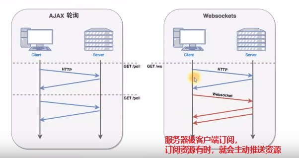

###### 2.WebSocket是基于TCP的支持`全双工`通信的应用层协议。

​	客户端，服务器，任何一方都可以主动发消息给对方。

​	WebSocket的应用场景很多：社交订阅，股票基金报价，体育实况更新，多媒体聊天，多玩家游戏等。

###### 3.HTTP和WebSocket对比

​	1.WebSocket和HTTP属于平级关系，都是应用层的协议。

​	其实TCP本身就是支持全双工通信的，客户端，服务端均可主动发消息给对方。所以如果我们不走HTTP协议，直接通过TCP通信，服务器端就可以主动推送消息给客户端。

​	只是HTTP设计之初就是“请求-应答模式”限制了TCP的全双工能力。

​	2.WebSocket使用80（ws://）、443（wss://）端口，兼容HTTP，协议号是ws://和wss://。可以绕过大多数防火墙的限制。

​		比如：ws://example.com/index.html

​	3.与HTTP不同的是，WebSocket需要在应用层建立连接

​		HTTP需要在TCP协议层建立连接，然后应用层就不需要建立连接了。WebSocket就需要在应用层建立连接，这就使得WebSocket称为一种有状态的协议，之后通信时可以省略部分状态信息。

​		即建立了应用层的WebSocket连接后，两边就都知道对方的存在。以后发送消息时，就可以省略一些身份信息等。像以前HTTP要带着Cookie信息，告诉服务器我是谁。

​		HTTP请求可能需要在每个请求都携带额外的状态信息，如身份认证等。

###### 4.借助HTTP协议来建立连接

​	由客户端（浏览器）主动发出握手请求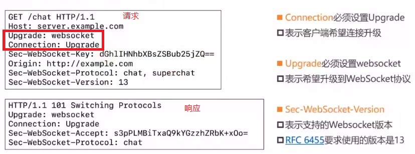

​	必须设置几个请求头

​	Connection: Upgrade，表示客户端希望连接升级。

​	Upgrade: websocket，表示希望升级到WebSocket协议。

​	Sec-WebSocket-Version，表示支持的Websocket版本

​	Sec-WebSocket-Key是客户端生成的随机字符串，服务器收到后，会进行一系列的算法得到另一串数字返回给客户端。客户端验证这串返回的数字，如果正确能匹配的上，那么确认这次请求是WebSocket协议。如此操作是为了尽量避免普通HTTP请求，被认为是WebSocket协议。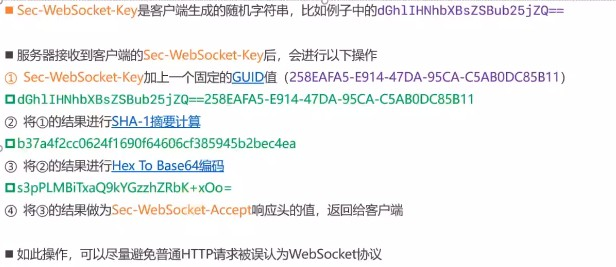

##### 5.WebService

​	1.译为Web服务，是一种跨编程语言和跨操作系统平台的远程调用技术标准。是一个比较落后的标准，因为这些跨编程语言，跨操作系统这些功能都可以直接通过Web API来实现，已经是默认实现的。

​	WebService使用场景举例：天气预报，手机归属地查询，航班信息查询，物流信息查询等。比如天气预报，是气象局把自己的服务以WebService形式暴露出来，让第三方程序可以调用这些服务功能。

​	事实上，WebService完全可以用普通的WebAPI取代，比如HTTP+JSON，现在很多企业的开放平台都是直接采用Web API。

​	2.WebService核心概念

​	SOAP（Simple Object Access Protocol），译为：简单对象访问协议。

​		很多时候，SOAP=HTTP+XML,WebService使用SOAP协议来封装传递数据。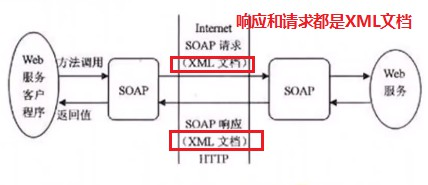

​	WSDL（Web Services Description Language），译为：Web服务描述语言。

​		是一个XML文档，用以描述WebService接口的细节，比如参数，返回值等。

​		一般在WebService的URL后面跟上?wsdl获取WSDL信息，比如：

​		http://ws.webxml.com.cn/WebServuce/WeatherWS.asmx?wsdl		

​	3.现在很多公司开放数据都不会这么做，而是普通的WebAPI+JSON。

##### 6.RESTful简介

###### 1.概述

​	1.REST的全程是: REpresentational State Transfer，译为“表现层状态转移”

​	2.REST是一种互联网软件架构设计风格：

​		定义了一组用于创建Web服务的约束，比如请求该怎么发

​		符合REST架构的Web服务，称为RESTful Web服务。

###### 2.RESTful实践建议

​	1.URL中尽量使用名词（建议用复数形式），不使用动词

​		推荐：/users， /users/6

​		不推荐：/listUsers，/getUser?id=6，/user/list，/user/get?id=6

​	2.使用HTTP的方法表达动作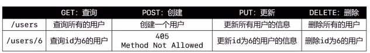

​		URL很简单，可以根据不同的请求方式，确定这个请求URL有不同的动作含义。

​	3.一个资源连接到其他资源，使用子资源的形式

​		GET	 	/users/6/cars/88	

​		POST		/users/8/cars

​	4.API版本化：URL携带版本

​		mj.com/v1/users

​		mj.com/v2/users/66

​	5.返回JSON格式的数据

​	6.发生错误时，不要反回200状态码。

##### 7.HTTPDNS

​	1.HTTPDNS是基于HTTP协议向DNS服务器发送域名解析请求，替代了基于DNS协议向运营商Local DNS发起解析请求的传统方式。可以避免Local DNS造成的域名劫持和跨网访问问题，常用在移动互联网中，比如Android，IOS开发中。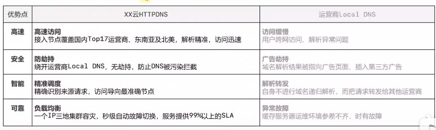

​	2.HTTPDNS-使用

​	市面上已经有现成的解决方案了：

​		腾讯云：https://cloud.tencent.com/product/httpdns

​		阿里云：https://help.aliyun.com/product/30100.html

​	移动端再集成相关的SDK即可使用HTTPDNS服务。

##### 8.FTP(File Transport Protocol)

1.译为：文件传输协议。是基于TCP的应用层协议。

​	FTP的URL格式为：ftp://[user[:password]@]host[:port]/url-path


​	在传输大文件方面，HTTP协议不适合，所以不用HTTP服务器，而是用FTP服务器，专门针对文件上传和下载。

2.FTP：连接模式

​	FTP有2种连接模式：主动Active和被动Passive

​	不管是哪种模式，都需要客户端和服务器建立2个连接：

​		1.控制连接：用于传输状态信息（命令，cmd）

​		2.数据连接：用于传输文件和目录信息（data）

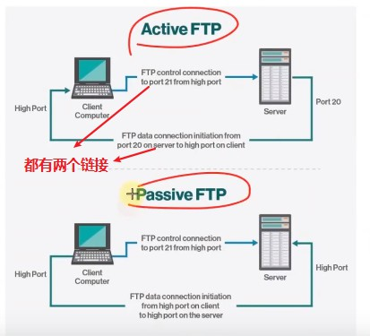

3.主动连接模式

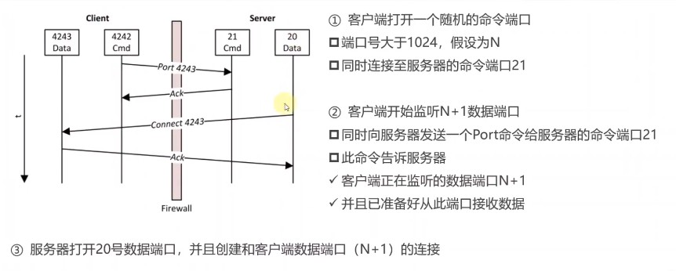

4.被动连接模式

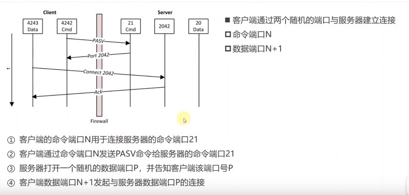

##### 9.邮件相关的协议

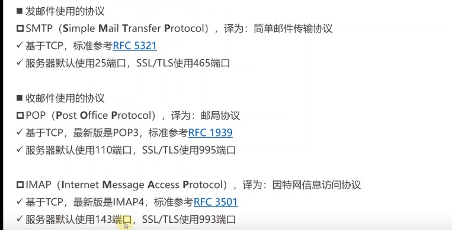

1.收发邮件过程

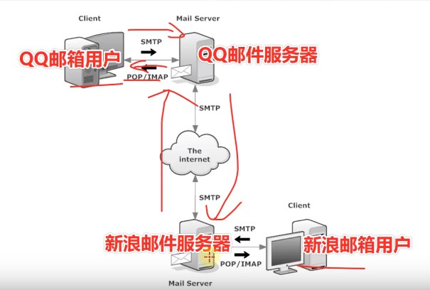

2.POS和IMAP

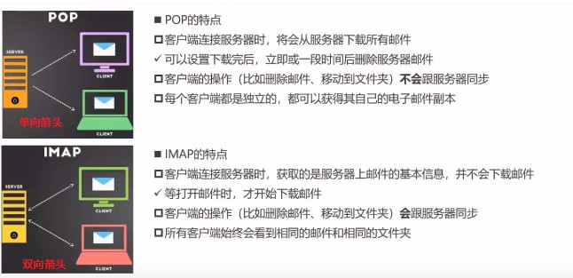

#### 14.补充知识

##### 	1.VPN

###### 	1.概述

​	VPN（Virtual Private Network），译为：虚拟私人网络。它可以在公共网络上家里专用网络，进行加密通讯。即原来是用来安全上网的，现在也被用来科学上网。

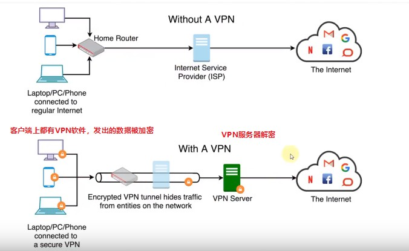

###### 	2.VPN作用

​	提高上网的安全性

​	保护公司内部资料：公司内部架设一台VPN服务器

​	隐藏上网者的身份：最后暴露的是VPN服务器的IP

​	突破网站的地域限制：有些网站针对不同地区的用户展示不同的内容

​	突破网络封锁：

​		因为有GWF的限制，有些网站在国内上不了。Great Firewall of China：中国长城防火墙。

​		购买能够访问这些网站的VPN服务器

###### 	3.VPN和代理的区别

​	软件：VPN一般需要安装VPN客户端软件，代理不需要安装额外的软件

​	安全性：VPN默认会对数据进行加密，代理默认不会对数据进行加密。（数据最终是否加密取决于使用的协议本身）

​	费用：一般情况下，VPN比代理贵。

###### 4.VPN的原理

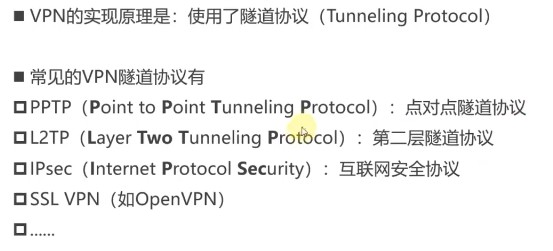

​		这些协议一般工作在传输层和数据链路层：能修改从应用层传下来的数据。

##### 2.tcpdump

一个Linux平台的抓包工具，命令行界面。

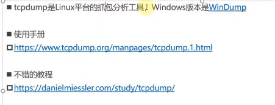

##### 3.网络爬虫

1.网络爬虫（Web Crawler），也叫做网络蜘蛛（Web Spider）。

模拟人类使用浏览器操作页面的行为，对页面进行相关的操作。

常用爬虫工具：Python的Scrapy框架。

2.网络爬虫-简易实例：

​	可以使用Java的一个小框架Jsoup爬一些简单的数据

​	jar包：https://jsoup.org/packages/jsoup-1.13.1.jar

​				https://mirror.bit.edu.cn/apache//commons/io/binaries/commons-io-2.8.0-bin.zip

​	爬取目标：https://ext.se.360.cn ，江湖推荐，良心推荐部分的图标。

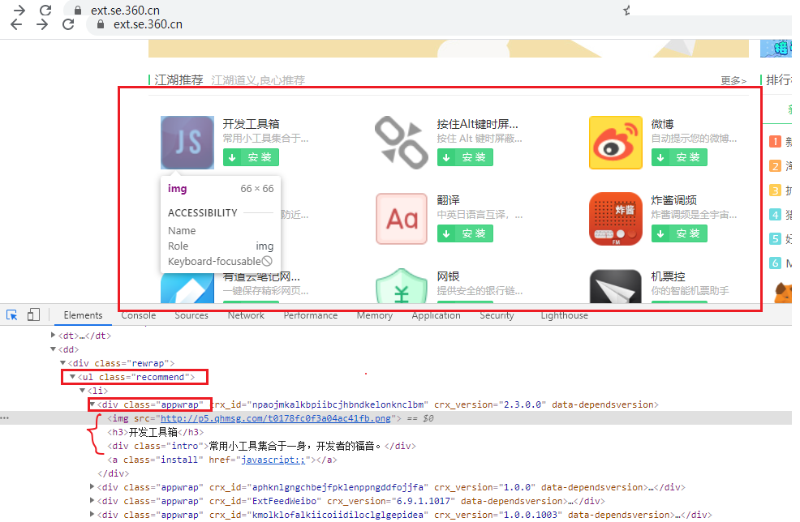

​	代码：

```java
package com.mj;

import org.apache.commons.io.FileUtils;
import org.jsoup.Jsoup;
import org.jsoup.nodes.Document;
import org.jsoup.nodes.Element;
import org.jsoup.select.Elements;

import java.io.File;
import java.net.URL;

/**
 * 描述：
 *
 * @author txl
 * @date 2021-03-23 10:02
 */
public class Main {
    public static void main(String[] args) throws Exception {
        //请求网站：https://ext.se.360.cn
        String dir = "D:/txl/imgs/";
        String url = "https://ext.se.360.cn";
        Document document = Jsoup.connect(url).get();//得到html页面
        Elements elements = document.select(".recommend .appwrap");
        for (Element element : elements) {
            String img = element.selectFirst("img").attr("src");
            String title = element.selectFirst("h3").text();
            String intro = element.selectFirst(".intro").text();
            System.out.println(img + "--" + title + "--" +intro);

            String filepath = dir + (title + ".png");
            FileUtils.copyURLToFile(new URL(img), new File(filepath));
        }
    }
}
```

​	爬取效果：

​	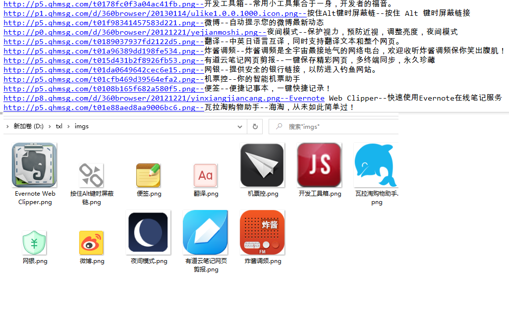

3.robots.txt

​	robots.txt是存放于网站根目录下的文本文件，比如https://www.baidu.com/robots.txt

​		用来告诉爬虫：哪些内容是不应该被爬取，哪些是可以被爬取的。

​		因为一些系统中的URL是大小写敏感的，所以robots.txt的文件名应统一为小写。

​	他并不是一个规范，只是约定俗成的，所以并不能保证网站的隐私。

​		只能防君子，不能防小人，无法阻止不讲“武德”的年轻爬虫爬取隐私数据。

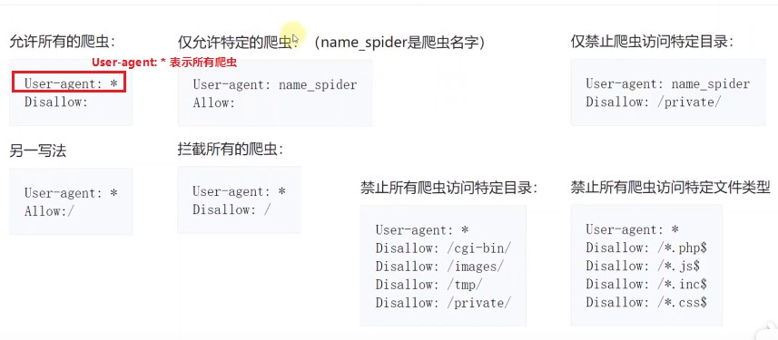

##### 4.HTTP缓存

​	Cache的发音跟Cash（现金）一样。

​	通常会缓存的情况是：GET请求+静态资源（比如HTML，CSS，JS，图片等）

​		Ctrl + F5：可以强制刷新缓存。

###### 1.缓存-响应头

​	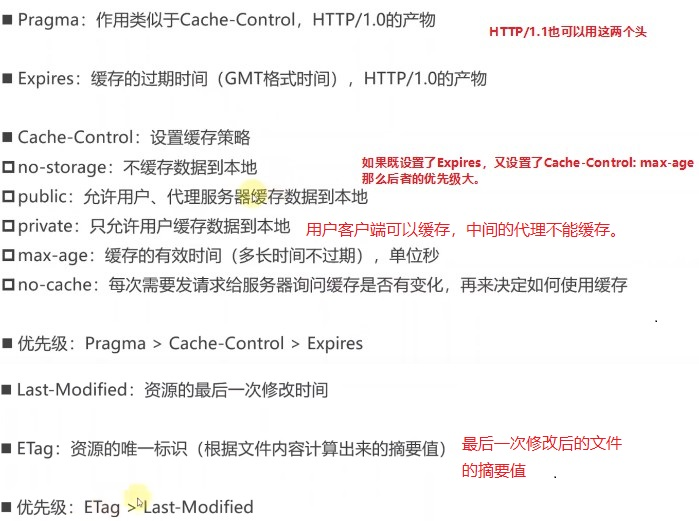

###### 	2.理解一个大概的机制

​		浏览器第一次请求得到的数据，通常会将一些静态资源缓存到本地，内存中或者磁盘中，并且响应头中会有这些缓存的过期时间。

​		在过期时间之内，浏览器再次请求这些数据时会直接从本地缓存获取。当过期时间结束，缓存过期时，浏览器再次请求这些数据，服务器收到请求后，并不会立马将资源返回给客户端。而是先从请求头的一些信息中判断这次请求的资源有没有变化，如果没有变化，那么会返回给客户端一个：304 Not Modified状态码。告诉浏览器这次请求的资源没有变化，可以直接从缓存中获取，并且刷新缓存时间。

​		304 Not Modified：说明无需再次传输请求的内容，也就是说可以使用缓存的内容。

​		客户端会缓存一些静态资源，比如HTML页面。			

​		服务器发现客户端这次请求的内容我上一次已经给过你了，而且这次请求的内容在我的服务器这边根本就没有动过。`服务器端就会返回一个304状态码给客户端，和一些常规的响应头，不返回请求的资源了。`告诉客户端这次响应的内容，我就不响应给你了，你直接从自己的缓存中拿吧。

###### 	3.Cache-Cotril: no-cache

​		表示每次都要发请求给服务器询问缓存是否有变化，如果没有变化，那么服务器换返回304 Not Modified状态码，可以直接使用缓存的内容。如果有变化，那么必须从服务器请求新的数据。

###### 	4.缓存-请求头

​	if-None-Match

​		如果上一次的响应头中有Etag，就会将Etag的值作为请求头的值。

​		如果服务器发现资源的最新摘要值跟if-None-Match不匹配，就会返回新的资源（200 OK）

​		否则，就不会返回资源的具体数据（304 Not Modified），告诉浏览器直接从缓存拿

​	if-Modified-Since

​		如果上一次的响应头中没有Etag，有Last-Modified，就会将Last-Modified的值作为这个请求头的值

​		如果服务器发现资源的最后一次修改时间晚于If-Modified-Since，就会返回新的资源（200 OK）

​		否则，就不会返回资源的具体数据（304 Not Modified）

###### 	5.Last-Modified和ETag对比

​		Last-Modified的缺陷：

​			1.只能精确到秒级别，如果资源在1秒内被修改了，客户端将无法获取最新的资源数据。

​			2.如果某些资源被修改了，但是内容却没有变化。比如删掉一个字符，又加上这个字符，那么最后一个修改时间会更新，但是内容却没有变化。

​			导致相同数据重复传输，应该使用缓存时没有使用缓存。

​		ETag可以克服这些缺点

​			1.只要资源的内容发生变化，ETag的值就会变化。

​		`所以ETag的优先级高于Last-Modified。`

###### 	6.缓存的使用流程

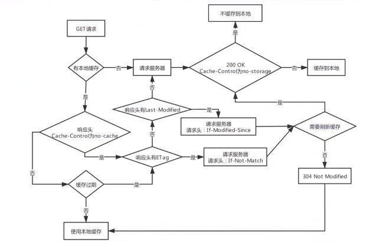

##### 5.IPV6

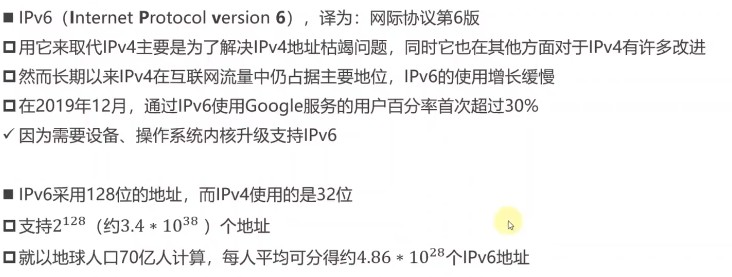

​	IPV6的地址格式

​		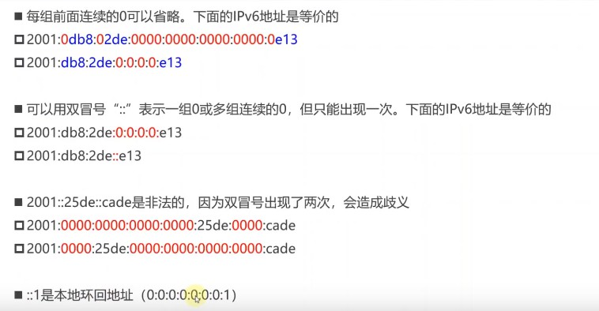

IPV6首部格式

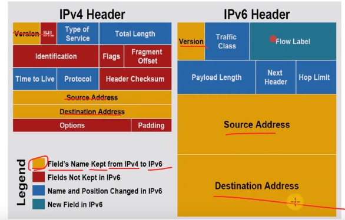