## 路由

- 在不同网段之间转发数据，需要有路由器的支持

- 默认情况下，路由器只知道跟它直连的网段，非直连的网段需要通过静态路由，动态路由告诉它。

- 1. 静态路由

     管理员手动添加路由信息

     适用于小规模网络

  2. 动态路由

     路由器通过路由选择协议（比如RIP，OSPF）自动获取路由信息

     适用于大规模网络

### 1.练习1：如何让4台主机之间可以互相通信

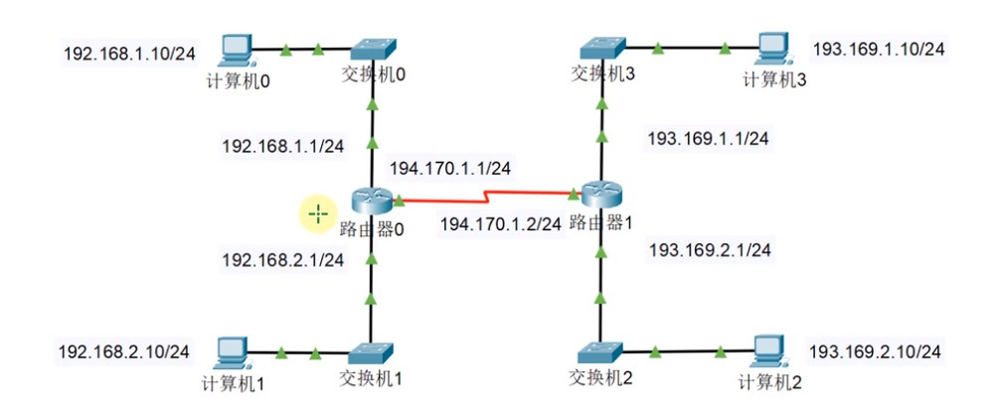

- 1.默认情况下，路由器只知道跟它直连的网段：所以计算机0和计算机1能通信；计算机2和计算机3能通信。
- 2.中间连接两个路由器的部分应该怎么设置？
- 3.尝试ping一下计算机0和计算机3：

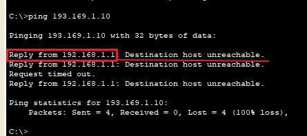

​		ping不通，因为计算机0和计算机3不是直连在一个路由上。

​		注意：是路由网关192.168.1.1返回的消息，目的主机无法到达。因为路由器直接发现目的地，不是直连在该路由上，无法到达，所以返回给源主机该信息。

### 2.通过配置静态路由使计算机0和计算机3进行通信

1.打开路由8进行配置：

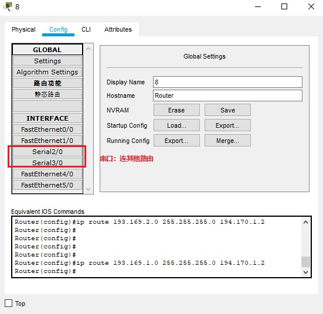

​			

2.路由0和路由1之间通过Serial2/0连接：互相连接的路由要为串口配置ip地址，而且ip地址要在一个网段。

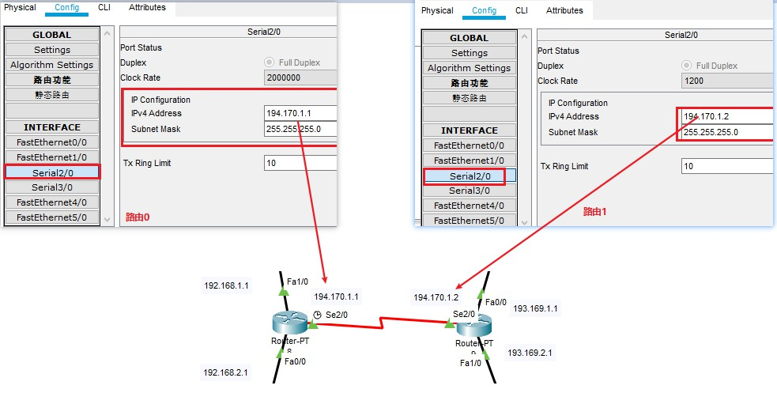

3.配置静态路由：当计算机0的目的地址是193.169.2.10时，走到路由器0。路由器0在路由表中进行匹配，路由表中存在静态路由。发现要先通过194.170.1.1找到路由器2，才能到193.169.2网段。

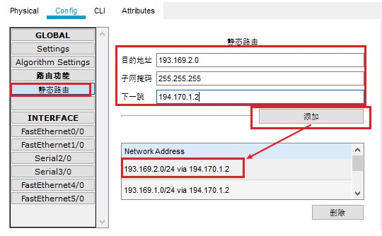

​		

4.查看路由表

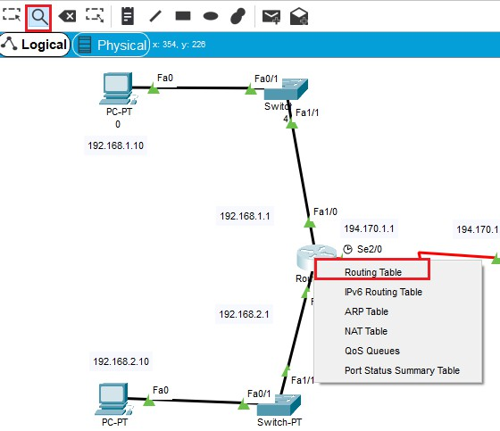

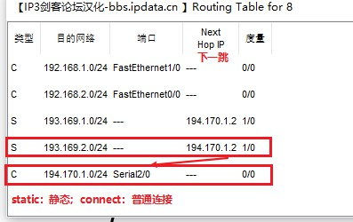

​		路由器0目前知道5个网段该怎么走：
​		192.168.1.0;
​		192.168.2.0;
​		193.169.1.0;
​		193.169.2.0;
​		194.170.1.0;

5.同理：路由器1要先通过194.170.1.1找到路由器0，再返回响应给计算机0

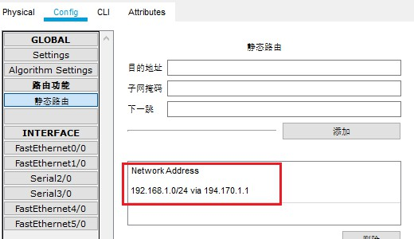

6.路由表不配置网段，只配置一个特定的ip。

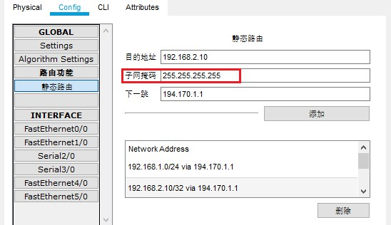

​	在路由器1中，配置了一个路由。目的地址是192.168.2.10且子网掩码是255.255.255.255。说明只匹配一个ip地址，而不是网段。
​	或者说在192.168.2.0这个网段中，路由1只能找到192.168.2.10这个ip，其他ip找不到。

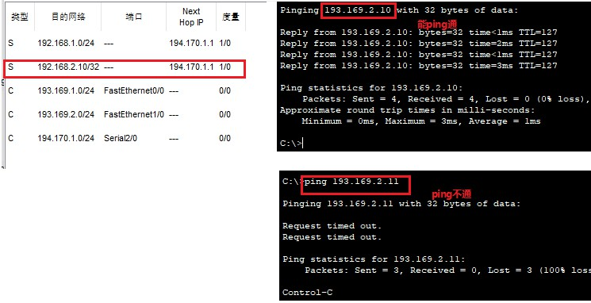

7.默认路由：没有在路由表中指定的，就走默认路由。

### 3.公网和私网

* IP地址也可以分为：公网ip和私网ip

  1.公网ip(Public)

  ​	1.Internet上的路由器只有到达公网的路由表，没有到达私网的路由表。

  ​	2.公网ip由因特网信息中心（Inter NIC）统一分配和管理。

  ​	3.ISP（移动，电信...）需要向Inter NIC申请公网IP。

  2.私网IP(Private)

  ​	1.主要用于局域网，下面是保留的私网网段

  ​	A类：10.0.0.0/8，一个A类网络

  ​	B类：172.16.0.0/16 ~ 172.31.0.0/16，16个B类网络。

  ​	C类：192.168.0.0/24 ~192.168.255.0/24，256个C类网络

* 重点：因特网中的路由器默认是无法知道私网ip的，无法通信。那么我们平常上网是如何连接到外网的呢？

* 私网ip给因特网中的一个公网ip发送请求时：源私网ip地址，会被因特网中的路由器转换成一个公网ip地址。这也成为NAT转换。

### 4.NAT

​	Network Address Translation

​	网络地址转换技术：

​		主要用于实现位于内部网络的主机访问外部网络的功能。当局域网内的主机需要访问外部网络时，通过NAT技术可以将其私网地址转换为公网地址，并且多个私网用户可以共用一个公网地址，这样既可以保证网络互通，又节省了公网地址。

​		企业或家庭所使用的网络为私网，使用的是私网地址；

​		运营商维护的网络为公共网络，使用的是共有地址。

​		会隐藏内部真实IP。

​		**私有地址不能在公网中路由，此时需要用到NAT技术进行地址转换（一般经过多个路由，进行多次转换）。**

​	

* NAT分类：

  * 1.静态转换：

    手动配置NAT映射表

    一对一转换

    不能达到节约公网的目的

  * 2.动态转换

    定义外部地址池，动态

* PAT：Port Address Translation

  * 目前应用最广范的NAT实现方式。
  * 多对一转换，最大限度节约公网IP资源。
  * 采用端口多路复用方式，通过端口号标识不同的数据流。

### 5.第一个包会丢失

​	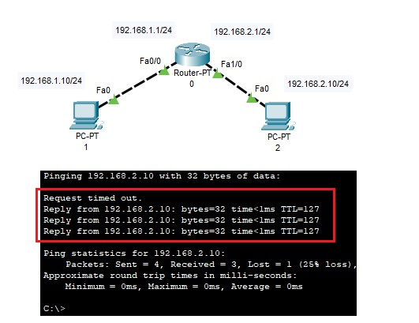

​	1.ping两个不同网段的ip地址时，会出现第一个包丢失的问题。

* 过程

  1.计算机1发送目的地址是不同网段的，那么会给网关发一个ARP广播。

  告诉计算机1网关的MAC地址什么。

  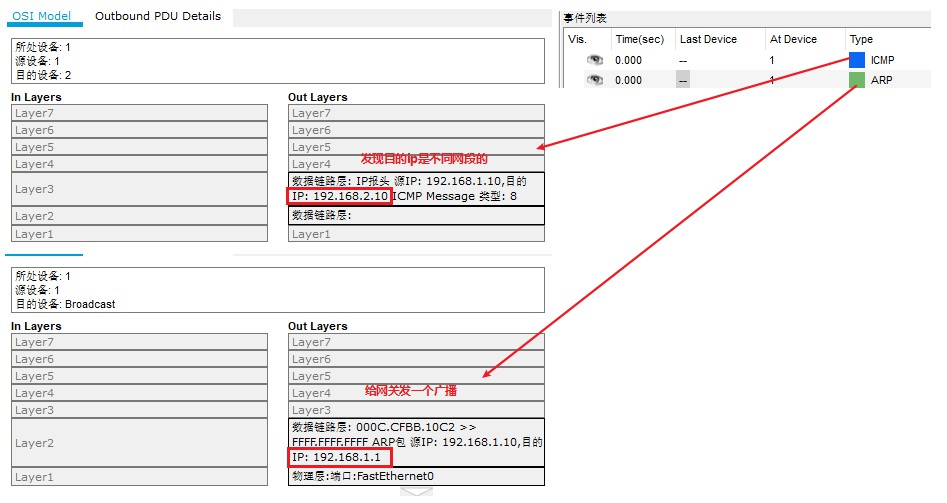

  2.网关将自身的MAC地址通过ARP返回给计算机1

  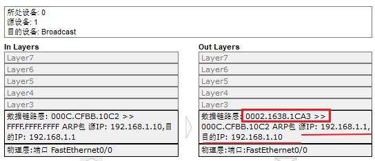

  3.计算机1收到网关的MAC地址，先通过ICMP协议发送数据包发到网关192.168.1.1

  ​	注意这个ICMP协议包的目的地址其实是192.168.2.10，目标MAC地址是网关192.168.1.1的MAC地址。

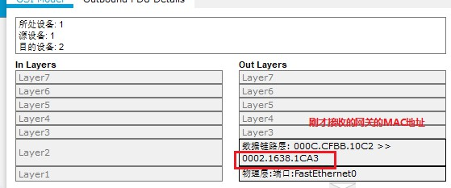

​		4.计算机1把数据包发给网关的时候，路由器发现这个数据是给192.168.2.10的。

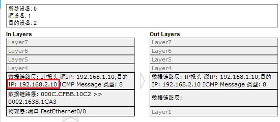

​			但是路由器第一次不知道这个ip的MAC地址，所以不能直接将ICMP协议包发给目的ip。**所以路由器会把ICMA包丢掉。**因为忙不过来，要先发ARP找到目的MAC。

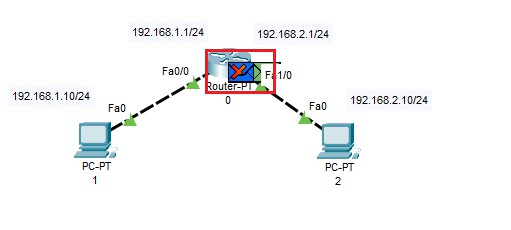

​				然后发一个ARP，寻找192.168.2.10的MAC地址。

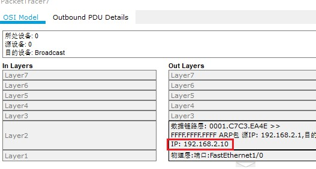

​		5.之后路由就会缓存192.168.2.10的MAC地址。

​		6.小结：在第一次跨网段通信时，计算机1判断目标地址不在同一个网段。那么要通过路由网关来实现跨网段通信。会先发一个ARP给路由，获得网关的MAC。然后知道网关MAC后，会将ICMP包携带着目标ip，网关mac发给网关。网关第一次也没有目标ip的mac，所以也要先发一个arp找到目标mac，缓存下来。但是路由忙不过来，就会丢掉计算机1发的icmp包，而去发arp包获得目的ip的mac。

​			这样第一次跨网段通信就会产生第一次包丢失问题，后续就建立好正常通信了。

