### 1.网络互联模型

​		为了更好地促进互联网的研究和发展，国际标准化组织ISO在1985年制定了网络互连模型。

​		1.OSI参考模型，具有7层结构：偏理论

​		2.TCP/IP协议模型：实际应用中用的最多，偏实际。

​			所以TCP/IP是一种网络互连模型的名称。

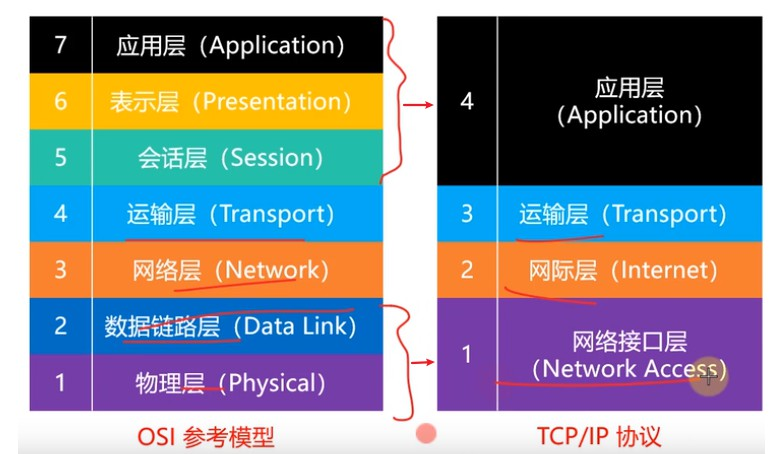

​		3.为了方便学习，一些教材会出现5层结构。因为数据链路层和物理层很值得单独学习。

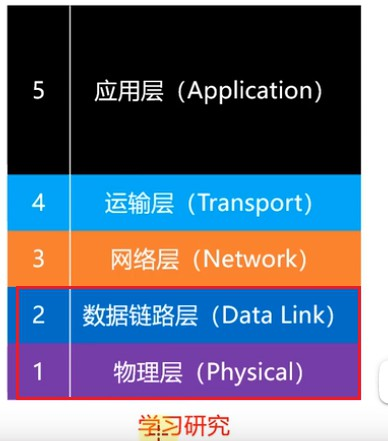

​		4.大致的请求过程

​		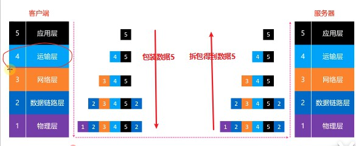

​			

​			应用层数据：报文，用户数据

​			经过运输层包装：段

​			经过网络层包装：包

​			经过数据链路层包装：帧

​			经过物理层包装：比特流

​	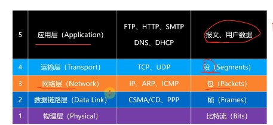

### 2.物理层（Physical）

 1. 物理层定义了接口标准，线缆标准，传输标准，传输方式等。

    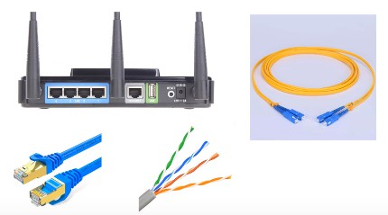
    
 2. 物理层数据

    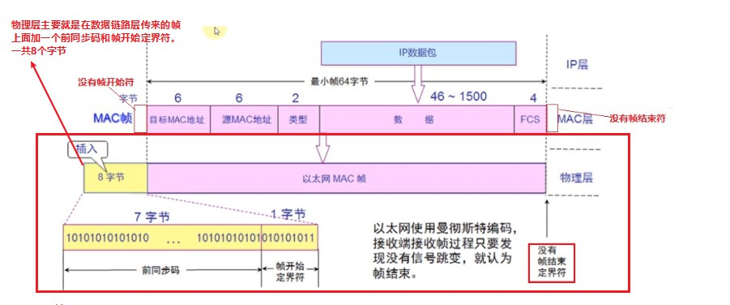

### 3.一些物理层相关概念

​	1.模拟信号

​		连续的信号，适合长距离传输

​		抗干扰能力差，收到干扰时表型变形很难纠正。

​	2.数字信号

​		离散的信号，不适合长距离传输

​		抗干扰能力强，受到干扰时波形失真可以修复。

​	3.数据通信模型

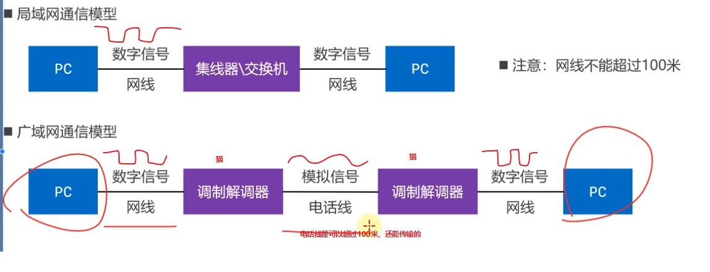

​	电话线不能传输数字信号，所以要用 猫 将数字信号转成模拟信号。

​	4.信道

​	信道：信息传输的通道，一条传输介质上（比如网线）上可以有多条信道

​	单工通信：有A，B两端进行通讯。信号只能往一个方向传输，任何时候都不能改变信号的传输方向。比如无线电广播，有限电视广播。

​	半双工通信：信号可以双向传输，但是A，B两端必须交替进行，同一时间只能往一个方向传输。比如对讲机。

​	全双工通信：信号可以同时双向传输。比如手机（打电话，听说同时进行）

### 4.数据链路层：Data Link

1.不同类型的数据链路，在数据链路层所用的通信协议可能是不同的。

​	1.广播信道：CSMA/CD协议。

​	2.点对点信道：PPP协议。

​	数据链路层的数据：帧。

​	1.链路：从一个节点到相邻节点的一段物理线路（有线或无线），中间没有其他交换节点。

​	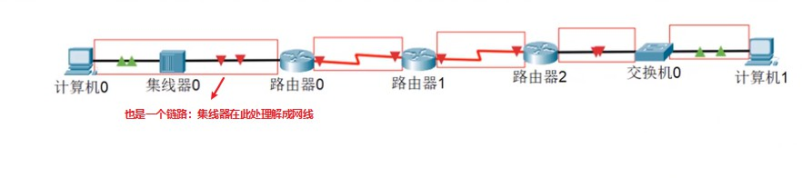

​	2.数据链路：**在一条链路上传输数据时，需要有对应的通信协议来控制数据的传输。**

​		不同类型的数据链路，在**数据链路层**所用的通信协议可能是不同的：

​		1.广播信道：CSMA/CD协议（广播信道：比如同轴电缆，集线器组成的网络）

​		2.点对点信道：PPP协议（比如两个路由器之间的信道）

​		

​	3.数据链路层的3个基本问题

​		1.封装成帧：把来自网络层的数据包封装成数据帧。

​		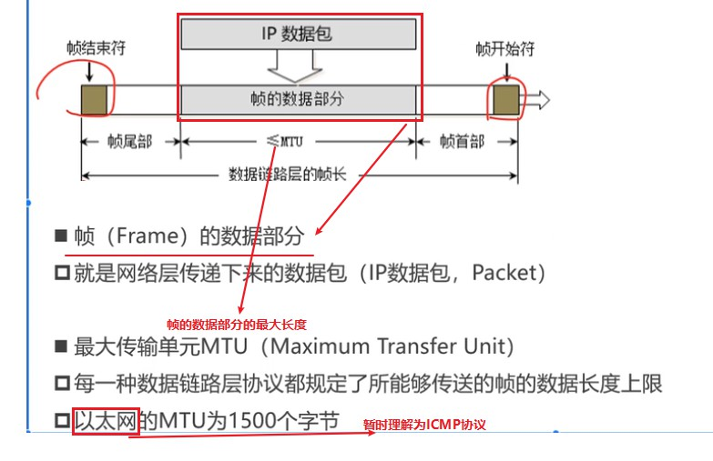

​		2.透明传输

​			帧在传输介质上传输的时候，是一连串的多个帧进行传输的。那么怎么区分那一部分是	一个完整的帧呢？

​			数据链路层在包装来自网络层的数据包时，会在帧两头加上帧首部（SOH）和帧尾部	（EOT）。但是这又会出现新的问题，如果帧的数据部分出现了SOH/EOT，这就产生冲突。导致得到一段残缺的帧。

​		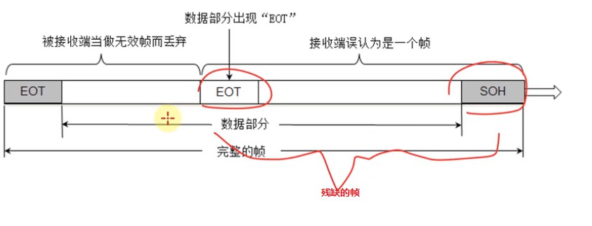

​			解决：透明传输

​				数据部分一旦出现SOH/EOT/ESC，就需要转义。加上ESC进行转义。

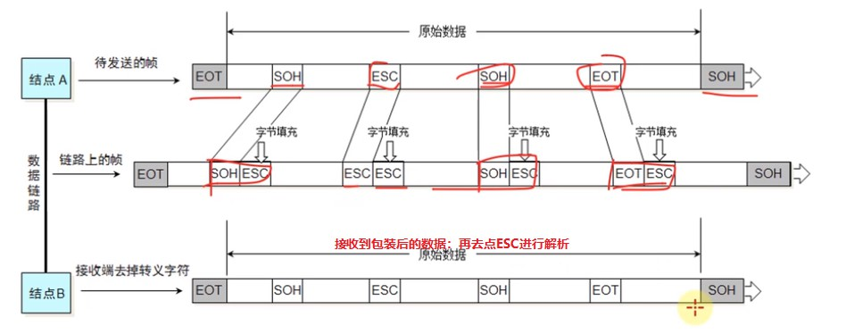

​		3.差错检验

​			考虑到帧在链路上传输时可能会发生差错，那么就有一个差错检验机制。

​			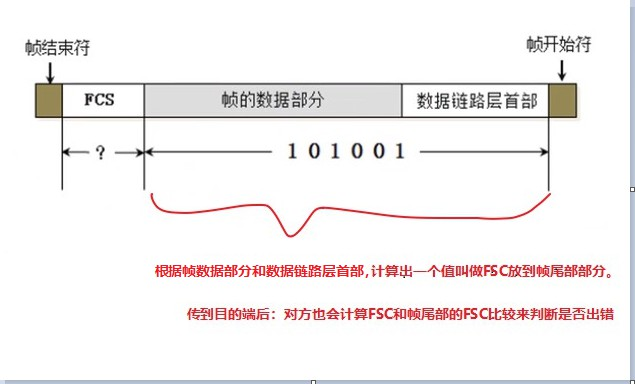

​			FCS是根据帧数据部分和数据链路层首部计算出来的。

​			目的端接收到数据后，再次进行一次计算得到FCS和帧尾部的FCS进行比较，如果出错，就丢掉该数据。

### 5.CSMA/CD协议：

1.不同类型的数据链路，在数据链路层所用的通信协议可能是不同的。

​	1.广播信道：CSMA/CD协议。

​	2.点对点信道：PPP协议。

​	1. 载波侦听多路访问/冲突检测

​	例如集线器组成的网络，是半双工通信的，同一时间只能往一个方向传输。

​	载波侦听：某一端会监听线路上是否有信号在传输，有的话就不发数据；没有的话，才发。

​	多路访问：各个端都可以发送信号。

​	冲突检测：如果两个端（计算机）同时检测线路上没有信号在传输，那么就会都发信号。但是此时由于是半双工通信，就会发生冲突。信号发生冲突，就会往回弹。所以计算机要能判断出收到的信号是来自其他端直接发送的还是因为冲突弹回来的。

​	2.使用了CSMA/CD的网络可以称为是 以太网，他传输的以太帧。比如集线器，交换机组成的网络。（局域网）

​	以太网帧的格式有：Ethernet V2标准， IEEE的802.3标准。

​	使用最多的是：Ethernet V2标准。

​	3.用交换机组建的网络，已经支持全双工通信。不需要再使用CSMA/CD协议，但它传输的帧依然是以太网帧。

​		所以用交换机组建的网络仍然可以叫做以太网。

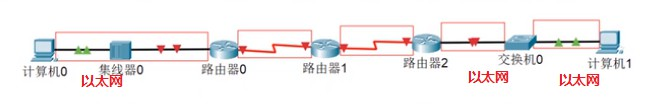

​	4.为了能够检测正在发送的帧是否产生了冲突，以太网的帧`至少`要64字节。

​		以太帧一般是传输信道的2倍，这样发生冲突时，信号会回弹。弹回到发出点时，会发现该信号还在发送（因为是信道的2倍）。那么就可以认定该信号发生了冲突。

### 6.Ethernet V2帧的格式

 1. Ethernet V2帧的格式：不需要帧开始符和帧结束符。

    那么接收帧时，怎么判断帧结束怎么判断帧开始呢？

    以太网使用曼切斯特编码。接收端接收帧过程只要发现没有信号跳变，就认为帧结束。
    
 2. 帧在传到物理层时，会在帧起始位置加上前同步码和帧开始定界符，一共8字节。

    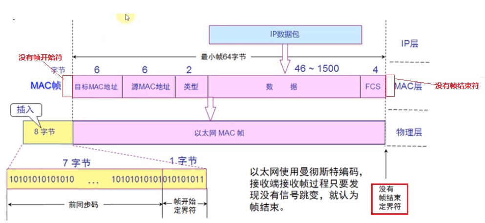

 3. 首部：目标MAC+源MAC+网络类型（IPV4/IPV6）

    以太网帧：首部+`数据(网络层传过来的IP数据包)`+FCS

    数据部分的长度至少是：64-6-6-2-4=46字节，最多是1500字节

 4. 当数据部分的长度小于46个字节时，数据链路层会在数据的后面加入一些字节填充，当接收端接收时又会将填充的部分去掉。

    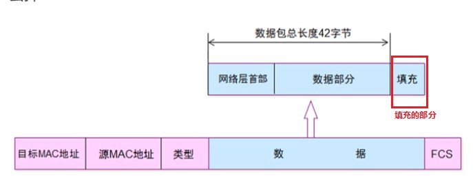

 5. 长度总结：

    以太网帧的数据长度：46~1500字节

    以太网帧的长度：64~1518字节

 6. 数据链路层为网络层传下来的数据包添加的内容：

    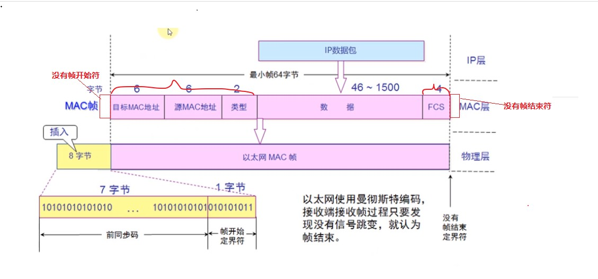

    目标MAC+源MAC+网络类型+FCS。

### 7.PPP协议：

1. 不同类型的数据链路，在数据链路层所用的通信协议可能是不同的。

   ​	1.广播信道：CSMA/CD协议。

   ​		在广播信道中，数据是会传输给各个端的，所以需要源MAC和目标MAC来确保接收端和发送端。

   ​	2.点对点信道：PPP协议，两个路由之间的链路。

   ​		点对点信道中，数据传输的两端是确定的，所以不需要源MAC和目标MAC。

2. 一些PPP帧的特点：

   1.因为是点对点通信，所以两端是确定的，顺着链路方向只能到达确定的一端。所以不需要源MAC地址和目标MAC地址。

   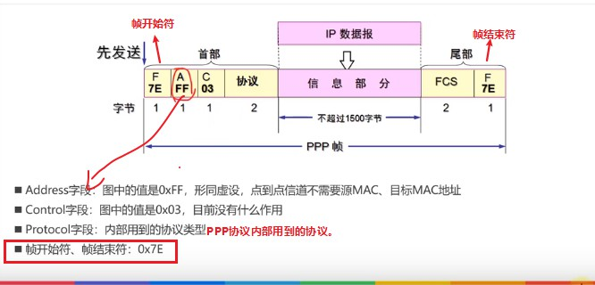

   2.PPP帧和以太网帧是不一样的，但数据部分都是相同的，都是从IP层传下来的。

   3.如果俩个路由器之间有一个交换机，那么路由器和交换机传输的就是以太网帧，有源目的MAC的。
   
   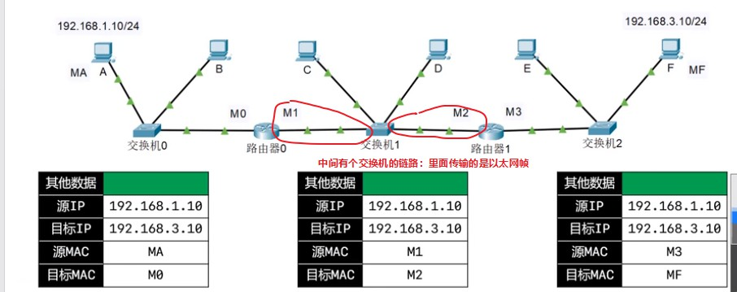
   
   
   
### 8.网卡

   	1.网卡工作在物理层和数据链路层。

​	     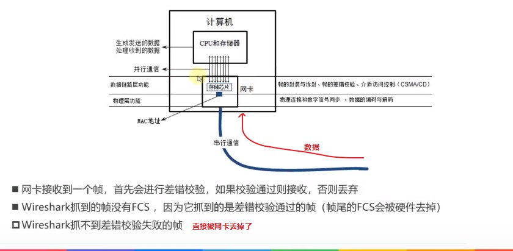

