### 4.网络层

​	1.网络数据包（IP数据包，Packet）由首部，数据2部分组成

​	2.数据部分：很多时候是由传输层传递下来的数据段（Segment）

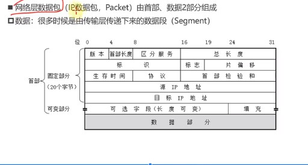

#### 1.网络层首部：由两部分组成。

##### 1.固定部分：固定20个字节

​	1.版本（Version）：占4位

​		0b0100：IPV4

​		0b0110：IPV6

​	2.首部长度（Header Length）：占4位，二进制乘以4才是最终长度

​		最小值：0b0101，对应的十进制值是5，所以最终首部长度最小是5*4=20字节

​		最大值：0b1111，对应的十进制值是15，所以最终首部长度最大时15*4=60字节。

​		由于首部固定长度是20字节，所以可变长度是0~40字节。

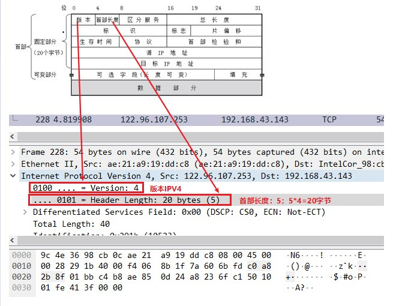

​	3.总长度：Total Length

​		占16位

​		1.首部+数据部分的长度之和，即整个数据包的长度，最大值是65535字节。

​		2.整个数据包是要传给数据链路层作为帧的数据部分的，但是帧的数据部分不能超过1500字节，所以过大的IP数据包，会被分成片（fragments）传输给数据链路层。

​		   而且每一片fragments都有自己的网络层首部（IP首部）。

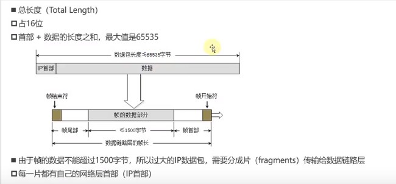

​	4.区分服务：Differentiated Services Field

​		1.占8位，可以用来提高网络的服务质量，Quality of Service

​		2.没有值时：0x00；如果值是0x40，可能路由器就会优先传输这个给IP包，即提高网络服务质量。

​	5.标识（Identification）：

​		1.占16位，数据包的ID，当数据包传给数据链路层时，发现数据包过大，数据包就会进行分片。每一片fragments都有自己的IP首部，而且这些片的IP首部的标识部分都一样。这样就能区分哪些片是一个IP包拆分的。

​		2.数据包的ID：代表是哪个IP包。而且有一个计数器专门管理数据包的ID，没发出一个数据包，ID就加1。

​		3.这个时候虽然能确定下来片fragments属于哪个数据包，但是怎么确定哪个片属于数据包的哪个部分呢？

​	6.片偏移（Fragment Offset）

​		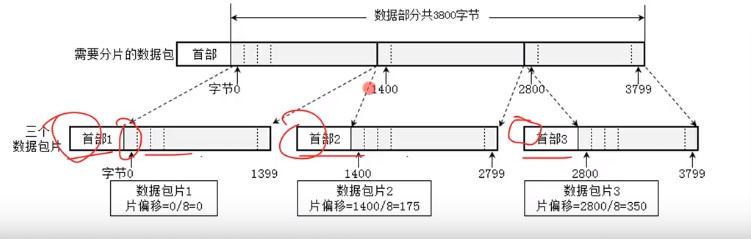

​		1.占13位，片偏移乘以8：字节偏移，每一片的长度一定是8的整数倍。

​		2.字节偏移：

​			第一片：从IP数据包首部后的第0字节处开始算，共1400字节

​			第二片：从IP数据包首部后的第1400字节处开始算，共1400字节。

​			第三片：从IP数据包首部后的第2800字节处开始算，共1000字节。

​			所以第一片的字节偏移是0，其IP首部中片偏移就是0/8=0

​			第二片的字节偏移是1400，其IP首部中片偏移就是1400/8=175

​			第三片的字节偏移是2800，其IP首部中片偏移就是2800/8=350

​		3.为什么不直接用字节偏移呢，而是要再除以8，用片偏移呢？

​			因为存放偏移量的这部分一共才13位，最大值是8192-1=8191。而整个IP数据包的最大长度是65535字节。所以如果用字节偏移量的话，很可能13位不够表示。

​	7.标志（Flags）

​		1.占3位，每一位有不同的含义。

​		2.第一位（Reserved Bit）：保留位

​		3.第二位（Don't Fragment）：1代表不允许分片，0代表允许分片

​		4.第三位（More Fragments）：1代表不是最后一片，0代表最后一片。

​		一旦发现第三位是0，说明这个网络层的数据包已经组装好了。

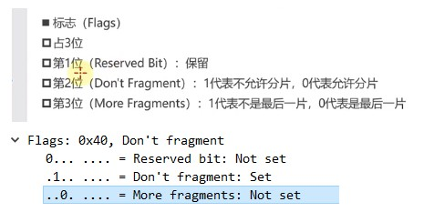

​	8.协议和首部检验和

​		网络层的数据是从运输层传下来的，那么`运输层用的什么协议`会被记录下来，放在网络层首部的协议位置处。

​		另外，ICMP也有协议字段，但是这些协议是被划分到网络层的。

​		

​		传输层的TCP协议的数据，或者UDP协议的数据，都会传输给网络层，被打包成IP协议的数据。

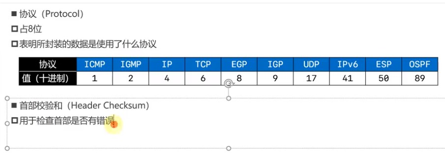

​	9.生存时间：Time To Live, TTL

​		占8位

​		1.每个路由器在转发之前都会将TTL减1，一旦发现TTL减为0，路由器会返回错误报告。

​		2.各个操作系统的发送数据的默认TTL。

​		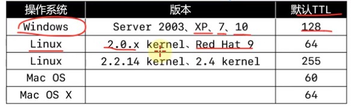 

​		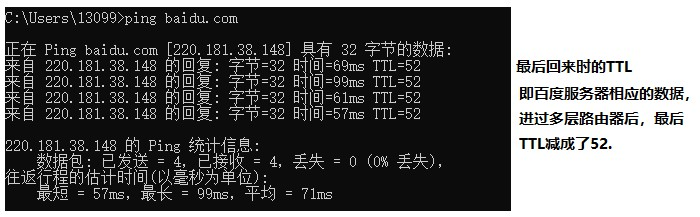

​			所以百度服务器应该是部署在linux服务器上，所以中间经历了64-52=12个服务器。

​		3.ping baidu.com -i 1

​			设置ping的数据的TTL是1，那么经过第一个路由器时就会减成0，就不会往下再发送包，而是返回报错信息。

​			我得ip：192.168.43.143。所以我的第一个网关地址就是192.168.43.1：

​			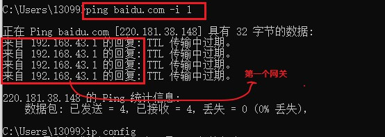

##### 2.工作在网络层的协议

​	ARP，IPV4/IPV6，ICMP。

​	传输层的TCP协议的数据，或者UDP协议的数据，都会传输给网络层，被打包成IP（IPV4、IPV6）协议的数据。

​	1.网络数据包的数据部分很多时候就是由传输层传递下来的数据段。但是这个不是绝对的，因为有时候的传输过程没有用到应用层，传输层等。

​		比如发送一个ICMP包，ICMP协议是专门工作在网络层的协议。直接在网络层组织一个ICMP包，发送给接收端，此时网络数据包的数据部分就不是来自传输层了。

​	2.ARP虽然更贴近数据链路层，ICMP协议在网络层上，但都划到了网络层。

#### 2.ping的几个用法：

​	ping发的是ICMP协议数据

​	1.ping /?：查看ping的用法

​	2.ping ip地址 -l 数据包大小：发送指定大小的数据包

​	3.ping ip地址 -f：不允许网络分层。

​	4.ping ip地址 -i TTL：设置TTL的值

​	5.通过tracert，pathping命令，可以跟踪数据包经过了哪些路由器。

​		tracert baidu.com

​		pathping baidu.com

#### 3.ping bilibili.com -l 4000

​	ping 4000个字节的包给B站，看一下包分。

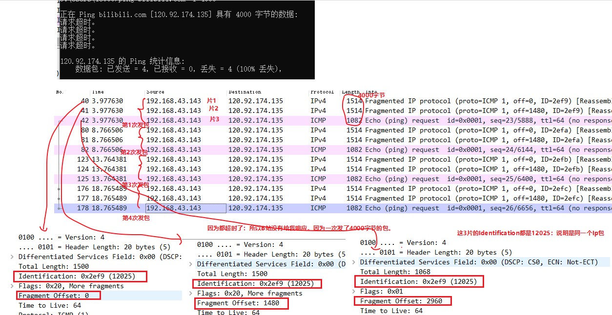

​	1.发了4次包，每次4000字节。

​	2.因为IP包是要传给数据链路层的，而数据链路层的数据部分不能超过1500字节。所以这个4000字节的IP包要分片。

​	3.那么就是这个包要分三片，发现这3片的IP网络层首部的表示部分Identification都是12025，所以这三篇属于同一个包。

​	4.这里的Fragment Offset部分是乘以8之后的结果。

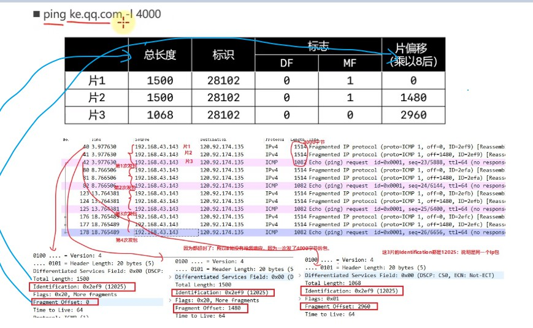