### 1.传输层Transport

1.传输层的TCP协议的数据，或者UDP协议的数据，都会传输给网络层，被打包成IP（IPV4、IPV6）协议的数据。

2.传输层主要有两个协议：

​	1.TCP（Transimission Control Proticol），传输控制协议

​		如果之前的数据没有发送成功，还会再发送一次，那么就打乱了实时性（现在接收的信息，突然插入一个之前的信息）。

​	2.UDP（User Datagram Protocol），用户数据报协议。

​		如果之前的数据没有成功发过来，那我也不要了，我只关注当前的信息：音视频通话。

​		

3.两个协议的大致区别：

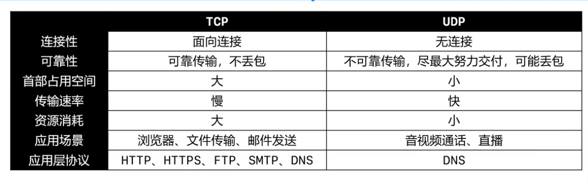

4.我们一般发送一个请求，是先在应用层用一个协议封装一个数据，然后在发给下一层，即传输层。

​	TCP协议一般封装的是，来自应用层的HTTP/HTTPS等协议封装的数据

​	UDP协议一般封装的是，来自应用层的DNS协议封装的数据。

#### 1.UDP-数据格式

​	1.UDP是无连接的，减少了建立和释放连接的开销

​	2.UDP尽最大可能交付传输的数据，但是不保证数据的完整性，即不保证可靠交付。

​	3.因此不需要维护一些复杂的参数，首部只有8个字节。（TCP首部至少20个字节）

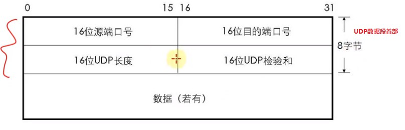

#### 2.UDP首部的构成：

​	1.UDP长度

​		16位，2字节：表示首部的长度+数据的长度

​	2.UDP校验和 Checksum

​		检验和的计算部分：伪首部+首部+数据

​		伪首部：仅在计算检验和时起作用，并不会传递给网络层。

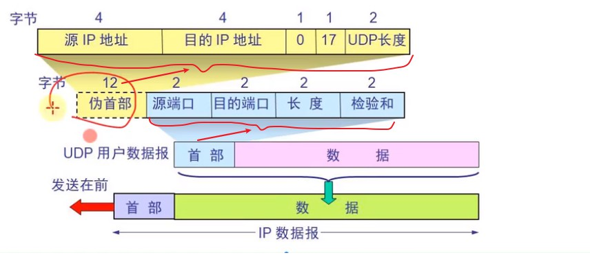

​	3.端口Port

​	 	1.服务器可以在一个端口上开启一个服务器软件，这个服务器软件来监听发送到这个端口的数据。之后服务器软件再从8080端口将数据返回给客户端。

​		2.UDP首部中每个端口部分占用2字节，可以推测出端口号的取值范围0~65535。

​		3.客户端的源端口是应用软件发送请求时的端口，而且是临时开启的随机端口，不固定。

​			临时开一个端口发数据，所以同一个应用软件前后两次发数据时，源端口很可能是不一样的。

​		4.服务响应请求，返回数据时。此时UDP数据包首部中的目的端口部分，就是客户端发送这个数据的源端口。

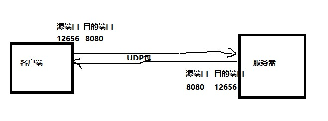

​			客户端接收到响应的数据，发现目的端口是12656，就会恍然；原来是响应我上次从12656端口发送的数据。

​			服务器发送数据时，源端口不变。

​		5.防火墙可以设置开启/关闭一些端口来提高安全性。

​			常用命令行：

​			netstat -an：查看被占用的端口

​			netstat -anb：查看被占用的端口，占用端口的应用程序。

​			telnet 主机 端口：查看是否可以访问主机的某个端口

​				安装telnet：控制面板-程序-启用或关闭Windows功能-勾选"Talnet Client"

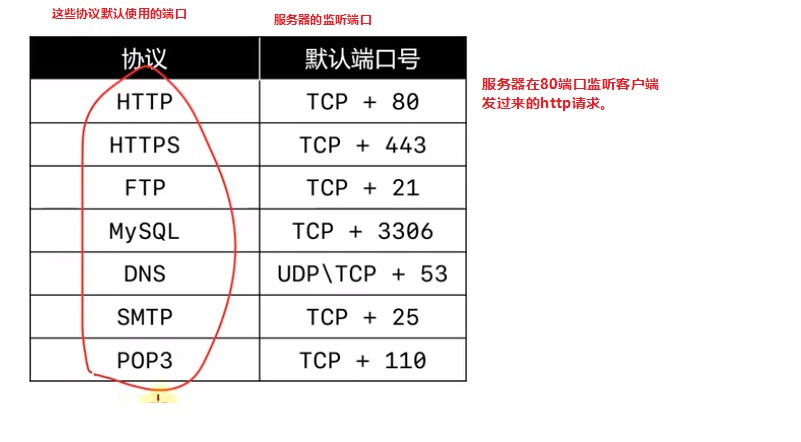

#### 3.注意服务器默认是用80端口监听http请求的

​	1.Tomcat服务器软件默认配置的监听的端口是8080，所以我们访问部署在Tomcat服务器上的应用时，一般要加上:8080来访问。

​	2.我们访问百度时：www.baidu.com 我们输入了域名，域名在解析成ip地址时，自动找到了百度服务器。但是我们没有指明端口呀，因为监听http请求的默认端口是80，即80可以不加。

​	3.如果我们`想要直接访问部署在tomcat下的项目,不加8080端口`，通过直接访问网址不加8080端口。可以通过niginx监听http请求，监听80端口，然后转发给8080端口。

#### 4.抓包看一下UDP数据

1.传输层的首部是1f 40 0f a8 00 3f 0e 73这8个字节，下面的部分02开始是传输层的数据部分。

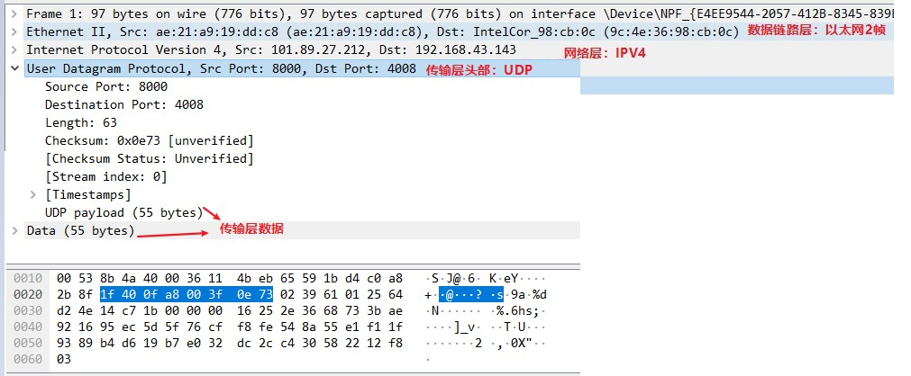

​	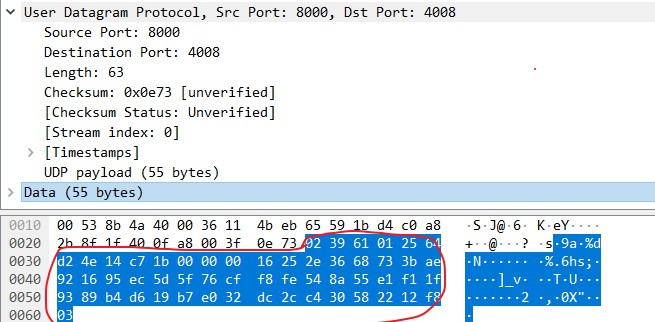

​	2.传输层的数据会传给网络层，被封装成包：而且数据部分是从1f 40 0f a8 00 3f 0e 73这8个字节开始。

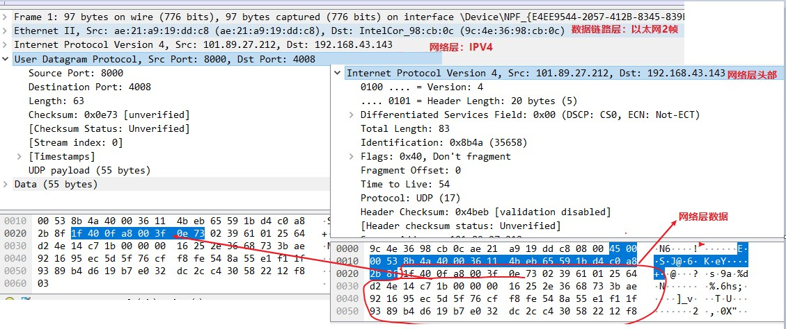

### 2.传输层协议：TCP协议

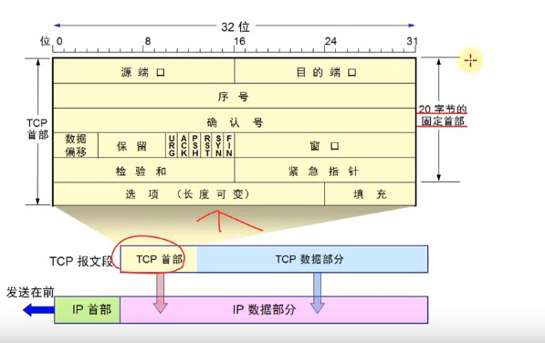

​	1.TCP协议的几个要点

​		1.可靠传输

​			先大致了解一下：

​			如果服务器响应给客户端的数据太大，那么会切成不同的包一次发过去。客户端每接收一个包都会给服务		器一个回应：我收到这个了这个包。服务器就会知道这个给包成功发送了。

​			如果有一个包在发送过路程中被路由器丢掉了，那么客户端收不到这个包，服务器也就收不到客户端给		服务器关于接收到这个包的响应。那么服务器在之后就会重新再发送一遍这个包。

​		2.流量控制

​		3.拥塞控制。

​		4.连接管理

​			1.建立连接

​			2.释放连接

#### 1.TCP协议报文段首部

​	1.TCP协议报文段首部包含两个部分：

​		1.20个字节的固定首部部分

​		2.选项和填充部分长度不固定

​		所以TCP协议报文段的首部最少20个字节。		

#### 2.首部各组成部分

##### 1.数据偏移	

​	占4位，取值范围是0x0101~0x1111。

​	乘以4：就是TCP报文段的首部长度，最小20~最大60字节。

​	因为TCP报文段首部最小是20字节，所以数据偏移的最小值是20/4=5，0x0101。

​	这部分和网络层首部一样。

* 首部长度：就是右边数据向右的偏移量。

##### 2.保留

​	占3位，目前用不到。预防以后可能用到，现在全是0。

##### 3.标志位：

​	1.占9位，前三位是保留位

​	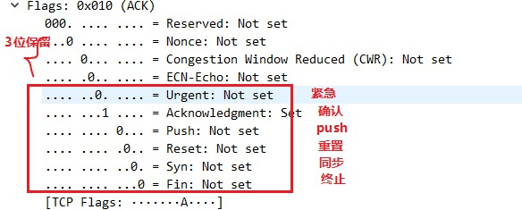

​	1.URG=Urgent

​		当URG=1时，紧急指针字段才有效。表明当前报文字段中有紧急数据，优先传输。

​		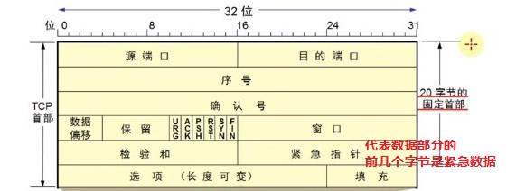

​	2.ACK=Ackownledgment

​		当ACK=1时，确认号ack字段才有效。

​	3.PSH=Push

​		一般不关注，用在交互式网络通信中。

​	4.RST=Reset

​		当RST=1时，表明连接中出现严重差错，必须释放连接，然后再重新建立连接。

​	5.SYN=Synchronization

​		1.当SYN=1，ACK=0时，表明这是一个建立连接的请求。

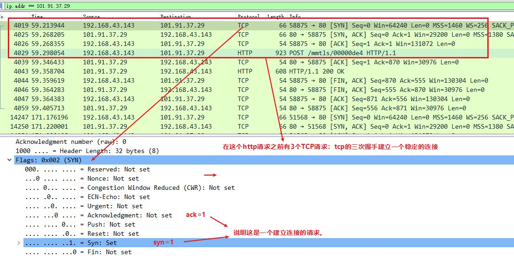

​		2.若对方同意建立连接，则回复SYN=1，ACK=1。

​		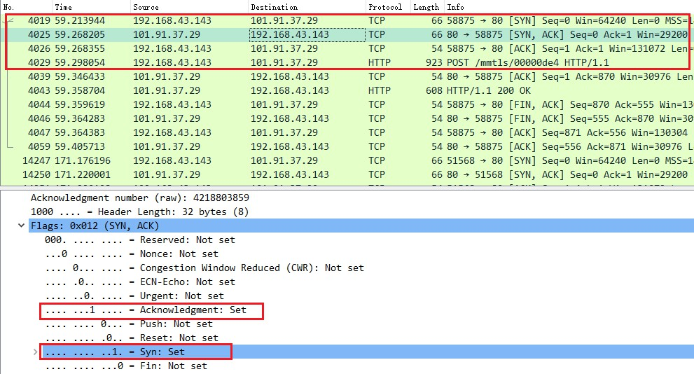

​	6.FIN=Finish

​		当FIN=1时，表明数据已经发送完毕，要求释放连接。

##### 4.注意：另一种说法

​	1.保留为6位，标志位6位。

​	但是其实两种说法差不多，因为标志位的前3位也是基本上不用的，所以会被算作保留位。

​	所以有些资料干脆说保留位6位，标志位6位。

##### 5.TCP：一个细节

​	1.UDP首部中有个16位的字段记录了整个UDP报文段的长度（首部+数据）；

​	但是TCP首部中仅仅有4位的字段记录了TCP报文段的首部长度，并没有字段记录TCP报文段的数据长度。

​	2.那怎么知道TCP报文段的数据长度呢？

​	1.其实UDP首部的这个记录UDP报文段的长度的字段是冗余的，不用这个字段也能就计算出UDP报文数据部分		的长度：

​		UDP首部固定是8字节

​		所以UDP数据部分是：网络层的总长度-网络层的首部长度-UDP报文首部长度

​	2.UDP的这个16位的字段，纯粹是为了保证首部是32bit对齐：

​		思考数据偏移*4代表了TCP报文段首部的长度，那么TCP报文首部长度能不能等于11？可能不行啊，

​	必须是4的倍数。所以这个16位的记录UDP报文段的长度的字段之所以占16位，就是为了满足UDP报文段

​	首部固定部分长度是4的倍数：如果没有这16位，那么UDP报文段首部固定部分长度3个字节，就不是4的倍数	  	了。

​	3.所以TCP/UDP的数据长度，完全可以由IP数据包的首部推测出来。

​		传输层的首部长度是固定的或者可知的：

​			1.UDP首部：20字节

​			2.TCP首部：存放在首部的数据偏移字段

​			3.网络层的总长度和首部长度：都有对应字段存储。

​		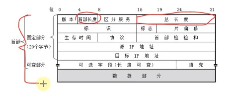

​		传输层数据部分是=网络层的总长度-网络层的首部长度-传输层报文首部长度

##### 6.TCP校验和-Checksum

​	1.跟UDP一样，TCP校验和的计算内容：伪首部+首部+数据

​	2.伪首部：占用12字节，仅在计算校验和时起作用，并不会传递给网络层。

##### 7.序号（Sequence Number）

​	1.占4字节。

​	2.首先，在传输过程中的每一个字节都会有一个编号，而且连续的字节编号也连续。；

​		类似于每一个字节都有一个内存地址。

​	3.在建立连接后，序号代表：这一次传给对方的TCP数据部分的第一个字节的编号。

​		比如A要发给B400字节的数据，分成4段发。第一个TCP报文段的数据部分是1~100，那么这个报文段的序号部分就是1（假设第一个字节的编号就是1）。

​		那么第二个报文段的数据部分就是101~200，这个报文段的序号部分就是101。

##### 8.确认号（Ackownledgment Number）

​	1.占4字节。

​	2.在建立连接后，确认号代表：期望对方下一次传过来的TCP数据部分的第一个字节的编号。

​	3.确认号ack，在标志位ACK为1时才有效。

##### 9.窗口（Window）

​	1.占2字节；

​	2.这个字段有流量控制功能，用于告诉对方下一次允许发送的数据大小（单位字节）。

#### 3.TCP可靠传输

##### 	1.实现TCP可靠传输 -- 停止等待ARQ协议

​		ARQ（Automatic Repeat-reQuest）：自动重传请求。

​		1.假设A要发送给B发送3个包，如果发送第一个包M1时，B没有接收到。那么B就不会给A发送：确认收到M1包这个消息。然后A端等待接收这个消息，直到超时。然后就会重新发送M1包。

​		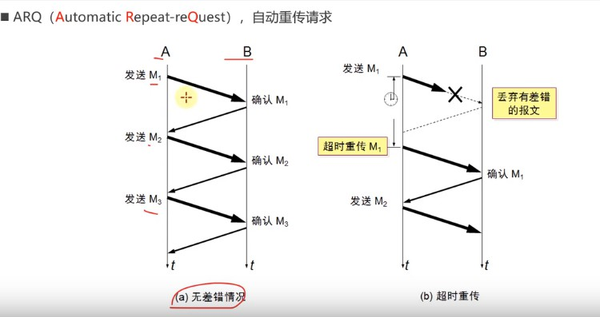

​	

​		2.停止等待ARQ协议实现TCP可靠传输的两种情况：

​			1.确认（信息）丢失：

​				B收到A发送的M1包，然后返回一个确认信息。但是这个确认收到M1信息在传输时，丢失了。那么A在			等待超时后会在次发送一个M1包，此时B端接收后，就会收到两个M1包，B端会丢掉一个M1包，再返回确			认收到M1包的信息给A端。

​			2.确认（信息）迟到

​				B收到A发送的M1包，然后返回一个确认信息。但是这个确认收到M1信息可能因为线路或者网络问题传			输的很慢，可能造成A端等待超时，再次发送M1包。B端接收到这第二个M1包后，发现已经收到过了，就			会丢掉一个M1包，再次发送确认收到M1信息。

​				对于A端来说，收到B端发送的确认收到M1信息后，就会接着发送M2信息。之后可能还会再次收到确认			收到M1信息。A端收到这个迟到的确认信息，发现之前收到过了，那么A端就会不响应这个信息。

​		3.停止等待ARQ协议能够保证TCP的可靠传输，但是因为必须等上一个数据传输结束，下一个信息才能传输，所以效率很低。

##### 2.改进：连续ARQ协议+滑动窗口协议+SACK选择性确认

​		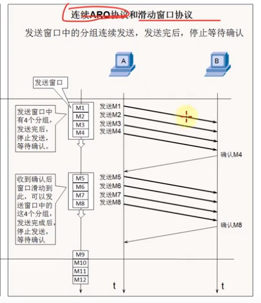

​		1.连续ARQ：发送窗口中有4个分组，会一口气发送完然后再等待确认信息。而且确认信息，也只会发送确认		收到最后一个分组的确认信息。等价于确认收到所有分组信息了。

​		2.滑动窗口：B这边有一个缓存窗口，用来暂时存放每次从A发送来的数据。这个窗口的大小会告诉A。窗口的		大小，代表每次最多能能接收多少分组。发送方的窗口大小，一般是由接收方决定的。

​		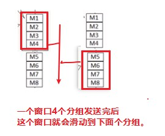

​		3.图示一个传输过程：注意序号Seq和确认号ack

​		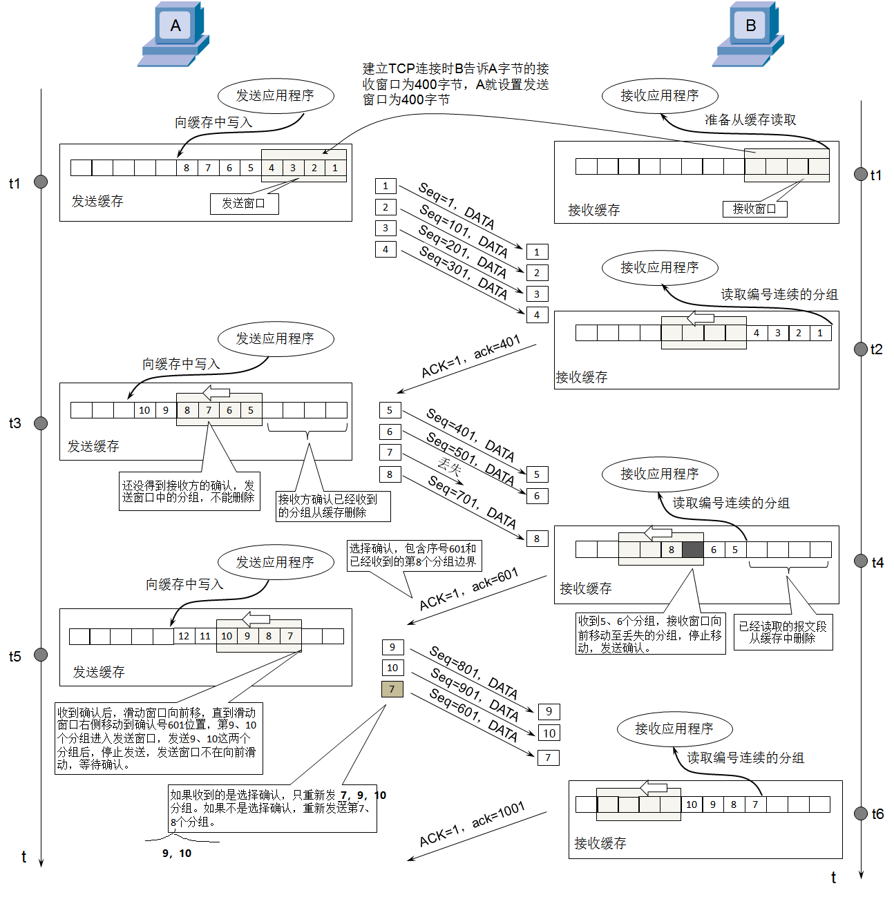

​		4.SACK选择性确认：Selective Acknowledgment

​			1.在TCP通信过程中，如果发送序列中间某个数据包丢失（比如1，2，3，4，5中的3丢失了）。

​			TCP会通过重传最后确认的分组（2）的后续分组（3，4，5）：收到的确认信息中的确认分组是2，那么发			送端会重传3，4，5。这样原先已经正确传输的分组也可能重复发送（比如4，5），降低了TCP性能。

​			2.为改善上述情况，发展了SACK(Selective Acknowledgment)技术：

​			告诉发送方哪些数据丢失，哪些数据已经提前收到。可以使TCP只重新发送丢失的包（比如3），不用发送			后续所有的分组（比如4，5）。

​			3.SACK信息会放在TCP首部的选项部分：此时TCP首部的选项部分就是SACK选项。

​			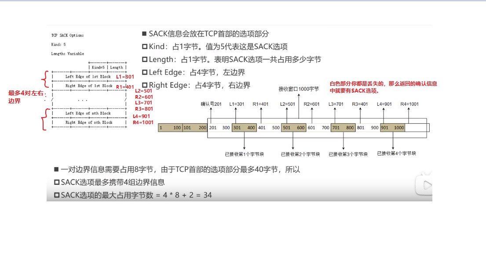

​		5.抓包演示：

​		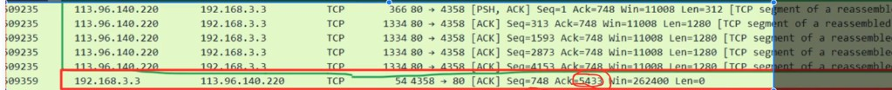

​			1.前面5个：发了5个分组。

​				前面5个包大小分别是312，1280，1280，1280，1280

​			2.后面1个：我给服务器回复一个确认信息。

​				我确认收到了5432字节，请给我发送5433及之后的字节，我的窗口大小是262400。

​			3.注意服务器发给我的第一个包的Seq是1，但是其实这个序号是相对序号。

​				相对于谁的序号呢？注意到下面还有个原始(raw)序号，那么原始序号 - 相对序号 = 基准数。

​				3277832203 - 1 = 3277832202

​				

​				看第二个包：得到基准数也是3277832202

​				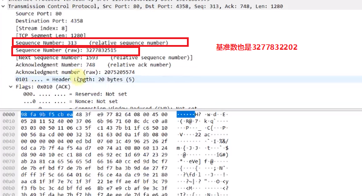

​			4.这个基准数其实是一个标识：标识这些连接属于同一个请求。这个值在连接的时候创建的。

​			5.序号部分放的是原始值Sequence Number(raw)，而不是相对值。

##### 3.疑问：

​	1.如果一个包重传了N次还是失败，会一直持续重传到成功为止吗？

​		这个取决于操作系统的设置，比如有些操作系统，重传5次还未成功就会发送reset报文（RST）断开TCP。

​	即发送端超出一定的重传次数或等待时间，还没有收到来自接收端的确认报文，于是发送reset报文。

​		当RST=1时，表明连接出现严重错误，必须释放连接，然后再重新建立连接。

​	2.如果接收窗口最多能接收4个包，但是发送方只发送了2个包，接收方如何确定后面还有没有第3个包呢？

​		等待一定时间后还是没有第3个包发过来，接收端就认为只传过来了2个包（无论是传输过程中丢包还是只有2	个包）。接收端就会返回确认信息：确认收到2个包。

##### 4.思考

​	1.为什么选择在传输层就将数据“大卸八块”分成多个段，而不是等到网络层再分片传递给数据链路层？

​		因为可以提高重传的性能：需要明确的是，可靠传输是在传输层进行控制的，即没有收到确认信息后，发送	端会重新发送这个报文段。

​		所以如果在传输层不分段，一旦出现数据丢失，整个传输层的数据都得重传。

​		如果在传输层分了段，一旦出现数据丢失，只需要重传丢失的那些段即可。

#### 4.TCP的流量控制

​	1.如果接收方的缓存区满了，发送方还是疯狂的发送数据，接收方只能把收到的数据包丢掉，大量的丢包会极大着浪费网络资源。所以要进行流量控制。

​	2.什么是流量控制：让发送方的发送速率不要太快，让接收方来得及接收处理。

​	3.缓存区和窗口是不同的概念：缓存区要比窗口大很多，每次收到一窗口大小的数据，会先放到缓存区中。

​	4.原理：

​		通过确认报文中窗口字段来控制发送方的发送速率。

​		发送方的发送窗口大小不能超过接收方给出的窗口大小

​		当发送方收到接收窗口的大小为0时，发送方就会停止发送数据。

​		

​	5.流量控制：特殊情况

​		1.有一种特殊情况：一开始接收方给发送方发送了报文段中的窗口字段值为0。后面，接收方又有了一些存储	空间，会给发送方发送一个非0窗口的报文但是这个报文丢了。

​		2.结果就是：发送方一直认为接收方的窗口为0，不发送报文；接收方一直等不到数据，一直等待；双方陷入	僵局。

​		3.解决方案：发送方主动询问窗口大小。

​		当发送方收到窗口为0的报文时，发送方会停止发送报文，但是同时会开启一个定时器，隔一段时间就发个测	试报文去询问接收方最新的窗口大小。如果接收方的窗口大小还是0，则发送方会再次刷新启动这个定时器。

#### 5.TCP：拥塞控制

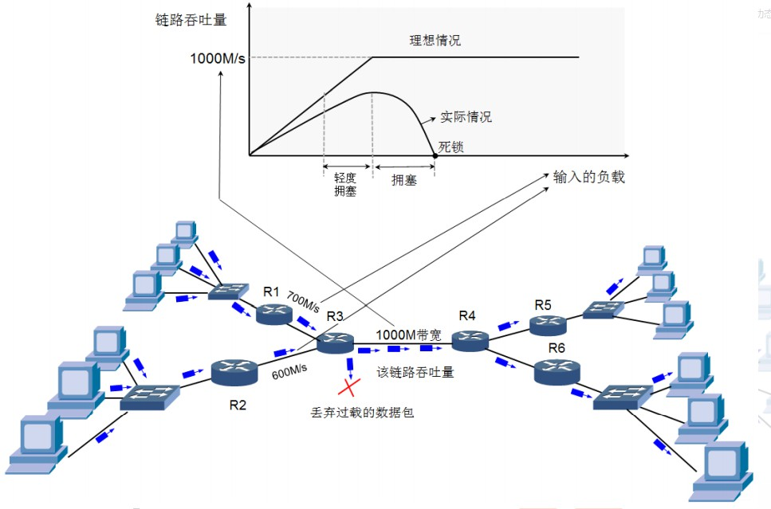

##### 1.什么是拥塞

​	1.如果一个路由器R3允许通过的最大带宽是1000M，此时R3路由器左侧又连接这个两个路由器R1和R2，R1的最大带宽是700M，R2的最大带宽是600M。那么此时就极有可能发生拥塞现象。

​	在理想情况下，R3能同时允许1000M的数据通过，但是R1和R2最多能通过1300M。此时就可能发生R3路由器来不及处理这么多数据，或者无法一次性通过这么多数据，就会造成拥塞现象。R3就会丢弃掉过载的数据包。

​	拥塞是指到达通信子网中某一部分的分组数量过多，使得该部分网络来不及处理，一致引起这个部分乃至整个网络性能下降的现象，严重时甚至会导致网络通信业务陷入停顿，即出现死锁现象。

​	2.理想情况和实际情况是不同的

​	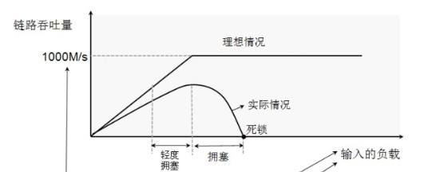

​		如果某个链路的理想情况下的吞吐量是1000M，但是实际情况由于数据可能在传输过程中可能会互相干扰。往往实际负载在不到1000M时，该链路的吞吐量就达到最大了。

​		之后再加大负载就会造成拥塞。

##### 2.拥塞控制

​	1.防止过多的数据注入到网络中，避免网络中的路由器或链路过载。

​	2.拥塞控制是一个全局性的过程（流量控制，是两端，点对点的控制过程）。

​		要整个链路来协同控制，涉及到所有的主机，路由器，以及与降低网络传输性能有关的所有因素，是大家共	同努力的结果。

##### 3.几个缩写：

* 1. MSS（Maxium Segment Size）：每个段的数据部分的最大长度

​			两端建立连接时，会商定一个合适的MSS值，即MSS在建立连接时确定。

​			每个段数据部分最大值的理论值：1460字节

​			

*  抓包观察这个字段：

​		首先这个MSS段的数据部分的最大长度是在建立连接时确定的，那肯定是在三次握手时确定的：

​		当SYN=1，ACK=0时，表明这是一个建立连接的请求。

​			

* 查看这个TCP报文的首部：发现TCP首部长度是32字节，所以有12字节在选项Options部分中。

​		在Options部分中发现了MSS字段且是1460（注意这个值不是固定的，两端发送的的TCP报文中这个值可能是		不一样的）。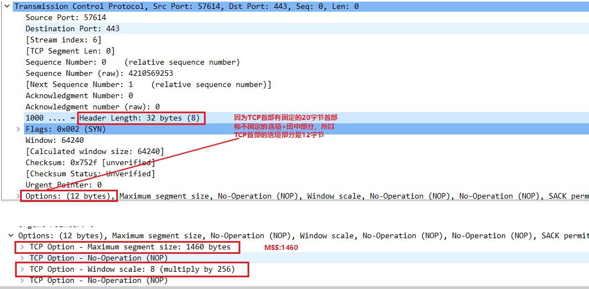

* 这个选项部分Options就是存放两端确定的一些东西：

​			比如MSS段的数据部分的最大长度，是否允许SACK 选择性确认（SACK permitted）

* 注意这个值不是固定的，两端发送的的TCP报文中这个值可能是不一样的。

​		比如A发给B的报文中MSS是1460，B发给A的报文中MSS是1412，那么此时MSS在两者中取最小值。为了兼		顾两者，这样传输数据两者都能接收。

​		MSS在建立连接时确定（协商的）。

* 2.cwnd(congestion window)：拥塞窗口
  * 进行拥塞控制，会动态的变化。

* 3.rwnd(receive window)：接收窗口
  * 接收方告诉发送方，你最多一次能发送多少的TCP报文段。
* 4.swnd(send window)：发送窗口
  * swnd = min(cwnd, rwnd)
  * 实际发送方的发送窗口，取拥塞窗口和接收窗口的最小值。

##### 4.拥塞控制的方法：

###### 	1.慢开始（slow start，慢启动）

​		加入一开始接收方告诉发送方的接收窗口rwnd=3000比较大，且MSS=100比较小。所以理论上发送方可以以口气发30个报文段给接收方。但是考虑到拥塞控制的话，拥塞窗口cwnd=100一开始会设置的比较小。那么发送窗口swnd会取拥塞窗口cwnd和接收窗口rwnd两者的最小值100，所以第一次会只发送1个报文段。

​		发送一个报文段后，发现网络状况良好。那么拥塞窗口会 * 2，cwnd=200。发送窗口取两者最小值为swnd=200，所以这次发送2个报文段。发现网络状况依然良好，拥塞窗口继续 * 2，cwnd=400。下一次发送4个报文段，如果网络状况依然良好的话，拥塞窗口cwnd * 2。

​		发送窗口缓慢增长，试探增长，慢慢开始。试探接收方的接收程度。

* cwnd的初始值比较小，然后随着TCP报文段被接收方确认（收到一个ACK）而成倍增长（指数级）。

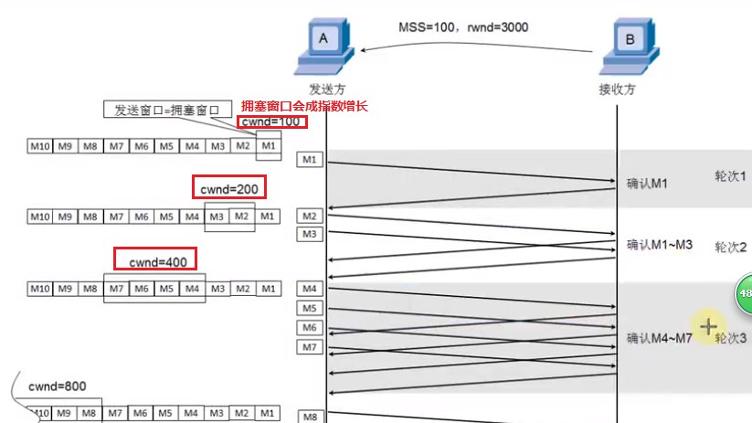

###### 	2.拥塞避免（congestion avoidacne）

​		1.在慢开始的基础上，为拥塞窗口cwnd加上一个慢开始阈值slow start threshold，cwnd在到达阈值之前只要网络良好没有出现拥塞等状况，就会成指数增长（乘以2）；如果达到阈值而且网络状况依然良好，拥塞窗口cwnd会呈乘法级增长（每次加固定值）。

​		2.当出现拥塞时（发现开始丢包/报文段），就会把慢开始阈值slow start threshold减半，同时从头开始执行慢开始算法（cwnd从初始值开始）。

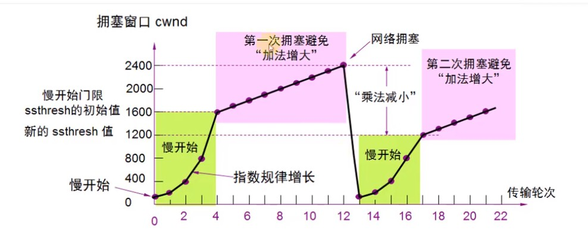

​		3.ssthresh(slow start threshold)：慢开始阈值，cwnd达到阈值后，以线性方式增长。

​		4.拥塞避免（加法增大）：拥塞窗口缓慢增大，以防止网络过早出现拥塞。

​		5.乘法减小：只要网络出现拥塞（发现开始丢包了），把ssthresh减半，与此同时，开始重新执行慢开始算法。

​		6.当网络出现频繁拥塞的话，ssthresh这个值会下降的很快。

###### 	3.快速重传（fast restransmit）

​		1.之前的实现TCP可靠传输时，有一个重传机制是“超时重传”。在ARQ自动重传请求机制中，如果A等待接受B的确认消息，如果等待超时的话，就会重新发送上一个报文段。

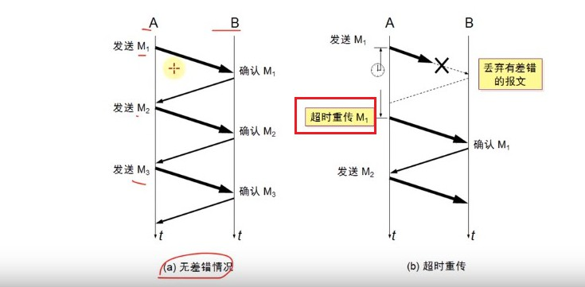

​		2.快重传机制：在接收方和发送方都进行了限制

​		3.接收方：

​			之前的做法：A发送5个段给B时，B只有等A的5个都发送完时或最后一个段超时时，才给A发确认信息：我		收到了哪些段。

​		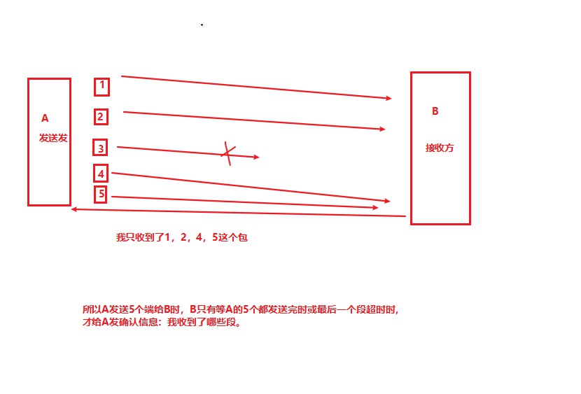

​				快重传做法：当接收方收到第二个分组后，返回一个确认收到分组2。但是没有收到第三个分组，直接收			到了分组4，即收到了一个失序的分组。那么在收到分组4后，会立即发出重复的确认（上一个确认信			息）：确认收到了分组2。然后继续收到分组5，再次发送确认收到了分组2；然后继续收到分组6，再次发			送确认收到了分组2。

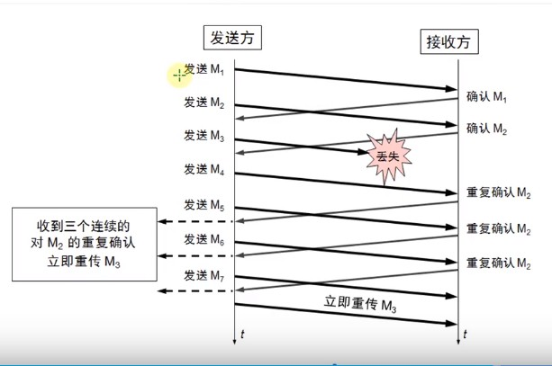

​			4.发送方：

​				如果连续收到3个重复的确认（总共4个相同的确认），就会立即重传尚未收到的报文段。

​				而不必继续等待重传计时器到期后再重传。

###### 	4.快速恢复（fast recovery）	

###### 		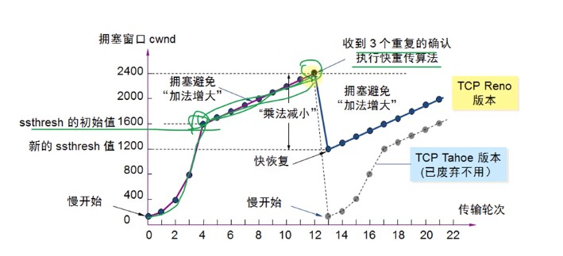	

​			1.拥塞控制是上述4个方法综合来治理的。

​			2.大致过程：

​				慢开始算法开始增大拥塞窗口，当拥塞窗口以指数增长，直到达到慢开始阈值后，执行拥塞避免算法即			拥塞窗口以线性增长。当收到3个重复的确认后，意识到此时开始掉包，产生拥塞了---->慢开始阈值乘法减			半，变成以前的一半：

​				之后又重新开始“慢开始算法”，拥塞窗口重初始值开始呈指数增长（这是旧版本的做法，已经弃置不			用）。但是这样效率较低，拥塞窗口应该在一个合适的初始值开始增大。

​				拥塞窗口直接以新的慢开始阈值作为初始值，开始以线性增长。

​			3.当发送方连续收到3个重复确认后，就意识到此时发生了丢包的现象，可能出现了拥塞。就执行“乘法减			小”，把慢开始阈值减半。之后不会执行慢开始算法，而是将拥塞窗口的值直接设置为慢开始阈值减半后的			新阈值，并且呈线性增长。

###### 5.发送窗口的限制条件

​	1.发送窗口的最大值：swnd = min(cwnd, rwnd)

​	2.当rwnd < cwnd时，是接收方的接收能力限制发送窗口的最大值。

​	3.cwnd < rwnd时，则是网络的拥塞限制发送窗口的最大值。

###### 6.拥塞控制可以理解为是在可靠传输，流量控制的基础上，进一步来控制网络的状态，协调网络的情况。尽量避免网络拥塞，出现状况。

