#### 6.TCP--连接管理

​	1.建立连接

​	2.释放连接

##### 1.TCP：序号，确认号详细步骤

​	在发送一个http请求前，要先建立一个稳定的连接。

​	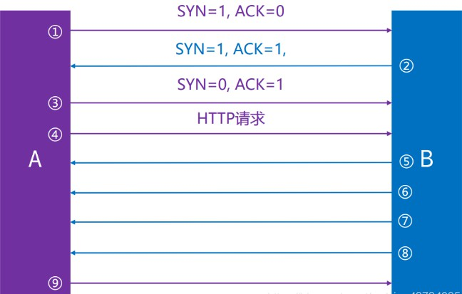

###### 	1.先回顾一下：

​		序号Seq：我当前发的包的数据部分的第一个字节的编号（在分段之前的整个数据包的编号）。

​			可以理解为我当前这个包的数据从哪个字节发。

​		确认号Ack：在建立连接后，确认号代表：期望对方下一次穿过来的TCP数据部分的第一个字节的编号。

​			也可以理解，我确认收到了这个编号前面字节的数据。确认号Ack只有在标志位ACK为1时明才有效。

###### 	2.序号，确认号：相对

​		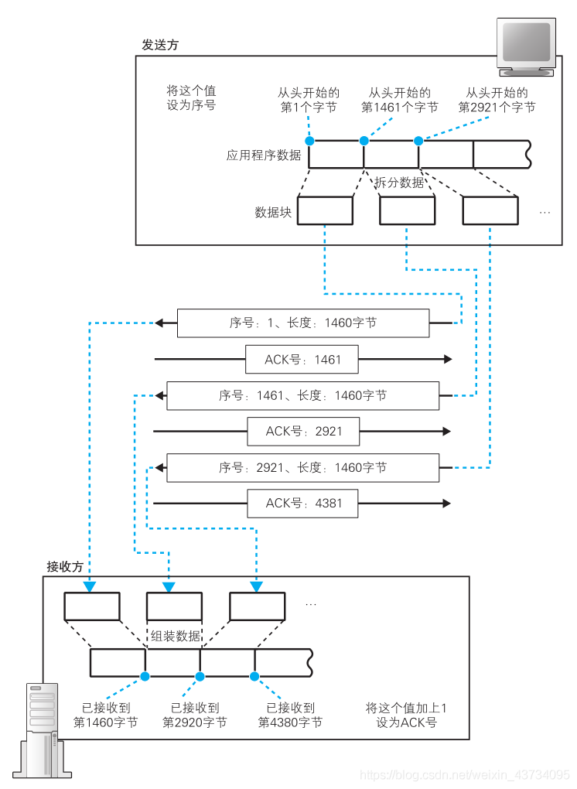

​	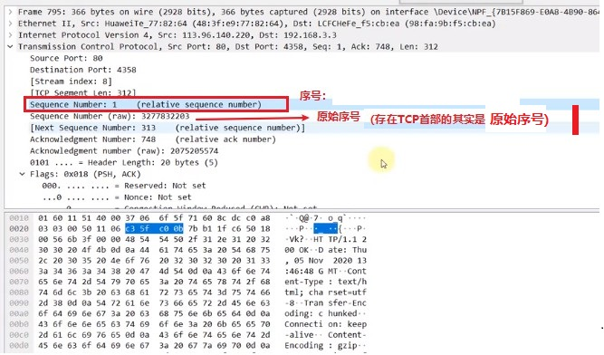

​			2.1存放在TCP首部的序号和确认号其实都是原始值

​			2.2在建立连接时，客户端会告诉服务器一个序号初始值；服务器也会告诉客户端一个序号初始值；这两个		初始值可以不同，而且分别在客户端和服务器中起作用。

​				比如：服务器给客户端发送数据时，序号字段的值就是在序号初始值上在加上发送的数据部分的首字节		编号。客户端给服务器发送数据时，序号字段的值就是在序号初始值上在加上发送的数据部分的首字节编		号。

​			2.3双方都是在建立连接的时候确定好，以后各自的序号从哪里开始。

###### 		3.分析一下Seq和Ack的变化过程

​			1.客户端给服务器发起建立连接的请求：

​				标志位SYN=1，确认客户端序号初始值seq = 123456。

​			2.服务器响应客户端建立连接的请求：

​				标志位SYN=1，ACK=1,确认服务器序号初始值seq=234567

​			3.客户端响应客户端：我知道你同意建立连接了

​				标志位SYN=0， ACK=1：连接建立好了，下面可以发送http请求了。

​			4.客户端给服务器发送第一个报文段：

​				序号seq = 123456 + 1，len = 100

​			5.服务器收到这个报文段响应：下一个包希望从这个位置开始接收，前面的都接收到了。

​				确认号ack = 123456 + 1 + 100

​			6.服务器也会给客户端发送第一个数据：

​				序号seq = 234567 + 1，len = 100

​			7.客户端接收到这个数据后，给服务器一个响应：

​				确认号ack = 234567 + 1 + 100

​	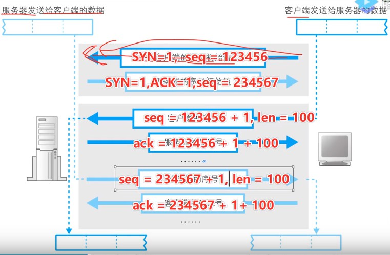

###### 	4.序号确认号：演示详细变化过程

###### 		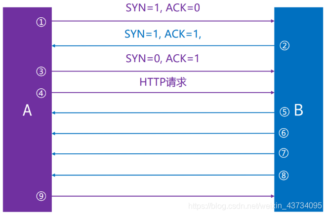

​		1，2，3：是建立连接。

​		4：客户端发送HTTP请求给服务器。

​		5，6，7，8：服务器连发4个数据给客户端。

​		9：客户端响应服务器。

​		1.第1步：客户端向服务器发起建立连接的请求：

​			客户端序号初始值是seq=s1，确认号ack=0因为没有收到数据。

​			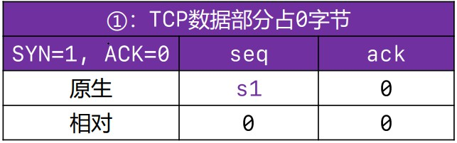

​		2.第2步：服务器响应客户端发起的建立连接请求：

​			服务器序号初始值seq=s2，确认号ack=s1+1。虽然客户端发给服务器的请求`没有数据部分，只有TCP首部。`但是服务器端仍然收到客户端发给服务器的数据，所以要有响应给客户端一个确认号，数据部分收到了0个字节，此时的ack=s1+0+1。意味着，我期待你下次发给我的数据部分从第一个字节开始。

​			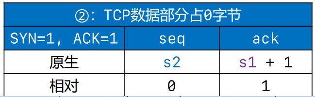

​	3.第3步：客户端响应服务器的响应

​		按理说这次也是没有数据部分的，但是为了响应上一次服务器的响应TCP报文的确认号ack=s1+1，所以这次TCP报文的序号是seq=s1+1。

​		同时客户端发现这次我收到的服务器响应的TCP报文的数据部分是0个字节，所以下次希望从1字节收。响应服务器期待下次发给我的数据部分从第一个字节开始ack=s2+0+1。

​	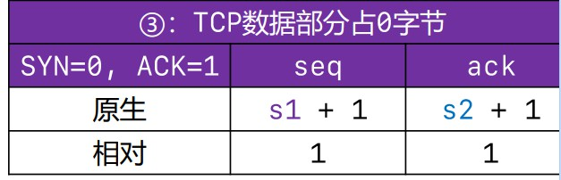

​	4.第4步：真正发送一个HTTP请求。

​		此时的TCP肯定是有数据的，因为发送了HTTP请求，TCP会封装这个HTTP请求到自己的数据部分。

​		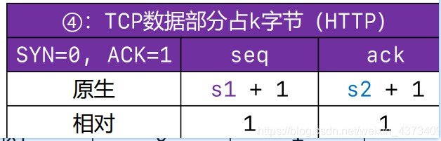

​		客户端给服务器发送一个HTTP请求，上一次客户端接收到服务器的TCP报文是在第2步。客户端当时接收到的报文中数据部分是len=0。所以在第4步，客户端继续发请求给服务器时的确认号ack=s2+0+1。

​		且上一次服务器响应的ack=s1+1，所以这次的序号seq=s1+1，且长度len=k。

​		所以第4步和第3步的seq和ack都是一样的，因为都是对第2步的回应。只是第四步有真正的数据部分。

​	5.第5，6，7，8步：服务器给客户端发送数据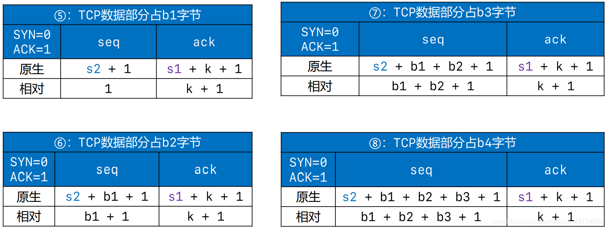

​		服务器要响应给客户端的数据分4次发送。这4次发送的TCP报文段中的确认号ack都是s1+k+1。因为ack表示响应接收到上一次对方发给自己的数据长度，并且期望下一次从哪个字节开始接收。

​		序号分别是s2+1，s2+b1+1，s2+b1+b2+1，s2+b1+b2+b3+1。

​	6.第9步：客户端连续收到了服务器发送的4个TCP数据段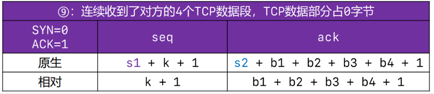

​	客户端响应给服务器一个TCP报文段：

​		seq=s1+k+1，就是上一次就收到服务器发送的报文的ack。

​		ack=s2+b1+b2+b3+b4+1，但是此时只是个确认TCP，所以数据部分len=0。

​	7.完整图示

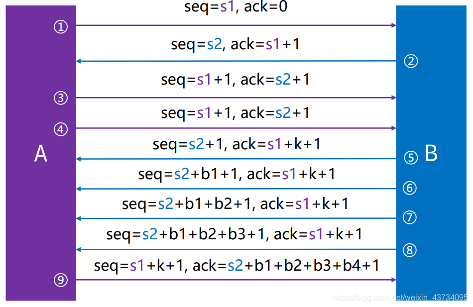

##### 2.TCP建立连接：3次握手

###### 1. 3次握手概述

​	为了建立稳定的TCP连接，通信双方必须从对方了解如下信息：

​		1.对方报文发送的开始序号Seq。

​		2.对方发送数据的缓冲区大小。

​		3.能被接收的报文段的数据部分的最大长度MSS。

​		4.被支持的TCP选项：MSS,，是否支持SACK，窗口缩放系数Window scale来确认对方能接受的窗口大小。

​	在TCP协议中，通信双方将通过三次TCP报文实现对以上信息的了解，并在此基础上建立一个TCP链接。而通信双方的三次TCP报文段的交换过程，也就是通常所说的TCP实现建立连接的三次握手过程。一般是客户端主动发起建立连接的请求。

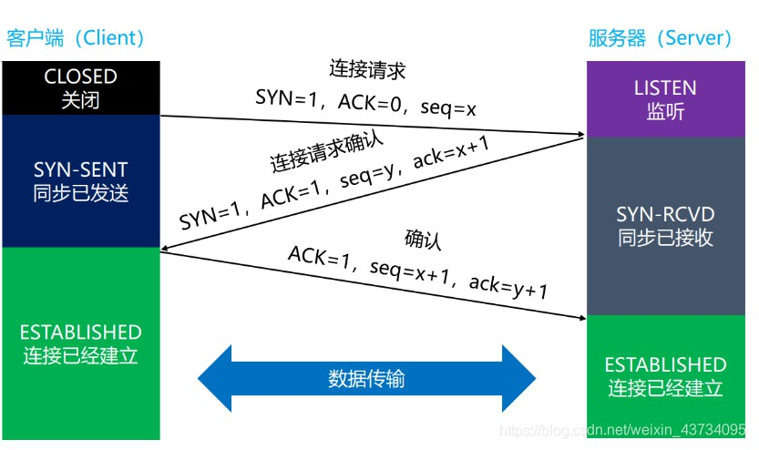

###### 	2.过程分析一下

​	1.首先客户端处于关闭状态CLOSED，服务器是开启的处于监听状态LISTEN，比如监听某一端口。

​	2.客户端想和服务器建立连接：客户端回结束CLOSED状态，并发送一个建立连接的请求。发送的TCP报文中没有数据部分，且标志位SYN=1，ACK=0；还要告诉了服务器我的初始序号seq=x。之后客户端进入SYN-SENT同步已发送状态，表示客户端已发送SYN报文，等待服务器的第2次握手。-----第一次握手

​	3.服务器监听到客户端发送的这个建立连接的请求，如果没有问题的话，服务器就会给客户端一个响应，发送一个TCP报文段给客户端，报文的标志位SYN=1，ACK=1；并且返回给客户端一个初始化序号Seq=y和确认号ack=x+1来作为对收到的报文中的seq=x的回应。同时结束LISTEN状态，进入同步已接收SYN-RCVD状态，表示服务器接收到了SYN报文，服务器同意建立连接，并且我也想建立连接。-----第二次握手

​	4.客户端收到了服务器发过来的确认信息，如果没有问题的话，客户端会给服务器一个响应。发送一个TCP报文给服务器，报文的标志位ACK=1，注意此时的SYN=0标志位没有值；并且由于上一个报文中的ack=x+1，seq=y，所以响应的序号seq=x+1，确认号ack=y+1。同时结束同步已发送SYN-SENT状态，进入ESTABLiSHED连接已建立状态。----第三次握手

​	5.服务器接收到第三次握手后，会结束同步已接收SYN-RCVD状态，进入ESTABLiSHED连接已建立状态。连接就正式建立了。

###### 3.前两次握手的特点

​	标志位的SYN=1

​	数据部分的长度都是0，其实第三次握手的数据部分长度也是0.

​	TCP头部的长度一般是32字节

​		1.固定20字节

​		2.选项部分12字节：

​			1.比如MSS即段的数据部分的最大长度，

​			2.是否允许SACK 选择性确认（SACK permitted），

​			3.window scale（窗口缩放系数）：TCP首部有一个窗口字段，告诉对方对方下一次允许发送的数据大小。		但是窗口这个字段只有2个字节，所以存不了太大的数，所以还要乘上一个系数。这个数据 乘以 window 		scale窗口缩放系数才是真正的允许发送的数据大小。	

​		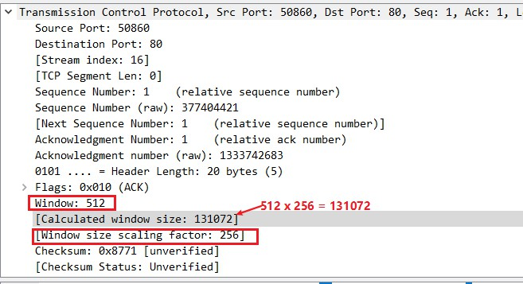

​		

###### 4.为什么建立连接的时候，要进行3次握手，2次不行吗？

​	主要原因：防止服务器端一直等待，浪费资源。

​	如果建立连接的时候，只进行了2次握手，可能会出现一种服务器端一直等待的情况：

​	1.客户端发送的第一个连接请求，因为网络延迟等原因，迟迟没有到达服务器端。

​	2.所以客户端迟迟没有收到服务器端的响应，就会再次发送一个连接请求。并且忘掉上一次的连接请求。

​	3.这次的连接请求很顺畅，两端成功建立了连接。并且数据传输完成后，连接又释放了。

​	4.1此时，第一个发送的连接请求姗姗来迟。注意！！！这个连接请求，客户端已经忘记了，或者说已经认为它失效了。但是服务器端确认为它是一个新的连接请求，那么服务器端会同意，并返回一个同意连接的响应。客户端收到这个响应有些不明所以，它会认为我没有给你发连接请求呀，所以会不管这个响应。结果就是客户端认为没有建立连接，但是服务器端认为已经建立连接了，所有服务器端会一直等待客户端发送数据过来，直到超时。

​	采用3次握手既可以避免上述现象：

​	4.2.如果是三次握手，在上述情况下：客户端没有向【服务器端的响应】发出确认，服务器端由于收不到确认，就知道客户端并没有建立连接。

###### 5.如果第三次握手失败了，会怎么处理？

- 此时服务器端的状态为SYN-RCVD同步已接收状态，如若等不到客户端的ACK=1的TCP报文，客户端会重新发送SYN=1，ACK=1的TCP报文。

- 如果服务器端多次重发SYN=1，ACK=1的TCP报文还是等不到客户端的ACK=1的TCP报文，服务器端就会发送RET=1的TCP报文，强制关闭连接。

  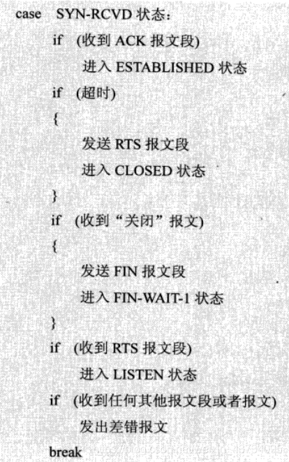

##### 3.TCP：释放连接

###### 	1.概述：

​		由于TCP连接是全双工的，因此每个方向都必须单独进行关闭。这个原则是当一方完成它的数据发送任务后就会发送FIN标志位，表明我的数据已经发完了，我要终止终止这个方法向的连接。但是也仅仅表示这个方向上没有数据流动了，另一端仍能发送数据。首先进行关闭的一方将执行主动关闭，而另一方执行被动关闭。

​		全双工：意味着客户端可以给服务器发东西，服务器也可以给客户端发东西，并且可以同时进行。我发东西给你的同时，你也可以同时发数据给我。

###### 	2.过程分析一下

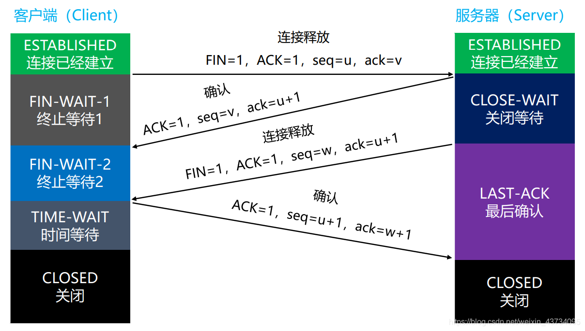

​	1.首先客户端，服务器开始都处于ESTABLISHED链接已建立状态。

​	2.客户端先发起一个释放连接的请求，客户端会结束ESTABLISHED链接已建立状态，进入FIN-WAIT-1终止等待1状态。并且发送一个TCP报文，其中标志位FIN=1，ACK=1。表明我得数据已经发完了，我这边要断开连接了。（注意：ACK标记为1，说明ack确认号是有用的。）

​	3.服务器端会收到一个FIN=1的TCP报文，即客户端发送的连接释放的请求。然后回先回应一个ACK=1的报文给对方，并且结束ESTABLISHED状态，进入CLOSED-WAIT关闭等待状态。客户端不会回应这个响应，但是会结束IN-WAIT-1终止等待1状态，进入FIN-WAIT-2终止等待2状态.

​	4.处于CLOSED-WAIT关闭等待状态的服务器，还要考虑自己是否还有数据要发送给对方，如果没有，那么也向对方发送一个释放连接的请求报文FIN=1。并且结束CLOSED-WAIT关闭等待状态，进入LAST-ACK最后确认状态。

​	5.客户端收到FIN=1的报文后，就知道服务器端也没有东西要发了，服务器也要断开连接了。就会再响应一下这个请求。发送一个TCP报文给服务器ACK=1，并且结束FIN-WAIT-2终止等待2状态，进入TIME-WAIT时间等待状态。

​	6.服务器端收到最后这个响应后，就会结束LAST-ACK最后确认状态，进入CLOSED关闭状态。

###### 3.为什么要进行4次挥手

​	1.因为TCP是全双工通信，所以两头，两个传输方向要分别都关闭。

​	2.第一次挥手：当主机发出FIN报文段时

​		表示主机1告诉主机2，主机1已经没有数据要发送了，但是，此时主机1还是可以接受来自主机2的数据。

​	3.第2次挥手：当主机2返回ACK报文段时

​		表示主机2已经知道主机1没有数据发送了，但是主机2还是可以发送数据到主机1.

​	4.第3次挥手，当主机2也发送了FIN报文段时

​		表示主机2告诉主机1，主机2已经没有数据要发送了。

​	5.第4次挥手：当主机1返回ACK报文段时

​		表示主机1已经知道主机2没有数据发送了，随后正式断开整个TCP连接。

###### 4.释放连接时的各个状态

​	1.FIN-WAIT-1：表示想要主动关闭连接

​		向对方发送了FIN报文，此时进入FIN-WAIT-1状态

​	2.CLOSE-WAIT：表示正在等待关闭。（在这个阶段，考虑自己需不需要关闭连接）

​		当对方发送FIN给自己，自己会回应一个ACK报文给对方，此时则进入CLOSE-WAIT状态。

​		在此状态下，需要考虑自己是否还有数据要发给对方，如果没有，发送FIN报文给对方，表明自己也要断开连接了。

​	3.FIN-WAIT-2：只要对方发送ACK确认后，主动方就会处于FIN-WAIT-2状态，等待看看对方是不是也要发送FIN报文，对方是不是也要结束连接结束。

​	4.CLOSING：一种比较罕见的例外状态。

​		表示你发送FIN报文后，并没有收到对方的ACK报文，反而却也收到了对方的FIN报文。

​		如果双方几乎在同时准备关闭连接的话，那么就会出现双方同时发送FIN报文的情况，也即会出现CLOSING状态，表示双方都正在关闭连接。

​	5.LAST-ACK：被动关闭一方在发送FIN报文后，最后等待对方的ACK报文

​		当收到ACK报文后，即可进入CLOSED关闭连接状态了。

​	6.TIME-WAIT：表示主动方也收到了对方的FIN报文，并发送出了ACK报文，就等2MSL后即可进入COLSED状态了。

###### 5.TCP连接：细节

​	1.TCP/IP协议栈在设计上，允许任何一方先发起断开请求。这里演示的是client主动断开请求。

​	2.client发送ACK后，需要有个TIME-WAIT阶段，等待一段时候后，再真正关闭连接。

​		一般是等待2倍的MSL（Maximum Segment Lifetime，最大分段生存期），即4分钟。

​		MSL是TCP报文在Internet上的最大生存时间。

​		每个具体的TCP实现（操作系统实现TCP）都必须选择一个确定的MSL值，RFC 1122建议是2分钟。

​	3.为什么要有TIME-WAIT这个阶段。

​		主要是预防这种情况：如果没有TIME-WAIT阶段，client发送ACK=1报文后立马断开连接。但是因为网络原因，服务器端没有收到客户端的ACK报文。服务器端就会重发FIN=1报文。但是此时客户端已经关闭了。此时可能出现的情况：

​		1.client没有任何反应，服务器那边会干等，甚至多次重发FIN，浪费资源

​		2.cient启动了一个新的应用程序，并且刚好分配了同一个端口号，新的应用程序就会收到服务器端重发的FIN=1报文。那么客户端就会马上开始执行断开连接的操作。

​			但是客户端本来想和服务器建立连接的。

​		换句话说：有了TIME-WAIT阶段可以防止本次连接中产生的数据包误传入下一次连接中（因为本次连接中的数据包包括服务器端重发的FIN=1报文，都会在2MSL时间内消失：所以2MSL时间后没有收到再FIN=1报文，就可以确认服务器端接收到了客户端的ACK报文）

​	4.所以TIME-WAIT主要是预防对方端没有收到上一次发送的ACK=1报文，看看能不能收到对方端重发的FIN=1报文。如果在TIME-WAIT阶段又收到FIN=1报文，说明上一次发的ACK=1报文对方没有收到，那么就会再次发送一个ACK=1报文，帮助对方顺利关闭。

##### 4.保活，心跳包

​	日常开发中可能出现这种情况，服务器为了节约资源，可能会实现如果在1min中内，没有收到客户端发送的数据，那么就会主动发起一个4次挥手断开连接。之后客户端再想发送数据给客户端时，就要发起一个3次握手建立连接。这样可能导致频繁的建立连接过程。那么为了避免这个情况，客户端就要定期向服务器发送一个心跳包，保证连接存活。

​	传输层TCP有一个`keep-alive`机制（和应用层HTTP的keep-alive不同），可以设置这个保活时间和心跳包。但是一般不用，开发中我们可以自己设置，相对灵活。

##### 5.抓包实践

###### 	1.只看到“3”次挥手。

​	有时候在使用抓包工具的时候，有可能只会看到“3”次挥手。其实是将第2，3次挥手合并。

​	因为当server接收到client的FIN是，发现自己也没有数据要发送给cilent了，这时server就会将给客户端的回应ACK=1报文段和自己的断开连接请求FIN=1，合并成一个同时发给客户端。

​	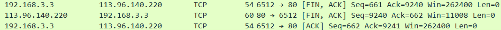

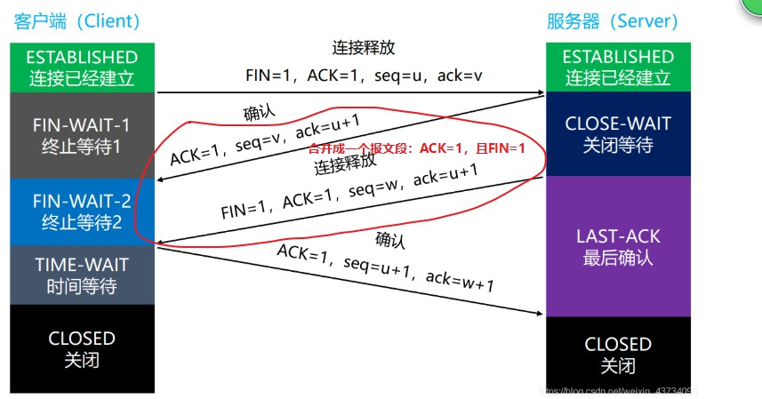			

​	本来两件事时分开的，发两次报文段，但是发现自己也没有数据要发送给cilent了时，就会只发一个报文段，同时告诉客户端两件事：

​	1.已经知道client没有数据要发，知道client要断开链接了。响应client发送的FIN=1断开连接请求

​	2.server已经没有数据要发了，server也要断开连接。主动发送FIN=1断开连接请求。

###### 2.此时FIN-WAIT-2状态还有吗？

​	因为FIN-WAIT-2状态是等待：看看服务器是不是也要断开联机，等待服务器发送的FIN=1报文。但是在FIN-WAIT-1阶段就收到了一个报文且标志位ACK=1，FIN=1。那么就会直接进入TIME-WAIT状态，没有FIN-WAIT-2状态。

​	如果在FIN-WAIT-1状态下，收到了对方同时带FIN标志和ACK标志的报文时：可以直接进入TIME-WAIT状态，而无需经过FIN-WAIT-2状态。

##### 6.长连接和短连接

​	如果建立连接后，进行一轮交互后就不需要在交互数据了，会立马关闭。那就是短连接。偶尔交互。

​	如果建立连接后可以一直进行数据交互，直到超过某一等待时间后还没数据，才会断开，那就是长连接。交互很频繁

##### 7.Socket对象

​	1.客户端和服务器建立连接后，在软件层面的体现就是各自的内存中都有一个Socket对象。这两个对象建立了连接。而网卡只是收发数据，没有连接建立的概念。所以如果建立连接后，一直不断开。只会影响到内存，不会影响到网卡硬件。

​	连接只是一种就绪状态，双方准备好随时进行数据交互。

​	2.网卡的作用：

​		对接收到的数据包进行检验，看一下MAC地址是不是给我的，不是我的就会丢掉。

​		网卡有带宽的概念：传输速度。如果传过来的速度超过了网卡能接受的速度，数据就可能会被丢掉。

​	3.每个连接都会有一对Socket对象。

​	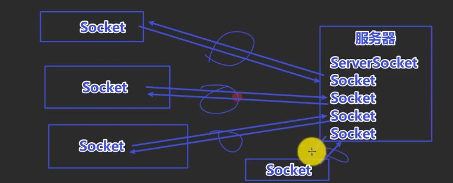

​		各个连接之间互不干扰。