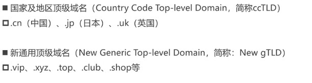
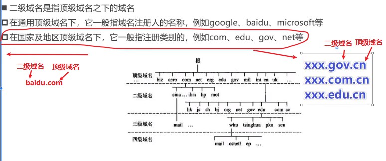
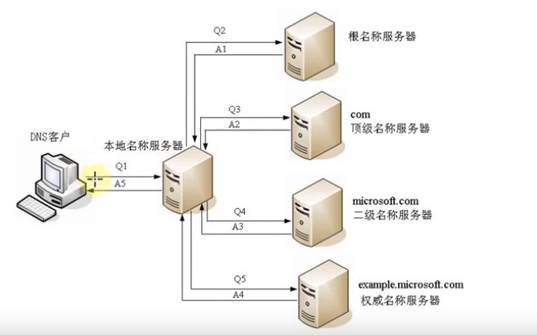
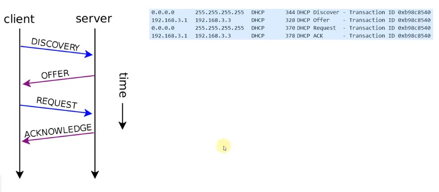

#### 7.应用层（一）

​		我们开发人员，一般都是面向应用层的。

##### 1.应用层的常见协议

​	1.超文本传输协议：HTTP，HTTPS

​	2.文件传输：FTP

​	3.电子邮件：SMTP，POP3，IMAP

​	4.动态主机配置：DHCP

​	5.域名系统：DNS

##### 2.DNS协议：

###### 	1.域名：Domain Name

​		由于IP地址不方便记忆，并且不能表达组织的名称和性质，人们设计除了域名（比如：baidu.com）

​		但实际上，为了能够访问到具体的主机，最终还是得知道目标主机的IP地址。

​		域名申请注册：https://wanwang.aliyun.com/

​	2.为什么不干脆全程直接用域名，不用IP地址呢？

​		1.首先域名本身就比ip地址占用的数据量大。每个字母一个字节，一个域名可能就10几个字节。而在网络层IP协议包中的IP地址仅占4个字节。

​			IP地址固定4个字节，域名随随便便都至少10几个字节，这无疑会增加路由器的负担，浪费流量。

###### 	2.根据级别的不同，域名可以分类

​		1.根域名：最右边的点“.”，但一般省略。

​			www.baidu.com.

​		2.顶级域名（Top-level Domain，简称TLD）

​			

​				

​		3.二级域名

​			

​		4.三级域名

​		.......

###### 3.DNS概述

​	DNS的全称是：Domain Name System，译为：域名系统。利用DNS协议，可以将域名解析成对应的IP地址。

​	1.在浏览器敲下www.baidu.com，想要访问百度服务器时，会先找DNS服务器

​	2.如果是第一次访问百度服务器，而且电脑中没有缓存百度的DNS信息时（DNS服务器也会缓存的）。此时就会发送一个DNS协议包给DNS服务器。DNS服务器就会经过一些列过程告诉你百度服务器的IP地址。

​	3.DNS服务器上存储有域名和IP地址的信息。

​	4.DNS是应用层的协议，所以底层也是走的传输层。DNS可以基于UDP协议，也可以基于TCP协议，服务器占用53端口。

​	5.DNS常用命令

​		ipconfig/displaydns：查看DNS缓存记录

​		ipconfig/flushdns：清空DNS缓存记录

​		ping 域名

​		nslookup域名

###### 4.找到example.microsoft.com的ip地址

​	1.客户端浏览器想要访问example.microsoft.com这个网站，假设是第一次访问，没有DNS服务相关的缓存。

​	2.那么客户端想要访问这个example.microsoft.com地址，就得先知道对应的IP地址，那么客户端会先发送一个请求，即DNS协议包给本地DNS服务器。本地DNS服务器收到DNS协议包后就会检查自己有没有这个域名对应的IP地址。

​	3.因为是第一次访问这个域名，那么本地DNS服务区和客户端本身都没有相关的缓存信息。由于所有的DNS服务器都记录了DNS根域名服务器的IP地址（每个DNS服务器都记录额DNS根域名服务器的IP地址和下一级DNS服务器的地址），那么本地DNS服务器会向根DNS服务器发送请求，询问根DNS服务器是否知道example.microsoft.com这个域名对应的IP地址。

​	4.显然根域名不会知道这个域名对应的IP，因为它只知道它下一级的DNS服务器的IP。但是他发现这个地址的顶级域名是com，所以会将下一级的comDNS服务器的IP地址返回给本地DNS服务器。

​	5.本地DNS服务器知道了comDNS服务器的ip地址后，就会发一个请求给comDNS服务器问它是否知道example.microsoft.com这个域名对应的IP地址。显然comDNS服务器也不知道这个域名对应的IP地址，但是它知道microsoft.com这级DNS服务器的IP地址，所以会将这个IP地址返回给本地DNS服务器。

​	6.本地DNS服务器继续发请求给microsoft.com这级DNS服务器，询问example.microsoft.com这个域名对应的IP地址。此时这个DNS服务器就知道他的下级example.microsoft.com这个服务器的IP地址了。并且把IP地址返回给本地DNS服务器。做好缓存后，再返回个客户端。

###### 5.DNS服务器小结

​	所有的DNS服务器都记录了DNS根域名服务器的IP地址。

​	上级DNS服务器记录了下一集DNS服务器的IP地址。

​	全球一共13台IPV4的DNS根域名服务器，25台IPV6的DNS根域名服务器。

##### 3.DHCP，动态主机配置协议

​	Dynamic Host Configuration Protocol

###### 	1.IP地址按照分配方式，可以分为：静态IP地址，动态IP地址。

​	动态IP地址是从动态主机配置协议（DHCP）服务器获得的地址。当每一次上网时，会随机分配一个IP地址，子网掩码，默认网关和DNS服务器。动态IP地址经常变化，每次设备连接到网络时，动态IP地址都会发生变化

​		1.从DHCP服务器自动获取IP地址。

​		2.适用场景：移动设备，无线设备。

​	静态IP地址是由网络管理员分配给设备的固定地址。

​		1.手动设置

​		2.适用场景：不怎么挪动的台式机（比如学校机房中的台式机），服务器等

###### 2.概述

​	DHCP协议基于UDP协议，客户端是68端口，服务器是67端口

​	客户端会首先发一个DHCP请求给DHCP服务器，然后DHCP服务器会从IP地址池中，挑选一个IP地址“出租”给客户端一段时间，并且时间到期后就会回收。

​	平时家里上网的路由器就可以充当DHCP服务器。

###### 3.DHCP分配IP地址的4个阶段

​	1.DISCOVER：发现服务器

​		此时还没有IP地址，发广播包从附近找一个DHCP服务器。因为还没有IP地址，所以发的包的源IP是0.0.0.0，目标IP是255.255.255.255（说明谁都可以收到），目标MAC时FF:FF:FF:FF:FF:FF（说明谁都可以收到）。	

​	2.OFFER：提供租约

​		当找到一个DHCP服务器时，这个DHCP服务器就会返回可以租用的IP地址，以及租用期限，子网掩码，网关，DNC等信息。

​		注意：此时可能有多个服务器提供租约。

​	3.REQUEST：选择IP地址

​		客户端选择一个OFFER，发送广播包进行回应。

​	4.ACKNOWLEDGE：确认

​		被选中的服务器发送ACK数据包给客户端。

​	到此DHCP分配IP地址已经完毕。

###### 4.DHCP细节

​	1.DHCP服务器可以跨网段分配IP地址吗？

​		DHCP服务器，客户端不在同一个网段时，可以借助DHCP中继代理实现跨网段分配IP地址。

​	2.自动续约

​		客户端会在租期不足时，自动向DHCP服务器发送REQUEST信息申请续约。

​	3.常用命令

​		ipconfig /all ：可以看到DHCP相关的详细信息，比如租约过期时间，DHCP服务器地址等。

​		ipconfig /release：释放租约（会断网）

​		ipconfig /renew：重新申请IP地址/（没有到期的话）申请续约，延长租期。

