#### HTTP（上）

##### 1.概述：

​	HTTP（Hyper Test Transfer Protocol），译为超文本传输协议。

​	是互联网中应用最广泛的应用层协议之一。

​	设计HTTP最初的目的是，提供一种发布和接收HTML页面的方法（就是为了浏览网页的），由URI来标识具体的资源。

​	URL是URI的一部分，URL能全网确定一个唯一的资源，URI不能唯一确定一个唯一资源（可以局部确定唯一的资源）。


​	后面用HTTP来传递的数据格式不仅仅是HTTP，用途非常广泛。

##### 2.版本迭代

 1. 1991年，HTTP/0.9

    只支持GET请求方法获取文本数据（比如HTML文档），且不支持请求头，响应头等，无法向服务器传递太多信息。

	2. 1996年，HTTP/1.0

    支持POST，HEAD等请求方式，支持请求头，响应头等，支持更多种数据类型（不再局限于文本数据）。

    浏览器的每次请求都需要与服务器建立一个TCP连接，请求处理完成后立即断开TCP连接。即没法送一个HTTP请求我都要新建立一个连接，每次一个请求响应完，都要断掉这个连接。

    即多个请求不能共用一个TCP连接，每个都要建立单独的TCP连接。

	3. 1997年，HTTP/1.1（最经典，使用最广泛的版本）

    支持PUT，DELETE等请求方法

    采用持久连接（Connection：keep-alive），长连接；

    `多个请求可以共用一个TCP连接。`

4. 2015年，HTTP/2.0
5. 2018年，HTTP/3.0（还没成熟，草稿阶段）

##### 3.标准

​	1. HTTP的标准

​		由万维网写会（W3C），互联网工程任务组（IETF）协调制定，最终发布了一系列的RFC文档。

​		RFC（Request For Comments，可以译为：请求意见稿）。

​		HTTP/1.1.最早是在1997年的RFC 2068中记录的，该规范在1999年的RFC 2616中已经作废；2014年又由RFC 7230系列的RFC取代。

​		HTTP/2标准于2015年5月以RFC 7540正式发表，取代HTTP/1.1成为HTTP的实现标准。

​	2. 中国的RFC

​	1996年3月，清华大学提交的适应不同国家和地区中文编码的汉字统一传输标准被IETF通过为RFC 1922

，称为中国大陆第一个被认可为RFC文件的提交协议。

##### 注意：

​	RFC文档仅仅是一个标准，是个规范，要有服务器去实现它，也就是说到具体的实现时，可能和标准有些差异。比如其他人要开发一个HTTP服务器（比如Tomcat服务器），那么它要遵守这个RFC规范来解析报文。但是在实现这个HTTP服务器时，可以增加一些“容错能力”。比如有多少空格，都可以正确解析出来（不认为是错误的报文）。

##### 4.报文格式（简）

###### 	1.先看一下浏览器Chrome解析的请求响应格式

​		注意：每一对key-value后还要跟一个换行符发送给服务器。冒号后跟一个空格。

​	

​	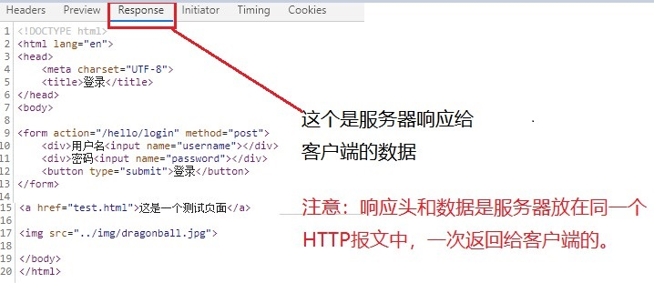

###### 	2.查看一下抓包工具抓到的HTTP报文格式

​	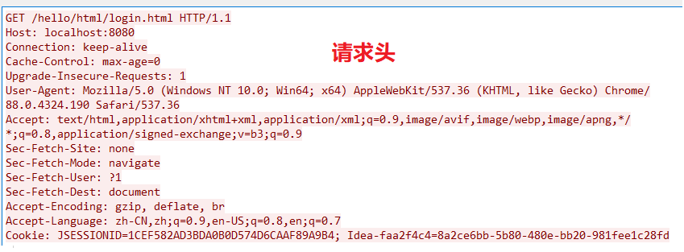

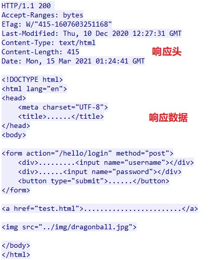

​		所以响应头response header和数据是一次性返回给客户端的。

###### 	3.请求报文格式

​		请求行+请求头+请求体（GET请求是没有请求体的）

​		POST请求是将请求参数放在请求体上，所以能放很多数据。

​		GET请求是将请求参数拼接在请求行后面，所以放的数据有限。

​		

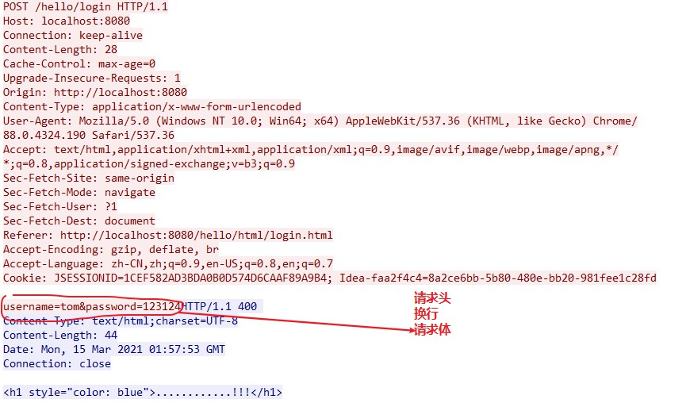

###### 4.响应报文格式

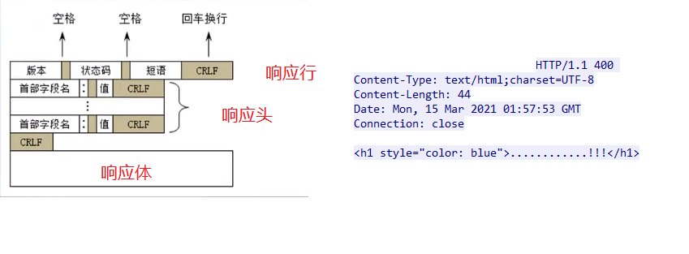

##### 5.报文格式（详）

###### 1.ABNF(Augment BNF)

​	是BNF（Backus-Naur Form， 译为：巴克斯-瑙尔范式）的修改，增强版

​	在RFC 5234中表明：ABNF用作internet中通信协议的定义语言

​	ABNF是最眼睛的HTTP报文格式描述形式，脱离ABNF谈论HTTP报文格式，往往都是不严谨的。

​	关于HTTP报文格式的定义：

​		RFC 2616 4.HTTP Message（旧）

​		RFC 7230 3.Message Format（新）

ABNF核心规则：

​	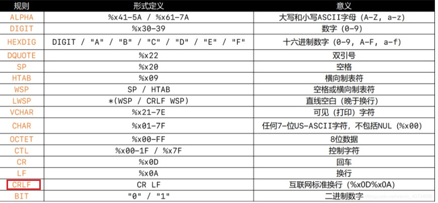

###### 2.报文格式：整体

注意：request-line（请求行） / start-line（响应行）内部包含了一个CRLF

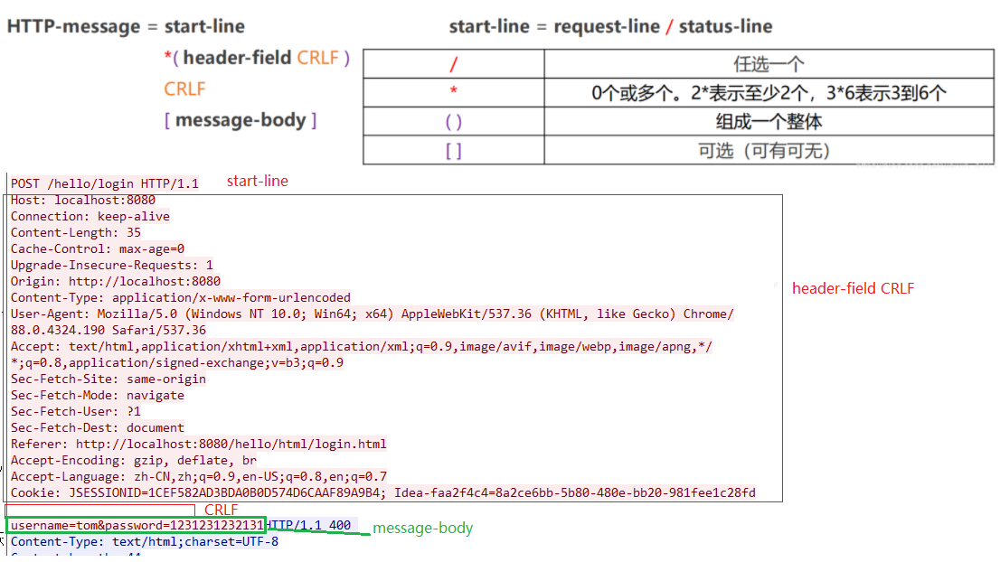

###### 3.报文格式 - request-line（请求行） / start-line（响应行）

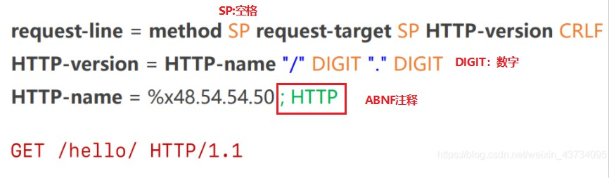

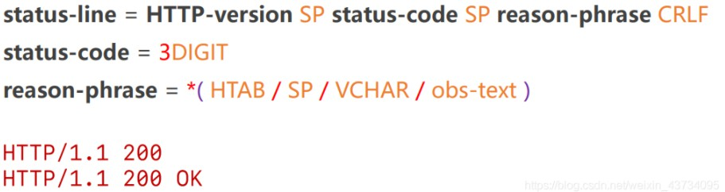

###### 4.报文格式-heaer-field，message-body

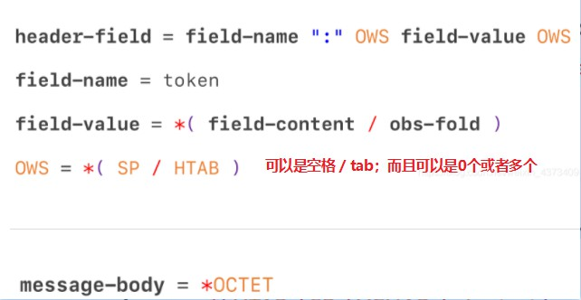

​		注意：

​			请求头冒号后面可以是空格也可以是tab制表符。而且可以是多个或者0个。

​			消息体：多个字节或者0个字节。

###### 5.URL编码

​	URL中一旦出现了一些特殊字符（比如中文，空格），需要进行编码。

​		在浏览器地址栏输入URL时，是采用UTF-8进行编码的

​	比如：

​		编码前：https://www.baidu.com/s?wd=百度

​		编码后：https://www.baidu.com/s?wd=%E7%99%BE%E5%BA%A6

​	可通过 Java 将 “百度” 用 UTF-8 解码后转为16进制查看：

```java
import java.nio.charset.StandardCharsets;

public class Main {
    public static void main(String[] args) throws Exception {
        byte[] bytes = "百度".getBytes(StandardCharsets.UTF_8);
        for (byte b : bytes) {
            System.out.print(Integer.toHexString(b & 0xFF) + " "); //保留低8位
        }
    }
}

//结果：e7 99 be e5 ba a6 
```

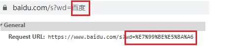

###### 6.Xshell + telnet面向报文与服务器交互

​	1.安装一个Xshell（安全终端模拟软件），在Xshell中使用telnet

​		1.可以直接面向HTTP报文与服务器交互

​		2.可以更清晰，更直观地看到请求报文，响应报文的内容

​		3.可以检验请求报文格式正确与否

​	2.telnet命令可以理解为与服务器`建立TCP连接`，然后我们可以`直接输入报文`来获取响应。

​	3.启动一个本地服务器，键入telnet localhost 8080。

​		成功建立连接，下面可以直接发送HTTP报文给服务器。

​	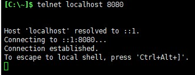

​	4.发送一个最简单的HTTP请求报文

​		GET /hello/ HTTP/1.1    //注意URL最后还要加一个 “/”

​		Host: localhost:8080

​		换行

​		回车确定：得到响应报文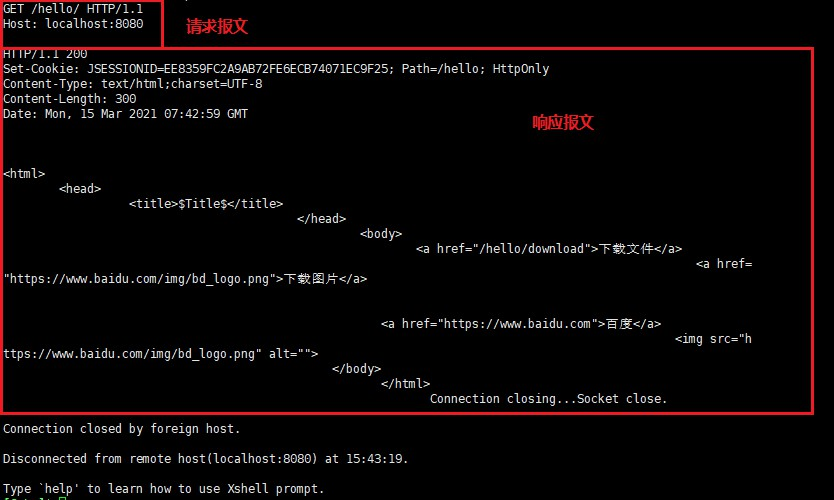

##### 6.请求方法（9种）

​	RFC 7231, section 4: Request methods: 描述了8中请求方法

​	GET，HEAD，POST，PUT，DELETE，CONNECT，OPTIONS，TRACE

​	RFC 5789, section 2: Patch method: 描述了PATCH方法

###### 1.几种方法简介

​	1.GET: 常用于读取的操作，请求参数直接拼接在URL的后面。（但是浏览器对URL是有长度限制的）

​	2.POST：常用于添加，修改，删除的操作，请求参数可以放到请求体中（没有大小限制），`而且也可以放参数在URL上面。`

​	3.HEAD：请求得到与GET请求相同的响应（只有响应行和响应头），但没有响应体。

​		使用场景：在下载一个大文件前，先获取其大小（HEAD），在根据响应头中的文件大小来决定是否要下载这个资源。如果要下载的话，那么在发送一个GET请求，以此可以节约宽带资源。

​	4.OPTIONS：用于获取目的资源所支持的通信选项，比如服务器支持的请求方法

​		OPTIONS * HTTP/1.1

​		通过向Tomcat发送OPTIONS请求，可以知道它支持以下请求方法

​	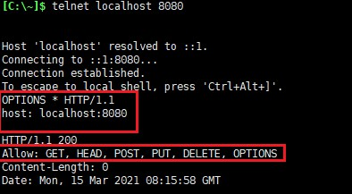

​	5.PUT：用于对已存在的资源进行整体覆盖。（不安全，一般不用）

​	6.PATCH：用于对资源进行部分修改（资源不存在，会创建新的资源）

​	7.DELETE：用于删除指定的资源。（不安全，一般不用）

​	8.TRACE：请求服务器回显其收到的请求信息（发给服务的内容，服务器再返回发送的内容），主要用于HTTP请求的测试或诊断。

​	9.CONNECT：可以开启一个客户端与所请求资源之间的双向沟通的通道，它可以用来创建隧道（tunnel）

​		可以用来访问采用了SSL(HTTPS)协议的站点。

##### 7.请求头字段（**Request Header Fields**）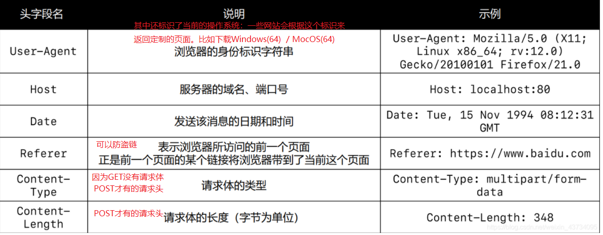


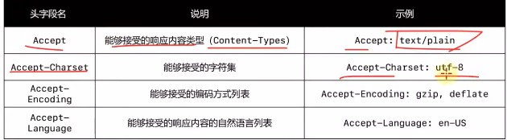

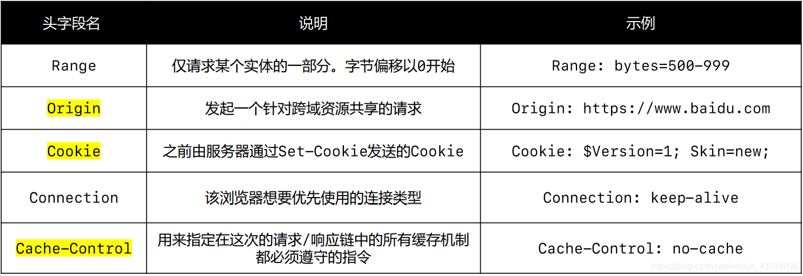

1.Referer请求头字段可以防盗链：

​		如果服务器中的某个资源，不想让外部用户随意访问，只能来自本公司的网站连接才能访问。那么就可以用这个Referer请求头字段来判断。如果该字段的URL不是本公司的网站链接，那么就拒绝这个访问请求。

2.q代表权重

​	q 值越大，表示优先级越高，如果不指定q值，默认是1.0（1.0是最大值）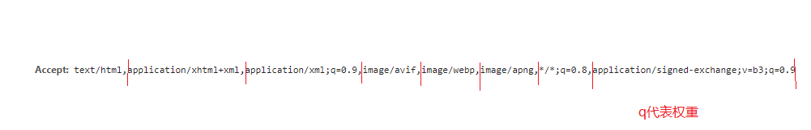

3.Range：可以用在多线程断点下载

​	充分利用CPU的多核：开4个线程，每个线程都发一个HTTP请求，根据Range请求头字段分别下载资源的某一部分。

​	断点：如果突然断网，客户端会记录线程1下载到哪里了，线程2下载的哪里了...；当网络恢复时，就可以从断点继续下载。

4.Connection: keep-alive

​	如果是keep-alive，就代表着是一个长连接。返回响应后，不要立马关闭。

5.Content-Type：告诉服务器我的请求体的类型，GET请求没有请求请求体，POST请求有请求体。

5.1.application/x-www-form-urlencoded：	

​	默认的Content-Type类型是：application/x-www-form-urlencoded。表示用&分隔请求体中的参数，用=分隔键和值，字符用URL编码方式进行编码。

```html
<form action="/hello/form" method="post" enctype="application/x-www-form-urlencoded">
</form>	
```

​	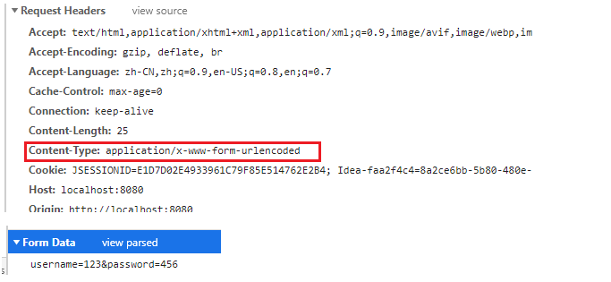

5.2.multipart/form-data：	

​	可以在提交表单时，设置该请求头：multipart/form-data。文件上传时请求体必须使用这种的编码方式。

```html
<form action="/hello/form" method="post" enctype="multipart/form-data">
</form>
```

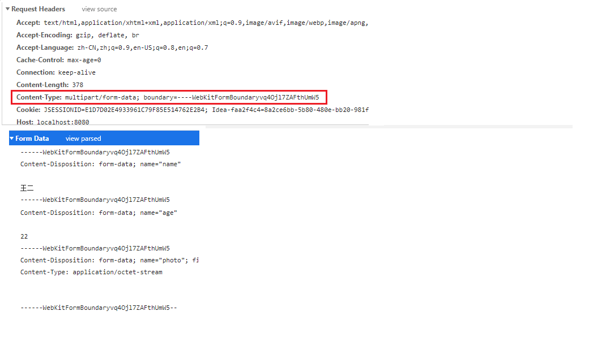

```java
//只能取出来用&隔开的请求体中的参数，比如，application/x-www-form-urlencoded这种Content-Type编码的参数数据，或者GET请求中URL的参数。
//multipart/form-data这种编码取不出来
String name = req.getParameter("name");
String age = req.getParameter("age");
String photo = req.getParameter("photo");

//结果
null
null
null
```


##### 8.响应头字段（**Response Header Fields**）

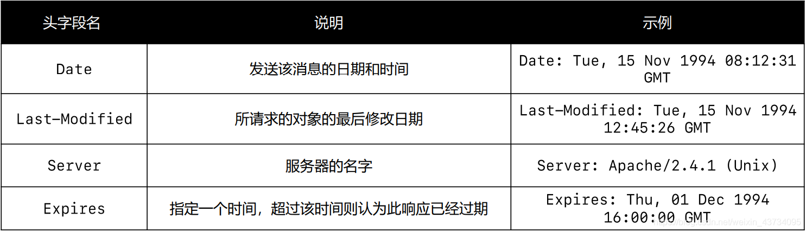

​	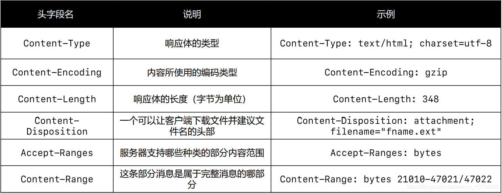

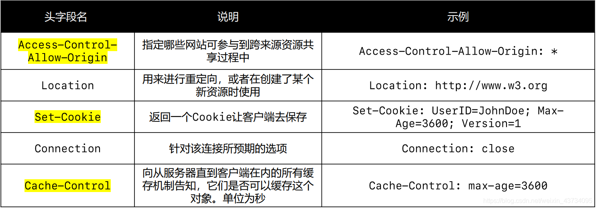

1.Content-Type使用示例：

​	相当于告诉客户端：我返回给你的是一个HTML，且字符串使用ISO-8859-1编码的（所以客户端会用这个字符集解码：显然会乱码）。

​	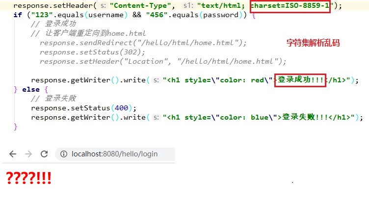

​	相当于告诉客户端：我返回给你的是一个普通文本，那么里面的HTML语法不会被浏览器解析

```java
response.setHeader("Content-Type", "text/plain; charset=ISO-8859-1");
```

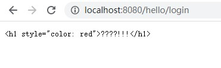

2.Content-Disposition 使用实例：

```java
@Override
 protected void doPost(HttpServletRequest request, HttpServletResponse response) throws ServletException, IOException {
     response.setContentType("text/plain; charset=UTF8");
     response.setHeader("Content-Disposition", "attachment; filename=\"mj.txt\"");
     response.getWriter().write("这是我的文件数据");
 }
```

​	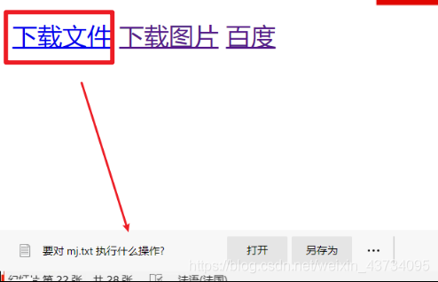

##### 9.状态码：Status Code

###### 	1.在RFC 2616 10.Status Code Definitions规范中定义。

​		状态码指示HTTP请求会否已成功完成

###### 	2.状态码可以分为5类

​		信息响应：100~199

​		成功响应：200~299

​		重定向：300~399

​		客户端错误：400~499

​		服务器错误：500~599

###### 	3.常见状态码

​		1.100 Continue

​			情景：

​			客户端给服务器发送的HTTP请求报文中，包含URL，请求头，请求体。服务器接收到这个报文后，仅仅通过判断URL，请求头就发现这个请求不合法，拒绝。即没有判断请求体中的内容，就拒绝了这个HTTP请求，那么发送的报文中的请求体（请求体可能很大）就是多余的，效率低下的。

​			那么客户端为了提高效率，可以先发送的请求中只有URL，请求头。服务器收到后，如果拒绝了这个请求后，那么客户端这次没有发送请求体，即提高了效率。如果服务器通过判断URL和请求头愿意接收该请求，会发现这个请求缺少一个请求体，那么就会在响应报文中添加一个状态码100 Continue，让客户端将这次请求的请求体也发过来。

​			概述：

​			在某些情况下，如果服务器在不看请求体就拒绝请求时，客户端就发送请求体是不恰当的或低效的。

​			允许客户端发送带请求体的请求前，看看服务器是否愿意接收请求（服务器通过请求体判断）。

​			请求的初始部分已经被服务器收到，并且没有被服务器拒绝，服务器会响应给客户端状态码100 Continue。客户端应该继续发送剩余的请求，如果请求已经完成，就忽略这个响应。


​		2.200 OK：请求成功


​		3.302 Found：请求的资源被暂时的移动到了由Location头部指定的URL上

​			重定向：

​				1.首先发送一个登陆请求/login/，携带用户名和密码：即本来是请求URL是/login/

​				2.用户名和密码正确：服务器返回一个302状态码，且还有个响应头Location: /home.html/

​				3.客户端收到这个响应后，会再发送一个请求/home.html/：重定向，客户端再次发送一个请求。

​				4.代码：

```java
response.sendRedirect("/hello/html/home.html");
//等价于：
//response.setStatus(302);
//response.setHeader("Location", "/hello/html/home.html");
```

​				5.图示：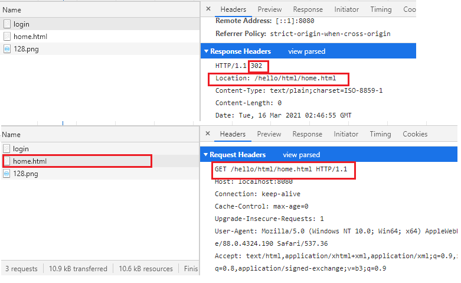


​		4.304 Not Modified：说明无需再次传输请求的内容，也就是说可以使用缓存的内容。

​			客户端会缓存一些静态资源，比如HTML页面。			

​			服务器发现客户端这次请求的内容我上一次已经给过你了，而且这次请求的内容在我的服务器这边根本就没有动过。`服务器端就会返回一个304状态码给客户端，和一些常规的响应头，不返回请求的资源了。`告诉客户端这次响应的内容，我就不响应给你了，你直接从自己的缓存中拿吧。


​		5.400 Bad Request：由于语法无效，服务器无法理解该请求。

​		6.401 Unauthorized：由于缺乏目标资源要求的身份验证凭证，请求被拒绝。

​		7.403 Forbidden：服务器端有能力处理该请求，但是拒绝授权访问。

​		8.405 Method Not Allowed：当前HTTP请求的方法不合法。	

​		9.406 Not Acceptable：服务器端无法提供与Accept-Charset以及Accept-Language指定的值相匹配的响应。

​		10.408 Request Timeout：服务器想要将当前连接关闭（没有在使用）。

​			一些服务器会在空闲链接上发送此信息，即便是在客户端没有发送任何请求的情况下。

​		11.500 Internal Server Error：所请求的服务器遇到以外的情况并阻止其执行请求。

​		12.501 Not Implemented：请求的方法不被服务器支持，因此无法被处理。

​			服务器必须支持的方法，只有GET和HEAD

​		13.502 Bad Gateway：作为网关或代理角色的服务器，从上游服务器（如tomcat）中接收到的响应是无效的。

​		14.503 Service Unavailable：服务器尚未处于可以接受请求的状态。

​			通常造成这种情况的原因是由于服务器挺急维护或者超载。

​	