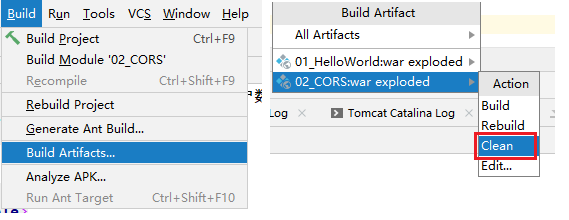
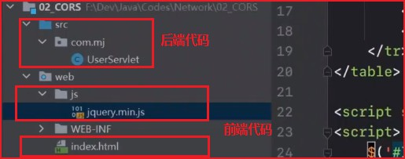
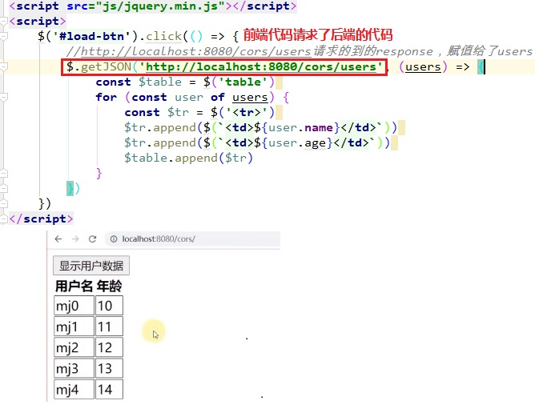
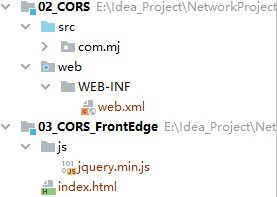
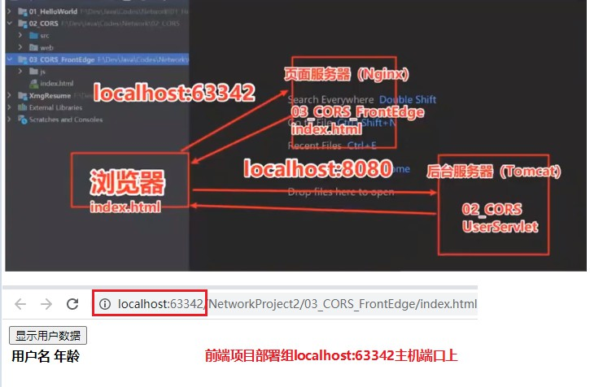
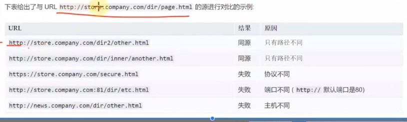
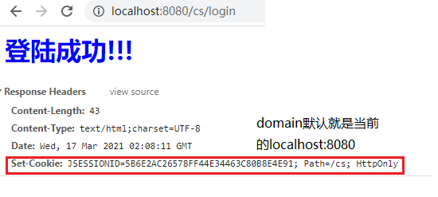
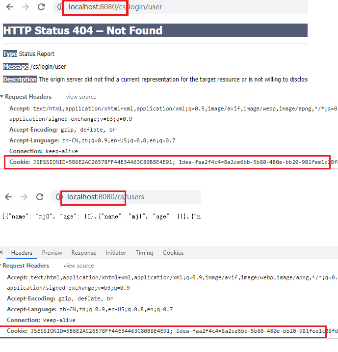

### 9.HTTP（下）


#### 0.杂记

​	JQuery没有引进来怎么办：按照下面操作，在重启服务。

​	

#### 1.涉及编码

1.对客户端提交过来的数据进行编码

```java
// 对客户端提交的数据进行编码
request.setCharacterEncoding("UTF-8");
```

2.响应（写）给浏览器的字符编码

```java
response.setCharacterEncoding(“utf-8”); 
response.getWriter().write("<h1 style=\"color: red\">登录成功!!!</h1>");
```

​	设置response.getWriter()的编码，即“登录成功!!!”是用utf-8编码的。

3.请求头字段：Content-Type

​	Content-Type: application/x-www-form-urlencoded

​	默认的Content-Type类型，表示用&分隔请求体中的参数，用=分隔键和值，参数字符用URL编码方式进行编码。

​	Content-Type: multipart/form-data

​	可以在提交表单时，设置该请求头：multipart/form-data。文件上传时请求体必须使用这种的编码方式。

```html
<form action="/hello/form" method="post" enctype="multipart/form-data">
</form>
```

4.响应头字段：Content-Type

​	4.1：

```java
response.setCharacterEncoding(“utf-8”); 
response.setHeader("Content-Type", "text/html; ISO-8859-1");

response.getWriter().write("<h1 style=\"color: red\">登录成功!!!</h1>");
```

​	其中response.setCharacterEncoding(“utf-8”); 设置response.getWriter()的编码，即“登录成功!!!”是用utf-8编码的。

​	但是response.setHeader("Content-Type", "text/html; ISO-8859-1");相当于告诉客户端：我返回给你的是一个HTML，且字符串使用ISO-8859-1编码的。

​	结果：所以客户端会用这个字符集解码：显然会乱码。

​	4.2：

```java
response.setHeader("Content-Type", "text/plain; charset=ISO-8859-1");
```

​	相当于告诉客户端：我返回给你的是一个普通文本，那么里面的HTML语法不会被浏览器解析

5.URL编码

​	URL中一旦出现了一些特殊字符（比如中文，空格），需要进行编码。在浏览器地址栏输入URL时，是采用UTF-8进行编码的。

​	比如：

​		编码前：https://www.baidu.com/s?wd=百度

​		编码后：https://www.baidu.com/s?wd=%E7%99%BE%E5%BA%A6


#### 2.跨域

##### 1.Origin和Access-Control-Allow-Origin

​	Origin是请求头中的一个请求头字段：告诉服务器我是来自哪个源头（部署的服务器，主机）

​	Access-Control-Allow-Origin是响应头中的一个响应头字段：告诉客户端这是一个允许跨域访问的请求。

​	两个跨域有关，且两者是对应的。

​	1.在一个前后端不分离的项目中

​	

​		因为前后端代码都部署在一个tomcat服务器中，前后端代码是可以正常调用的，且没有出现跨域的问题。

​	

​	2.但是前后端不分离会带来很多的开发问题，所以目前一般项目都是前后端分离。



​		此时后端代码（项目）部署在tomcat服务器上，前端代码部署在另一个服务器上

​		

​		此时点击“显示用户数据”，前端代码会调用后端项目代码http://localhost:8080/cors/users，此时发送了一个异步请求，此时就会出现问题：

```javascript
    $('#load-btn').click(() => {
        //http://localhost:8080/cors/users请求的到的response，赋值给了users
        $.getJSON('http://localhost:8080/cors/users', (users) => {
            const $table = $('table')
            for (const user of users) {
                const $tr = $('<tr>')
                $tr.append($(`<td>${user.name}</td>`))
                $tr.append($(`<td>${user.age}</td>`))
                $table.append($tr)
            }
        })
    })
```

​		通过断点调试，发现请求能进入后端代码里面。但是前端页面没有展示最后数据，且前端报错：

​	

​	3.这就是“跨域”的问题了。

​		前端代码向后端发送了一个异步请求：http://localhost:8080/cors/users；前端部署在http://localhost:63342/NetworkProject2/03_CORS_FrontEdge/index.html；

​		前端部署在localhost:63342主机端口，发送的请求发到localhost:8080，被跨域策略（CORS policy）阻止（blocked）了。

​		异步请求时是会受到同源策略限制，所以http://localhost:8080/cors/users这个请求和http://localhost:63342不是同源的，所以不能发AJAX请给给对方。

​	4.怎么解决跨域呢？

​		注意浏览器的报错信息中有一句：“No 'Access-Control-Allow-Origin' header is present on the requested resource.”，提示我们响应头中没有这个 `Access-Control-Allow-Origin`响应字段。那么我们在后端代码加上这个响应头：

```java
resp.setHeader("Access-Control-Allow-Origin", "http://localhost:63342");
```

​	5.跨域资源共享

​		1.解决AJAX跨域请求的常用方法: CORS(Cross-Origin Resource sharing)，跨域资源共享

​		2.CORS的实现需要客户端和服务器同时支持

​			客户端：所有的浏览器已经都支持了（IE至少是IE10版本）

​			服务器：需要返回相应的响应头（比如Access-Control-Allow-Origin），告诉浏览器这是一个允许跨域访问的请求。

​		3.其实请求是成功了，且数据也返回给浏览器了（断点调试发现进入了后端代码），但是当浏览器没有发现这个响应头时，认为服务器是不允许跨域的，所以浏览器不会把数据给回页面。

​	6.a标签，img标签等标签不受跨域影响。

```html
<a href="http://www.baidu.com">百度</a>


```

​	7.开发中一般是先拿到Request中的Origin请求头字段，判断这个源能不能跨域，在决定要不要设置响应头字段Access-Control-Allow-Origin

```java
if(req.getHeader("Origin") == "www.xxx.com"){
    resp.setHeader("Access-Control-Allow-Origin", "http://localhost:63342");
}
```


##### 2.同源策略

​	浏览器有个同源策略（Same-Origin Policy），它规定了默认情况下，AJAX请求只能发送给同源的URL

​	同源是指3个相同：协议（http等），主机，端口。

​	

##### 3. 前端解决跨域的办法

怎么解决跨域：通过配置代理来解决

   同源策略限制的是浏览器，但是中间代理是服务器，服务器之间的请求响应不受同源策略限制。

   用一个中间代理服务器和客户端开在同一个端口，客户端直接给代理服务器发请求，代理服务器再转发给5000服务器。

   但是由于同源策略限制的是浏览器，中间代理是服务器，服务器之间进行请求不受同源策略限制，所以5000服务器的响应不会被拦截。开在3000端口上的代理服务器能接收到5000端口服务器的响应，然后在返回给3000端口的客户端，客户端和代理服务器是同源的，这样就解决了跨域问题。同源策略限制不了代理服务器。

   所以代理服务器可以顺利把5000的响应成功返回给3000客户端。


#### 3.Cookie和Session

​	Cookie是直接存储在浏览器本地的一小串数据。

​	Windows中的Chrome浏览器的Cookie存放位置：

​		C:\Users\13099\AppData\Local\Google\Chrome\User Data\Default\Cookies这个文件中，存储着JSESSIONID。

​		是使用SQLite数据库进行存储的。


##### 	1.`服务器怎么确定用户已经登陆过了？`

1. 当用户访问某个服务需要登录并且已经登陆后，那么在后续的请求中，服务器怎么知道这个用户已经登陆了呢？我们要知道http请求是无状态的，每次http请求都是独立的，服务器根本感知不到之前已经处理过登录的http请求。

2. 当用户登录成功后，服务器在内存中存储一些信息来记录这个用户已经登陆了，记录什么呢？用户名和密码吗？可是用户只会在登陆的时候携带用户名和密码来访问，那么服务器怎么知道后续的请求还是这个已经登录过的用户发起的呢？

3. 将用户的登录信息和登录时的浏览器绑定起来

   通过将登录状态和浏览器挂钩：服务器可以存储用户的登录信息，在浏览器访问资源时，通过判断用户是否已经登陆，来决定是否允许。要知道存储的登录信息来自那个浏览器，要确定访问请求是来自同一个浏览器，这样才能认为用户已经登陆了。

   所以要将用户的登录信息和登录时的浏览器绑定起来。

4. Session是跟浏览器建立一个会话，来区分这次请求来自哪个浏览器，所以也称会话跟踪技术。

##### 2.具体流程

1. Cookie是一个请求头，Set Cookie是一个响应头。

   Cookie在客户端（浏览器）存储一些数据（而且是存储到本地磁盘，硬盘），而且服务器可以以响应头的形式返回一个Cookie交给客户端去存储。

   Session：在服务器端存储一些数据（一般是存储到内存中）。

2. 当用户登陆成功后：localhost:8080/xx/login?username=xx&password=xxx

   服务器会创建一个Session来保存用户的登录信息，注意，是**为这个浏览器特意创建**的Session，且有一个SessionId，还有domain: localhost:8080/，path: /xx。说明这个Cookie是针对localhost:8080/xx这个路径的。

   设置一个响应头给浏览器：Set-Cookie: JSESSIONID=SessionId返回给浏览器。

   客户端收到这个Set-Cookie响应头后，就知道服务器希望我将这个Set-Cookie: JSESSIONID=SessionId响应头存起来：存在浏览器本地Cookie: JSESSIONID=SessionId

3. 客户端下一次访问：localhost:8080/xx/content，

   发现本地有个Cookie中的domain和path是对的上这个请求URL的，那么这次请求就会自动带着这个Cookie: JSESSIONID=SessionId放在请求头，一起发给服务器。

4. 服务器收到这次请求，发现HTTP报文中有个请求头Cookie: JSESSIONID=SessionId，且这个JSESSIONID在服务器内存中存在，说明这个浏览器登录成功过。因为只有登陆成功的浏览器，服务器才会为其创建一个Session存放在内存中，并且才会给客户端返回一个响应头Set-Cookie: JSESSIONID=SessionId，希望客户端将Cookie响应头存到浏览器本地。

5. 所以浏览器访问服务器一旦带着Cookie这个请求头，服务器就会判断内存中是否有Cookie请求头中的 JSESSIONID，有的话就认为这个浏览器登录过了。

   服务器验证浏览器登陆过之后，就会返回请求localhost:8080/xx/content的响应数据。


##### 2.request.getSession()

​	0.request.getSession()的执行流程

​		如果request中没有Cookie请求头，或者Cookie中没有JSESSIONID，或者服务器中没有JSESSIONID对应的Session，那么就会创建一个新的Session对象。

​		如果request中有Cookie请求头且Cookie有JSESSIONID，那么就会拿到这个JSESSIONID对象的Session，返回。

​	1.登录成功的话，会创建一个Session，并设置相应内容。之后服务器端返回给浏览器的响应就会自动带着Set-Cookie响应头字段，而且服务器会自动生成一个JSESSIONID。

```java
        if("mj".equals(username) && "mj".equals(password)) {
            //将用户信息存放到Session中：
            HttpSession session = req.getSession();
            session.setAttribute("username", username);
            session.setAttribute("password", password);

            resp.getWriter().write("<h1 style=\"color:blue\">登陆成功!!!</h1>");
        } else {
            resp.getWriter().write("<h1 style=\"color:red\">登陆失败!!!</h1>");
        }
```

​	2.服务器会默认为这个Cookie设置一个JSESSIONID和Path，且domain默认的就是当前的主机端口：localhost:8080。

​	

​	3.之后客户端再次访问:localhost:8080/cs/xx时，就会带着Cookie请求头。



##### 	3.有效期：

​		1.浏览器关闭后，默认情况下会删除本地的Cookie。也可以通过服务器设置浏览器本地Cookie的过期时间。

比如一个星期，那么下次在打开浏览器时就会发现Cookie还在。

​		2.Session的默认有效期是30分钟。

##### 4.代码演示一遍：

​	1.LoginServlet

```java
    
@Override
protected void doPost(HttpServletRequest req, HttpServletResponse resp) throws 	
    ServletException, IOException {
    
    String username = req.getParameter("username");
    String password = req.getParameter("password");
    resp.setContentType("text/html; charset=UTF-8");
    HttpSession session = req.getSession();
    if("mj".equals(username) && "mj".equals(password)) {
        //将用户信息存放到Session中：设置好Session后，服务器端返回给浏览器的数据就会自动带着Set-Cookie响应头字段
        session.setAttribute("username", username);
        session.setAttribute("password", password);

        resp.getWriter().write("<h1 style=\"color:blue\">登陆成功!!!</h1>");
    } else {
        //登录失败后：清除掉服务器端存的Session
        session.invalidate();
        resp.getWriter().write("<h1 style=\"color:red\">登陆失败!!!</h1>");
    }
}
```

​	2.UserServlet

```java
    @Override
    protected void doPost(HttpServletRequest req, HttpServletResponse resp) throws ServletException, IOException {
        //
        /**
         * 判断是否登陆成功
         *  request.getSession()的执行流程
         *     如果request中没有Cookie请求头或者Cookie中没有JSESSIONID或者服务器中没有JSESSIONID对应的Session，那么就会创建一个新的Session对象。
         *     如果request中有Cookie请求头且Cookie有JSESSIONID，那么就会拿到这个JSESSIONID对象的Session。
         * 所以Session不会为空，并且都会返回一个Session。
         */
        HttpSession session = req.getSession();

        if("mj".equals(session.getAttribute("username")) && "mj".equals(session.getAttribute("password"))){
            //登陆成功
            resp.setContentType("application/json; charset=UTF-8");
            StringBuilder sb = new StringBuilder();
            sb.append("[");
            sb.append("{\"name\": \"mj0\", \"age\": 10},");
            sb.append("{\"name\": \"mj1\", \"age\": 11},");
            sb.append("{\"name\": \"mj2\", \"age\": 12},");
            sb.append("{\"name\": \"mj3\", \"age\": 13},");
            sb.append("{\"name\": \"mj4\", \"age\": 14}");
            sb.append("]");
            resp.getWriter().write(sb.toString());
        }else{
            //清除掉服务器端Session
            session.invalidate();
            //登录不成功：重定向到登录页面
            resp.sendRedirect("/cs/login.html");
        }
    }
```

​	3.登陆成功后，再次到login.html页面，且输入错误的账户密码

​		第一次登录成功时，服务器存储了一个JSESSIONID=666的SESSION，客户端也存着一个Cookie: JSESSIONID=666。

​		请求到LoginServlet后，验证用户名和密码发现不正确，会清除服务器存储的当前浏览器的JSESSIONID=666的SESSION。注意：客户端还有这个JSESSIONID=666的SESSION。

​		再次请求UserServlet：请求头中有Cookie: JSESSIONID=666请求头字段。服务器要先拿Session，发现request中的JSESSIONID=666，但是服务器自身却没有JSESSIONID=666的Session。那么服务器就会创建一个新的Session返回给req.getSession();这个新的Session没有用户信息，所以在UserServlet中，会判断没有登录成功，将请求重定向到登录页面。

##### 5.Cookie的作用域

​	domain和path标识定义了Cookie的作用域，即访问哪些URL时，会携带着Cookie请求头。

​	domain：

​	标识指定了那些主机可以接受Cookie

​	path：

​	标识指定了主机下的哪些路径可以接受Cookie。

##### 6.服务器设置Cookie

​	Cookie通常是由Web服务器使用响应头Set-Cookie设置的

​	在Java中，如果设置max-age为0，则立即删除Cookie；如果设置为负数，按照默认情况处理。

##### 7.服务器设置Session

​	1.默认情况下，当用户关闭浏览器时，Cookie中存储的JSESSIONID会被销毁。可以通过以下代码延长JSESSIONID在客户端的寿命：

```java
Cookie cookie = new Cookie("JSESSIONID", req.getSession().getId());
cookie.setMaxAge(3600);
resp.addCookie(cookie);
```

​	2.可以在Http服务器Tomcat通过web.xml配置文件中设置Session的有效期。


#### 4.代理：Proxy

##### 1.概述

​	有时候我们连接不到目标服务器（被墙），比如Google，这个时候就需要代理服务器了，这个代理服务器能连上Google。

​	特点：本身不生产内容。处于中间位置转发上下游的请求和响应

​	面向下游的客户端时：它是服务器

​	面向上游的服务器时：它是客户端

##### 2.正向代理：代理的对象是客户端

​	

​	1.正向代理的作用：

​		隐藏客户端的身份（公网IP）

​		绕过防火墙（突破访问限制）

​		Internet访问控制：通过代理服务器才能访问目标主机。

​		数据过滤：必须通过代理来访问主机，代理服务器可以做一些过滤操作。


​	2.一些免费的正向代理

​		https://ip.jiangxianli.com/

​		https://www.kuaidaili.com/free/inha/

​		可以专门为一个浏览器设置一个代理，也可以为整个操作系统设置一个代理。

##### 3.反向代理：代理对象是服务器


1.反向代理作用

​	1.隐藏服务器身份

​	2.安全防护

​	3.负载均衡

​		当服务器有非常大的访问量时，我们可以做一个Web服务器集群，然后通过一个反向代理服务器做负载均衡。

​		那么会有一个疑问，以前是巨大的访问量都访问一个服务器，但是现在巨大的访问量都访问代理服务器了，那么代理服务器能撑的住吗？要知道，服务器接收的到这些访问，不仅仅接收请求，还要做很多的算法，业务处理，返回响应等，所以负担很大。但是代理服务器收到这个请求，只需要根据具体的负载均衡算法，做一下转发即可，不做具体的业务处理，所以负载能力很强。

​		服务器返回的响应也会经过代理服务器。

##### 4.抓包工具的原理

​	1.Fiddler，Charler等抓包工具的原理：在客户端启动了正向代理服务

​	


​	需要注意的是：Wireshark工具的原理是通过底层驱动（网卡驱动），拦截网卡上流过的数据。

##### 5.代理服务器相关的头部字段

​	

#### 5.CDN（Content Dlivery Network）内容分发网络

##### 1.概述

​	一般是处理静态资源的：利用最靠近每位用户的服务器（CND服务器），更快更可靠地将音乐，图片，视频等资源文件（一般是静态资源）传递给用户。

​	使用CND前后：

##### 2.谁来提供这些CDN服务器呢

​	CND运营商在全国，乃至全球的各个大枢纽城市都建立了机房，部署了大量拥有高存储高带宽的节点（CND服务器），构建了一个跨运营商，跨地区的专用网络。

​	内容所有者向CDN运营商支付费用，CDN将其内容交付给最终用户。

##### 3.CND原理

​	1.使用CDN前：

​	2.使用CND后：

​		假设是第一次访问这个域名，还没有存储DNS和CDN缓存。

​		1.在根据DNS服务器查询IP时，DNS服务器发现要找的是CDN资源，那么就会去找CND 的DNS服务器。

​		2.CND的DNS服务器会根据域名，告诉客户端一个IP地址，这个IP地址是CDN 全局负载均衡系统的IP（CDN根服务器IP）。

​		3.CDN根服务器根据这个源IP地址能够定位到一个离这个IP最近的CDN服务器的IP地址返回给浏览器。

​		4.浏览器拿到这个CDN服务器IP地址，访问这个离它最近的CDN服务器，并且缓存下来这个IP地址，下次在访问相同域名时，就会直接发请求到这个CDN服务器。

​		5.如果这个CDN服务器没有浏览器要请求的内容（没有实时更新，缓存新的内容），那么这个CDN服务器会向更上一级的CDN服务器发请求，看看有没有想要的数据。因为更大一层的CDN服务器会服务更多的区域范围，所以缓存的内容会更多，更丰富。一级一级往上请求都没有的话，就会访问到源站，即域名对应的IP。得到数据后，更新CDN服务器的缓存。

##### 4.CDN使用距离

​	使用CDN引入jquery

```html
<script src="https://cdn.bootcdn.net/ajax/libs/jquery/3.5.1/jquery.min.js"></script>>
```

